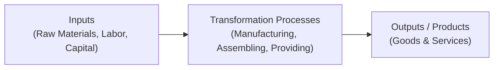
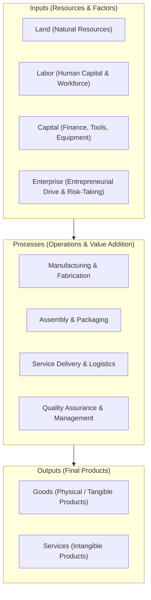
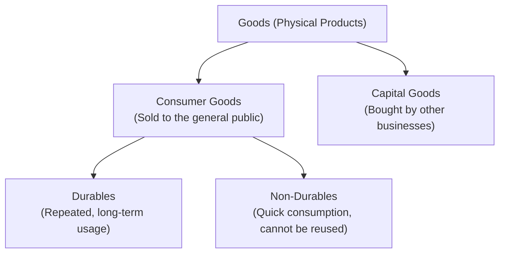
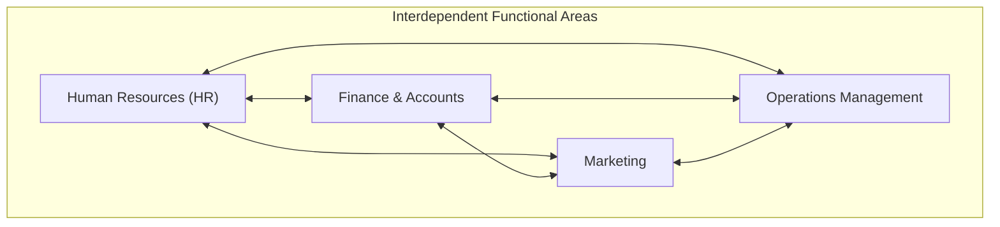
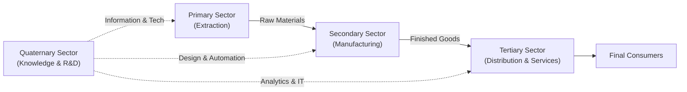
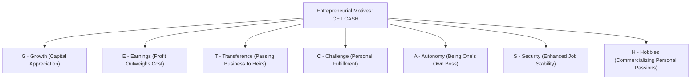

# 1.1 What is a Business?

> **IB Business Management | Unit 1: Business Organization and Environment**  
> **Topic:** 1.1 Introduction to Business Management (SL/HL Core)

---

## 1. Core Definitions & The Nature of Business

### What is a Business?
A **business** is a decision-making organization involved in using inputs to create products (goods and/or services) to satisfy the needs and desires of customers. Businesses exist within a dynamic external environment and vary significantly in their size, structure, objectives, and legal forms.

### Primary Objectives & Purpose of Business Activity
* **Main Goal:** To **create customers** who are willing to purchase and use its products. A business accomplishes this by developing goods and services that effectively identify and fulfill the specific **needs** (essential necessities like water, food, and shelter) and **wants** (discretionary desires like smartphones, luxury goods, and leisure travel) of consumers.
* **Main Purpose:** To **generate added value** (value-added). Business activity takes raw or semi-processed resources and transforms them into higher-value outputs, generating economic surplus for the organization.

---

## 2. The Transformation Model: Inputs, Processes, & Outputs

Every business acts as a transformation system that converts input resources into output products.

### Breakdown of the Transformation Model

1. **Inputs:**
   * The resources a business uses to produce products.
   * Traditionally categorized into the **Four Factors of Production**:
     * **Land:** All natural, renewable, and non-renewable physical resources (timber, crude oil, agricultural land, minerals).
     * **Labor:** The physical and mental effort exerted by human workers (factory technicians, engineers, administrative staff).
     * **Capital:** The non-natural resources used in further production, including machinery, IT hardware, factories, and working capital.
     * **Enterprise:** The management skill and willingness to take financial risks in combining land, labor, and capital to produce goods or services.
   * *Note from Student Materials:* Inputs are the foundational resources a business employs to create products (which are sometimes referred to in operations contexts as the input-output cycle).

2. **Processes:**
   * What the business does to convert inputs into outputs.
   * Includes designing, refining, assembling, testing, marketing, transporting, and customer servicing.
   * The process is where **added value** is embedded into the product.

3. **Outputs (Products):**
   * The resulting goods or services created by the transformation process.

---

## 3. Product Classifications: Goods vs. Services

> [!NOTE]
> In business terminology, the umbrella term **"product"** encompasses both physical goods and intangible services.

| Dimension | Physical Goods | Intangible Services |
| :--- | :--- | :--- |
| **Definition** | Tangible, physical objects that can be touched, stored, and inspected. | Intangible activities, deeds, or benefits provided to customers. |
| **Storage & Inventory** | Can be stored as inventory for future consumption. | Perishable; cannot be stored in inventory (consumed when produced). |
| **Tangibility** | Tangible (physical substance). | Intangible (no physical substance). |
| **Examples** | Smartphones, motor vehicles, clothing, furniture. | Haircuts, public transportation, healthcare, banking, education. |

### Classification of Goods

1. **Consumer Goods:**
   * Products sold directly to the general public for personal or household consumption.
   * **Durable Goods (Durables):** Products with a long lifespan designed for repeated, long-term use (e.g., cars, refrigerators, laptops, washing machines).
   * **Non-Durable Goods (Non-Durables):** Fast-moving products that require rapid consumption and cannot be reused once depleted (e.g., food, beverages, newspapers, single-use toiletries).

2. **Capital Goods:**
   * Physical products purchased and deployed by other businesses rather than end-consumers.
   * Used as inputs in the production of other goods or services (e.g., industrial machinery, delivery vans, factory buildings, robotics, high-grade office printers).

### Customers vs. Consumers

It is essential to distinguish between customers and consumers, as they may or may not be the same entity:
* **Customer:** The individual or organization that **purchases** the product (transacts financially).
* **Consumer:** The individual or end-user who actually **uses or consumes** the product.
* *Example:* A parent (customer) purchases baby formula or a toy that is used exclusively by their infant (consumer). Conversely, a commuter buying a coffee for their personal walk to work is both customer and consumer.

---

## 4. Entrepreneurship

### Definition of an Entrepreneur
An **entrepreneur** is an individual who plans, organizes, and manages a business and its day-to-day operations, taking on calculated **financial risks** in doing so in pursuit of commercial success or social impact.

### Key Characteristics & Skills of Successful Entrepreneurs
* **Risk-taking:** Willingness to invest capital, time, and reputation into an uncertain venture.
* **Innovation & Creativity:** Ability to identify market gaps, develop novel solutions, and differentiate offerings from existing competitors.
* **Leadership & Resilience:** Capacity to inspire teams, navigate setbacks, adapt to volatile market conditions, and maintain focus through adversity.
* **Strategic Vision & Organization:** Competence in coordinating the four factors of production and aligning resources toward clear commercial targets.

---

## 5. Functional Areas of a Business (Interdependent Departments)

A business is composed of distinct yet deeply interdependent functional areas (departments). Each department specializes in a specific sphere of operations, but none can operate in isolation.

### The Four Main Departments

1. **Human Resources (HR):**
   * **Core Role:** Responsible for managing the personnel (human capital) of the organization.
   * **Key Activities:** Workforce planning, recruitment, selection, induction, continuous training, performance appraisals, motivation, compliance with employment law, and disciplinary/grievance procedures.
   * **Interdependence Link:** HR must liaise with Operations to supply skilled technicians, and with Finance to determine salary bands, bonuses, and severance packages.

2. **Finance and Accounts:**
   * **Core Role:** Responsible for managing the business's money, maintaining financial health, and ensuring legal compliance with financial regulations and tax authorities.
   * **Key Activities:** Preparing financial statements (Balance Sheet, Profit & Loss Account, Cash Flow Statement), budgeting, monitoring cash flow, allocating funds to other departments, managing credit, and securing investment capital.
   * **Interdependence Link:** Finance allocates capital expenditure budgets to Operations for machinery, and operating budgets to Marketing for promotional campaigns.

3. **Marketing:**
   * **Core Role:** Identifying, anticipating, and satisfying the needs and wants of customers through targeted research and commercial strategies, ensuring that the business's products sell profitably.
   * **Key Activities:** Conducting primary and secondary market research, managing the marketing mix (Product, Price, Promotion, Place), building brand equity, and establishing customer retention channels.
   * **Interdependence Link:** Marketing provides Operations with consumer feedback and sales volume forecasts, and coordinates with Finance on pricing strategies to protect gross and net profit margins.

4. **Operations Management (Production):**
   * **Core Role:** The conversion of business inputs into finished outputs (products). Creation and delivery of goods or services.
   * **Key Activities:** Sourcing raw materials, production line management, quality control and quality assurance, logistics, supply chain management, and capacity planning.
   * **Interdependence Link:** Operations relies on HR for qualified personnel, Finance for working capital to procure inventory, and Marketing to provide reliable customer demand forecasts.

---

## 6. Sector Classification & The Chain of Production

Businesses are classified according to the stage of the **chain of production** in which their primary activities occur.

### The Four Economic Sectors

1. **Primary Sector:**
   * **Definition:** Direct extraction, harvesting, or acquisition of natural resources from the earth or sea.
   * **Activities:** Mining, agriculture, oil drilling, forestry, commercial fishing.
   * **Economic Link:** Dominant in **low-income countries** (developing economies) where a large percentage of the working population is employed in subsistence or agrarian production.

2. **Secondary Sector:**
   * **Definition:** Processing, manufacturing, construction, and transformation of primary raw materials into semi-finished or finished physical goods.
   * **Activities:** Automobile manufacturing, textile fabrication, chemical refining, construction, food processing.
   * **Economic Link:** Dominant in **medium-income countries** (emerging / newly industrialized economies) experiencing industrial expansion.

3. **Tertiary Sector:**
   * **Definition:** Providing services and intangible support activities to the general population and commercial organizations.
   * **Activities:** Retail, hospitality, banking, tourism, logistics, healthcare, personal grooming.
   * **Economic Link:** Dominant in **high-income countries** (developed economies), where consumer spending power is high and automated manufacturing has shifted domestic labor toward the service industry.

4. **Quaternary Sector:**
   * **Definition:** A specialized sub-category of the tertiary sector focused on intellectual, information-based, and knowledge-driven activities.
   * **Activities:** Scientific research and development (R&D), biotechnology, software engineering, financial advisory, data analytics, management consultancy.
   * **Economic Link:** Highly concentrated in advanced, innovation-driven economies supporting high-tech industries.

### The Chain of Production
The economic sectors are **interdependent** and linked together via the **chain of production**:
$$\text{Primary (Extraction)} \longrightarrow \text{Secondary (Manufacturing)} \longrightarrow \text{Tertiary (Distribution / Retail)} \longrightarrow \text{Consumers}$$
* *Example (Forestry to Textbook):*
  * **Primary:** A forestry company fells timber.
  * **Secondary:** A paper mill turns timber into pulp and paper; a printing firm binds the paper into a Business textbook.
  * **Tertiary:** A logistics carrier ships the books, and an educational bookstore or e-commerce platform sells them to students.
  * **Quaternary:** Authors, pedagogical researchers, and instructional designers create the textbook curriculum and digital study tools.

---

## 7. Challenges to Starting and Sustaining a Business

Launching a new enterprise carries substantial risk. A high proportion of startup businesses fail within their first five years due to a range of operational and external hurdles:

1. **Lack of Finance:**
   * Inability to raise sufficient initial seed capital or long-term investment. Financial institutions are often hesitant to lend to unproven startups without established collateral or trading records.

2. **Unestablished Customer Base & Marketing Problems:**
   * Emerging businesses lack brand recognition and customer loyalty. They struggle to attract customers away from entrenched competitors and may fail to identify target customer segments or address real consumer needs.

3. **Cash Flow Problems:**
   * **Cash flow** is the timing and volume of money moving into and out of the business. Even profitable businesses can rapidly become insolvent if customers delay payment while rent, supplier bills, and wages fall due immediately (lack of working capital for daily running).

4. **People Management Problems (HR Failures):**
   * Startups often struggle to recruit, afford, and retain staff with the specialized skills needed to manage diverse business functions, leading to operational bottlenecks, low productivity, and poor customer service.

5. **Challenges in Forecasting Demand:**
   * Inaccurate market demand projections make it difficult to determine production volume. Underestimating demand causes stockouts and lost revenue; overestimating demand leads to unsold inventory, high holding costs, and liquidity drainage.

6. **Legalities & Regulatory Compliance:**
   * Compliance with complex legislation (business registration, occupational health and safety, employment laws, licensing, consumer protection, environmental standards, and tax registration) requires extensive time, expertise, and legal costs.

7. **High Production Costs & Lack of Economies of Scale:**
   * Startups face heavy initial capital setup costs (equipment, technology, leasing). Unlike established competitors who benefit from **economies of scale** (lower average cost per unit due to bulk buying, managerial specialization, and mass production), small startups produce at high average unit costs.

8. **Poor Location:**
   * Selecting an unfavorable physical or strategic site (low footfall, poor transport links, high rental rates, or excessive distance from target customers and suppliers) severely degrades commercial viability.

9. **External Shocks & Macro Crises:**
   * Macroeconomic downturns, global financial crises, supply chain shocks, political instability, and worldwide pandemics (such as COVID-19). Large, well-capitalized firms have cash buffers to absorb these shocks, whereas small businesses are disproportionately vulnerable.

---

## 8. Opportunities for Starting a Business: The "GET CASH" Framework

Entrepreneurs are motivated to take risks and launch startups by a combination of financial and non-financial incentives. The core drivers are captured by the mnemonic **`GET CASH`**:

| Letter | Motivation Factor | Detailed Explanation & Real-World Mechanism |
| :---: | :--- | :--- |
| **G** | **Growth** | Entrepreneurs benefit personally when their enterprise appreciates in market value over time. This increase in the equity value of the enterprise is known as **capital growth**, which can yield substantial wealth upon a future sale, merger, or public flotation. |
| **E** | **Earnings** | The expectation that the prospective financial returns and profits earned from operating the business will substantially exceed the costs of setup and the potential wages earned from traditional salaried employment. |
| **T** | **Transference & Inheritance** | Self-employed entrepreneurs frequently view their enterprise as a permanent family asset that they can build, preserve, and pass on to their children and future generations. |
| **C** | **Challenge** | Many founders are driven by the psychological thrill, intellectual demand, and personal satisfaction derived from conceiving an idea, overcoming competitive obstacles, and turning a concept into a thriving reality. |
| **A** | **Autonomy** | The desire for independence and self-direction. As self-employed owners, entrepreneurs control their own strategic vision, operational pace, working environment, and daily schedule without taking orders from superiors. |
| **S** | **Security** | A desire for greater long-term job security. Salaried corporate employees face the perpetual threat of corporate downsizing, restructuring, and redundancy. Owning a business provides direct control over one's employment future. |
| **H** | **Hobbies** | Successful entrepreneurs often turn personal passions, creative interests, and recreational pursuits (such as cooking, coding, fitness, fashion, or photography) into commercial enterprises that keep them passionate and committed. |

---

## 9. Quick Reference & Exam Revision Checklist

- [ ] **Definition:** Decision-making body using inputs to generate products; main goal is creating customers; main purpose is adding value.
- [ ] **Transformation Model:** Inputs (Land, Labor, Capital, Enterprise) $\rightarrow$ Processes (Operations) $\rightarrow$ Outputs (Goods/Services).
- [ ] **Goods vs. Services:** Physical/tangible vs. intangible.
- [ ] **Goods Subdivisions:** Consumer Goods (Durables vs. Non-durables) vs. Capital Goods (B2B machinery/tools).
- [ ] **Customer vs. Consumer:** The buyer vs. the end-user.
- [ ] **Functional Areas:** HR, Finance & Accounts, Marketing, Operations (all interdependent).
- [ ] **Economic Sectors:** Primary (extraction; low-income), Secondary (manufacturing; medium-income), Tertiary (services; high-income), Quaternary (knowledge/R&D sub-sector).
- [ ] **Startup Challenges:** Finance, marketing, cash flow, human resources, demand forecasting, legalities, lack of economies of scale, location, macro crises.
- [ ] **Startup Drivers (GET CASH):** Growth, Earnings, Transference & inheritance, Challenge, Autonomy, Security, Hobbies.
