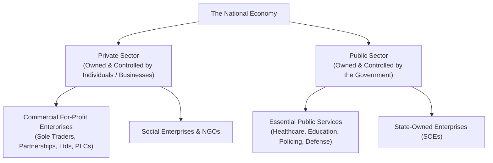
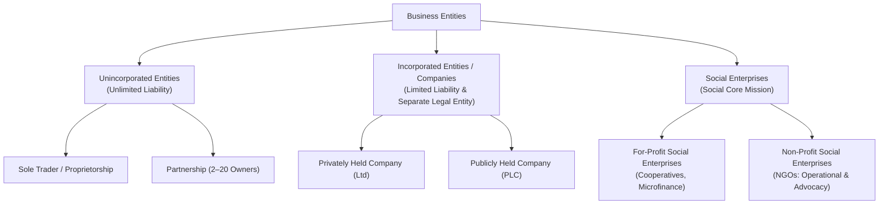
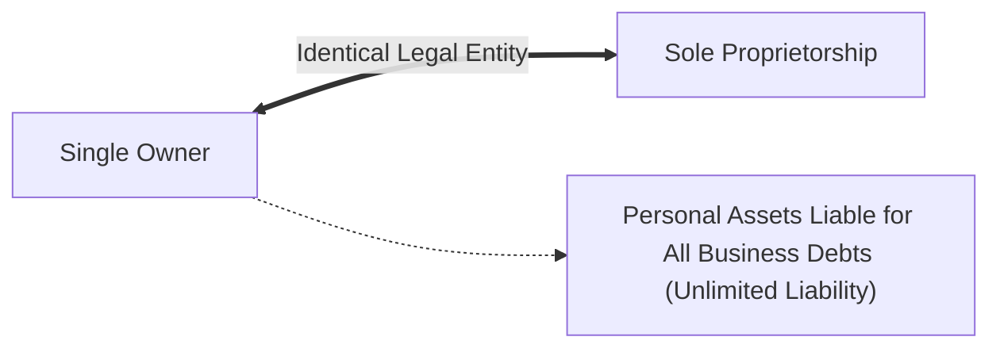
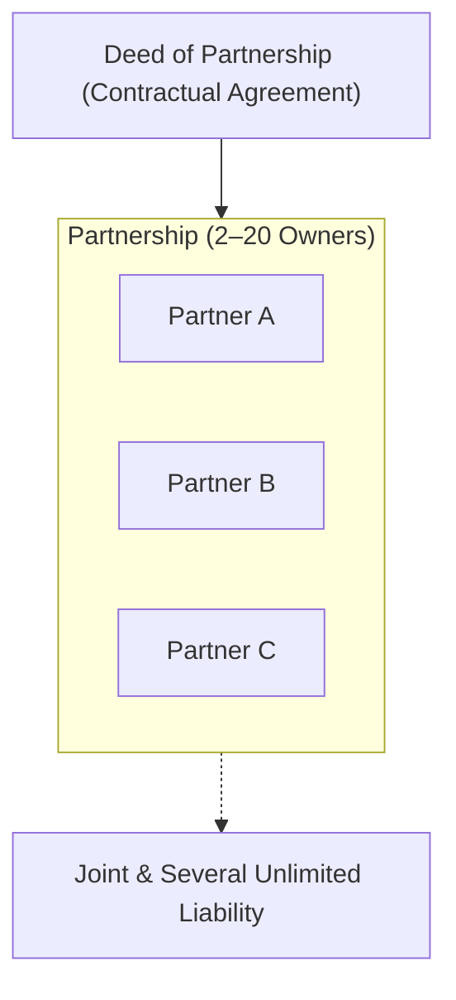
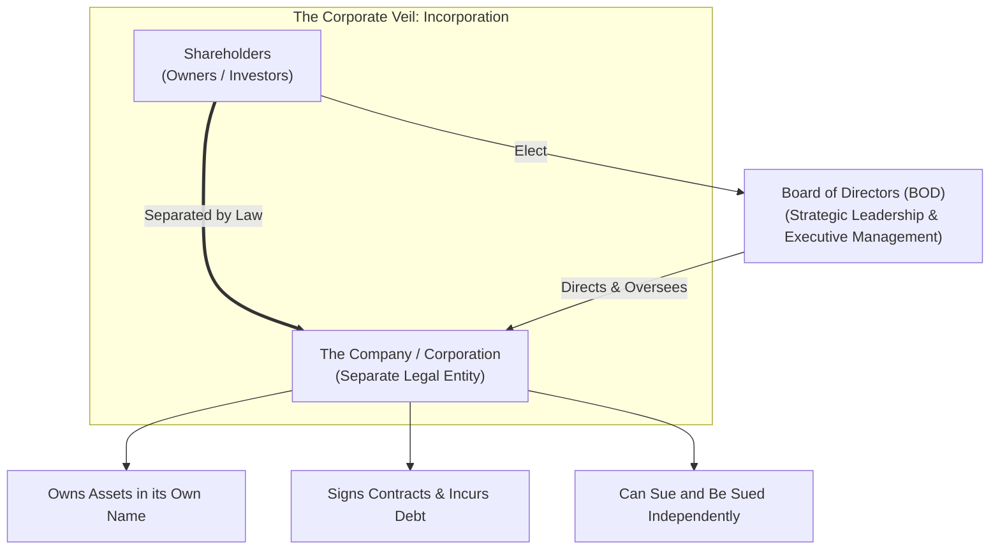
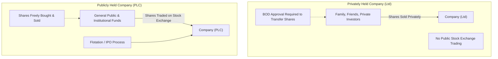
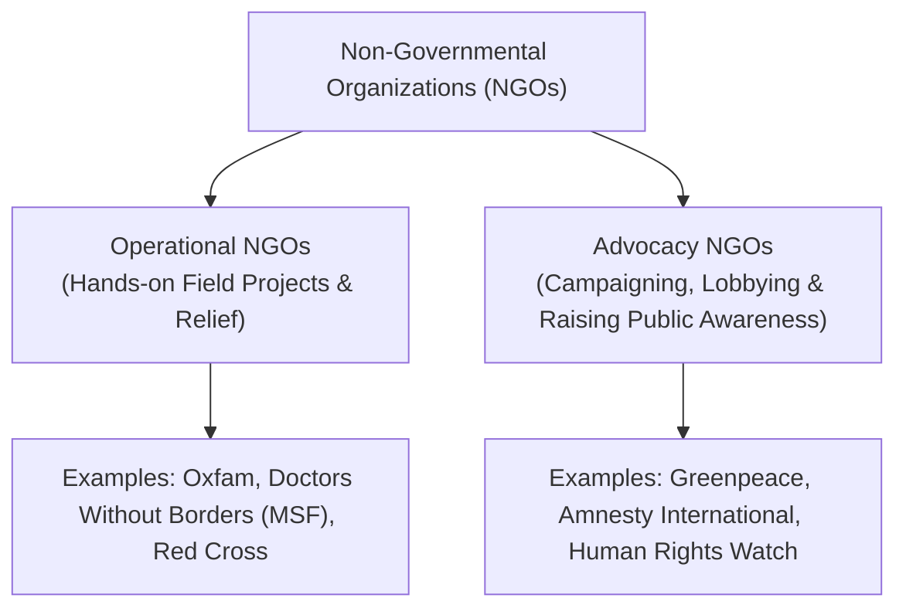
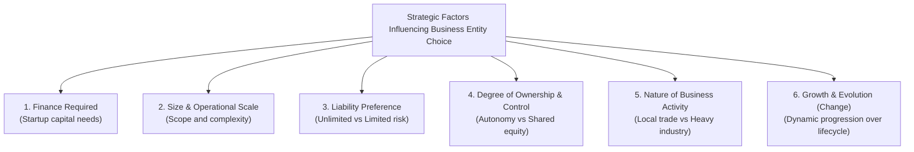

# 1.2 Types of Business Entities

> **IB Business Management | Unit 1: Business Organization and Environment**  
> **Topic:** 1.2 Types of Business Entities (SL/HL Core)

---

## 1. The Broad Economic Sectors: Private Sector vs. Public Sector

Every economy is divided into two primary structural sectors based on ownership, financing, and underlying organizational purpose.

### Definitions & Structural Distinction

* **Private Sector:**
  * **Ownership & Control:** Owned, controlled, and financed by private individuals, partners, or commercial enterprises.
  * **Primary Motive:** Primarily focused on generating commercial profit, expanding market share, and maximizing returns for owners and private shareholders (with the exception of private non-profit social enterprises).
* **Public Sector:**
  * **Ownership & Control:** Under the direct ownership, accountability, and operational control of central, regional, or municipal governments.
  * **Primary Motive:** To deliver essential public goods and merit services to all citizens, promote societal welfare, and stabilize the macroeconomy.

### Six Key Benefits of Public Sector Business Activity

1. **Ensures Universal Access to Basic Services:**
   * Guarantees that vital, life-sustaining services (clean drinking water, public healthcare, primary and secondary schooling, sanitation) are available to every citizen regardless of income or socioeconomic status.
2. **Avoids Wasteful Competition:**
   * Natural monopolies (e.g., national railway networks, electrical grids, water pipelines) involve massive infrastructure setup costs. Operating them under a unified public provider avoids inefficient duplication of infrastructure and harnesses extensive state **economies of scale**.
3. **Provides Services Inefficient or Undesirable for Private Markets:**
   * Private markets under-provide or ignore non-excludable **public goods** (e.g., street lighting, flood defense levees) and **merit goods** (e.g., public libraries, free clinics) because they are unprofitable to supply commercially. The public sector fills this critical market failure.
4. **Protects Citizens, Communities, and Commerce:**
   * State organizations maintain the rule of law, national security, consumer rights, and public safety through institutions such as the police force, judiciary, military, and regulatory bodies (e.g., food safety inspectorates).
5. **Creates Employment Opportunities:**
   * The public sector serves as a major national employer (teachers, civil servants, nurses, infrastructure engineers), providing fair wages, pensions, and workplace standards.
6. **Stabilizes the National Economy:**
   * Through fiscal policy, countercyclical spending, public procurement, and emergency capital injections, the public sector cushions the economy during recessions and controls inflation.

---

## 2. Overview of Business Entities

---

## 3. Sole Trader / Sole Proprietorship

### Definition & Legal Status
A **sole trader** (or **sole proprietorship**) is a business entity owned and managed by a single individual. It is **unincorporated**, meaning that the business has **no separate legal identity** from its owner. In the eyes of the law, the owner and the business are the identical legal entity.

### Comprehensive Advantages of Sole Proprietorships
* **Few Legal Formalities & Fast Setup:** Starting a sole proprietorship is exceptionally straightforward with minimal regulatory paperwork, licensing hurdles, and administrative setup costs compared to corporate registrations.
* **Full Profit Retention (Profit Taking):** The sole trader is the exclusive owner and therefore retains 100% of all after-tax profits generated by the business.
* **Being Your Own Boss (Total Autonomy):** Complete independence and flexibility in decision-making. The owner controls business strategy, pricing, operational methods, and working hours without needing approval or taking orders from superiors.
* **Personalized Customer Service:** Due to their local presence and manageable scale, sole traders build intimate, direct, and customized relationships with their clientele.
* **Financial Privacy:** Unlike incorporated companies, sole traders are not required to publish their financial records, balance sheets, or profit figures to the general public or competitors.
* **Agile, Rapid Decision-Making:** Operational changes, product introductions, and pricing adjustments can be implemented instantly without consulting partners, committees, or boards of directors.

### Comprehensive Disadvantages of Sole Proprietorships
* **Unlimited Liability:** Because the business is unincorporated, there is zero legal distinction between personal assets and business liabilities. If the enterprise fails or incurs debts, creditors have the legal right to seize the owner's personal savings, car, and home.
* **Limited Sources of Finance:** Capital is strictly constrained by the owner's personal savings and limited borrowing capacity. Commercial banks are reluctant to extend substantial unsecured loans to small sole traders.
* **High Commercial Risk & Failure Rates:** Sole traders face steep failure rates due to fierce competition from well-funded corporations, cash flow volatility, and limited reserves to survive downturns.
* **High Workload and Executive Stress:** The sole owner is personally responsible for executing every single departmental function—marketing, bookkeeping, operations, inventory logistics, and customer support—leading to severe burnout.
* **Limited Economies of Scale:** Operating at low production volumes prevents sole traders from securing bulk-buying discounts or advanced automation, resulting in higher average costs per unit and less price competitiveness.
* **Lack of Continuity:** If the owner falls ill, suffers disability, takes a leave of absence, or dies, the business frequently ceases trading immediately.

---

## 4. Partnerships

### Definition & Legal Framework
A **partnership** is a private sector commercial business owned by two or more individuals (typically between **2 and 20 partners**, though professional practices like accounting or law firms may have more depending on jurisdiction). 

Like sole traders, traditional partnerships are **unincorporated** organizations with **unlimited liability**, where the partners are jointly and severally responsible for the debts and contractual obligations of the firm.

### The Deed of Partnership
To prevent catastrophic disputes, professional partnerships operate under a legally binding contract known as the **Deed of Partnership** (or Partnership Agreement). This document stipulates:
1. The initial capital contribution provided by each partner.
2. The formula for distributing profits and absorbing losses.
3. Roles, operational responsibilities, and voting rights of each partner.
4. Rules regarding the admission of new partners or retirement of existing partners.
5. Procedures for dissolving the firm or valuing partnership equity upon death or departure.

### Comprehensive Advantages of Partnerships
* **Greater Financial Strength:** Multiple owners contribute equity, significantly increasing startup capital and borrowing capacity compared to a sole trader.
* **Shared Expertise, Workload, and Division of Labor:** Partners bring complementary skills (e.g., one specializes in client acquisition and marketing, another in technical operations, and a third in financial accounting), leading to higher operational efficiency.
* **Mutual Support & Reduced Stress:** Shared decision-making and collaborative problem-solving alleviate the isolation and psychological burden felt by sole operators.
* **Expanded Client Networks:** Each incoming partner contributes their existing professional network, rapidly enlarging the firm's client base.
* **Financial Privacy:** Similar to sole traders, partnerships are not required to publish or publicly register their annual financial accounts for public inspection.

### Comprehensive Disadvantages of Partnerships
* **Unlimited Liability (Joint & Several):** Partners share legal liability for all debts incurred by the business. Under **mutual agency**, a single partner can commit the entire firm to contracts or debts for which all other partners are held personally liable with their private wealth.
* **Prolonged Decision-Making:** Major strategic moves require consultation, discussion, and agreement among multiple stakeholders, slowing operational responsiveness.
* **Interpersonal Disagreements and Conflict:** Philosophical divisions over strategic direction, unequal workloads, or profit allocation can paralyze the leadership and destroy the venture.
* **Instability & Lack of Continuity:** If any partner leaves, becomes bankrupt, or passes away, the legal partnership is technically dissolved and must be formally renegotiated under a revised partnership deed.

---

## 5. Companies / Corporations

### The Concept of Incorporation & Separate Legal Entity
A **company** (or corporation) is an incorporated business entity owned by its **shareholders**. 

* **Incorporation:** The legal process that creates a company as an independent legal "person" separate from its owners.
* **Separate Legal Entity:** The corporation can own property, hold bank accounts, sign legally binding contracts, incur debt, and be sued or take legal action in a court of law in its own corporate name.
* **Limited Liability:** Because the business is an independent legal person, shareholders enjoy limited liability:
  * Shareholders' personal assets are legally shielded from corporate debts, lawsuits, or bankruptcy.
  * The absolute maximum amount a shareholder can lose is the **value of their investment** (the money paid to purchase their shares).
* **Board of Directors (BOD):** Shareholders elect a Board of Directors to formulate long-term corporate strategy, protect shareholder interests, and supervise executive management.

---

## 6. Privately Held vs. Publicly Held Companies

Incorporated companies in the private sector exist in two primary legal structures: **Privately Held Companies (Ltd)** and **Publicly Held Companies (PLC)**.

| Key Dimension | Privately Held Company (Ltd / Private Limited) | Publicly Held Company (PLC / Public Limited) |
| :--- | :--- | :--- |
| **Share Sales & Flotation** | **Cannot** advertise or sell shares to the general public. Shares are restricted to private investors, founders, family, and colleagues. | **Can** advertise and sell shares to the general public and institutional investors via a recognized Stock Exchange. |
| **Transferability of Shares** | Shares **cannot** be sold or transferred without the explicit agreement/approval of the Board of Directors (BOD). | Shares are freely bought and sold on the open stock market without board restrictions. |
| **Flotation / IPO** | Not applicable. (Remains unlisted). | Undertakes **flotation** via an **Initial Public Offering (IPO)** to sell equity to external markets for the first time. |
| **Governance & AGMs** | Required to hold Annual General Meetings (AGMs) for private shareholders, but meetings are closed and internal. | Mandated to hold formal, highly publicized AGMs where all public voting shareholders can question the BOD. |
| **Financial Disclosure** | Must file accounts with government registries, but discloses significantly less granular data than PLCs; financial secrecy is largely preserved from public view. | Subject to strict statutory transparency: must publish full audited annual financial statements, quarterly reports, and executive compensation publicly. |
| **Vulnerability to Takeovers** | **Low:** Outsiders cannot purchase shares unless existing owners explicitly agree to sell. | **High:** Vulnerable to hostile takeovers if a predatory competitor buys a majority of voting shares on the open exchange. |

---

## 7. Comprehensive Company Evaluation: Advantages vs. Disadvantages

| Factor | Advantages of Companies | Disadvantages of Companies |
| :--- | :--- | :--- |
| **Capital & Finance** | **Massive Capital Potential:** Ability to raise substantial equity capital by issuing shares. Unlike debt finance (loans), equity capital carries no fixed interest burden—dividends are only distributed if the company records a net profit. | **Costly Flotation & Underwriting:** Executing an IPO or issuing subsequent shares requires massive merchant banking fees, legal underwriting costs, and stock exchange listing fees. |
| **Risk & Liability** | **Limited Liability:** Protects owners' personal wealth, making it vastly easier to attract both retail and institutional investors whose downside risk is strictly capped. | **Moral Hazard & Speculation:** Shareholder detachment from day-to-day operations can encourage speculative short-termism or management disengagement. |
| **Continuity** | **Perpetual Succession:** As a separate legal entity, the company survives indefinitely regardless of changes in ownership, shareholder retirement, or death. | **Divorce of Ownership & Control:** Agency problem: The interests of executive directors (salaries, power, prestige) may conflict with those of shareholders (dividends, share value). |
| **Cost & Efficiency** | **Economies of Scale:** Substantial capital enables mass production, automated supply chains, and bulk buying, dramatically reducing unit production costs. | **Diseconomies of Scale & Bureaucracy:** Ballooning corporate layers cause sluggish communication, duplicated managerial roles, red tape, and interdepartmental silos. |
| **Productivity & Human Resources** | **Specialized Management:** Can afford to hire world-class executive talent, specialized directors, and skilled technical experts, maximizing organizational productivity. | **Impersonal Culture:** Impersonal working environments can alienate employees and weaken direct customer relationships compared to agile sole traders. |
| **Taxation & Compliance** | **Tax Efficiencies:** Companies pay **Corporation Tax** on profits, which is frequently lower than top-bracket individual income tax rates, and can deduct wide-ranging business expenses. | **Extreme Compliance & Public Scrutiny:** Stringent regulatory compliance, extensive accounting disclosures, audit costs, and loss of commercial secrecy to competitors. |

---

## 8. For-Profit Social Enterprises

### Definition & Purpose
**For-profit social enterprises** are revenue-generating commercial businesses that have explicit **social, environmental, or community objectives** integrated directly into the core of their operations. 
* While conventional commercial businesses seek to maximize financial profit for private owners, for-profit social enterprises operate to generate a **sustainable financial surplus** to reinvest into their social cause.
* They can operate in either the **private sector** or **public sector**, and may be structured legally as sole traders, partnerships, or incorporated companies.

### Cooperatives
A **cooperative** is a prominent type of for-profit social enterprise owned, governed, and democratically operated by its members to serve their mutual economic and social interests.
* **Democratic Governance:** Governed by the democratic principle of *"One Member, One Vote"*, preventing any single wealthy investor from dominating decisions.
* **Types of Cooperatives:**
  * **Employee (Worker) Cooperatives:** Owned and managed by the employees themselves. Profits are shared among workers, enhancing motivation and job security (e.g., worker-owned bakeries, manufacturing plants).
  * **Customer (Consumer) Cooperatives:** Owned by the customers who purchase goods and services from the business. Members receive dividends (rebates) based on their patronage volume and enjoy lower retail prices (e.g., cooperative credit unions, retail grocery co-ops).
  * **Producer Cooperatives:** Formed by independent producers (e.g., smallholder dairy or coffee farmers) who unite to purchase machinery jointly, process yields, and market products collectively.

---

## 9. Non-Profit Social Enterprises & Non-Governmental Organizations (NGOs)

### Definition & Core Principles
**Non-profit social enterprises** are organizations that generate or collect funds with **no objective of returning profit to private owners or shareholders**. 
* Any financial surplus (revenue exceeding operational expenses) is retained and **100% reinvested** directly into achieving the organization's social, humanitarian, cultural, or environmental goals.
* They can exist across the private or public sector and may be registered with incorporated charitable status.

### Non-Governmental Organizations (NGOs)
The most widespread non-profit social enterprises are **NGOs**. They operate independently of government control to alleviate suffering, support underprivileged groups, defend human rights, and deliver basic societal amenities.

### The Two Classifications of NGOs

1. **Operational NGOs:**
   * **Definition:** Organizations established to achieve concrete, direct, on-the-ground operational projects and objective relief efforts.
   * **Focus:** Immediate disaster response, building clean water wells, running refugee clinics, supplying educational materials, and famine relief.
   * **Examples:** *Oxfam*, *Médecins Sans Frontières (Doctors Without Borders)*, *International Committee of the Red Cross*.

2. **Advocacy NGOs:**
   * **Definition:** Organizations that adopt an active, vocal, and aggressive promotional stance to raise public consciousness, lobby politicians, and defend or advance a specific cause.
   * **Focus:** Organizing public protests, conducting undercover investigative journalism, running mass media awareness campaigns, and direct lobbying to influence government policy and corporate behavior.
   * **Examples:** *Greenpeace* (environmental defense), *Amnesty International* (human rights defense), *PETA* (animal welfare).

---

## 10. Six Key Factors Influencing the Choice of Business Entity

Entrepreneurs and leadership teams evaluate six critical strategic factors when selecting or transitioning the legal form of their organization:

1. **Amount of Finance Required:**
   * Sole traders and partnerships are ideal for small ventures requiring modest startup capital. If an enterprise requires millions in capital investment (e.g., establishing a pharmaceutical lab or airline), it must incorporate as a company (often progressing to a PLC) to tap into public share issues.
2. **Size and Operational Complexity:**
   * Micro-enterprises operating locally can easily function as sole proprietorships. As an organization expands across multiple geographic regions and employs hundreds of workers, the administrative and legal protection of an incorporated company becomes mandatory.
3. **Liability Preference:**
   * The desire of owners to protect their private assets from corporate debt and legal damages. Founders entering high-risk, debt-intensive industries typically insist on **limited liability** (Ltd/PLC) to insulate their personal wealth.
4. **Degree of Ownership and Control:**
   * Founders who wish to retain absolute, uncompromised control over strategy and day-to-day operations will choose a sole proprietorship or a closely-held private limited company (Ltd). Choosing a PLC dilutes founder control and exposes the firm to outside shareholder votes and hostile takeovers.
5. **The Nature of the Business Activity:**
   * The scope, risk profile, and commercial conventions of the industry dictate the entity structure. A local freelance graphic designer or plumber can function perfectly as a sole trader, whereas high-liability operations (e.g., civil engineering, pharmaceutical development, mass logistics) necessitate corporate structures.
6. **Change and Business Evolution:**
   * Business structure is not static. As a successful enterprise moves through its lifecycle, it continuously evolves: starting as a **sole proprietorship**, recruiting partners into a **partnership**, incorporating into a **private limited company (Ltd)** for capital and protection, and ultimately executing an IPO to become a **public limited company (PLC)** to finance global scale.

---

## 11. Quick Reference & Exam Revision Checklist

- [ ] **Private vs. Public Sector:** Privately owned/controlled for commercial surplus vs. state owned/controlled for universal public welfare.
- [ ] **6 Public Sector Benefits:** Basic services, avoid wasteful competition (economies of scale), provision of merit/public goods, public protection, employment generation, macroeconomic stabilization.
- [ ] **Sole Trader:** Unincorporated, 1 owner, unlimited liability, full profit retention, total autonomy, financial privacy, zero continuity.
- [ ] **Partnership:** Unincorporated, 2–20 owners, unlimited liability (joint & several), Deed of Partnership, shared skills/workload, potential partner conflict.
- [ ] **Incorporation & Limited Liability:** Creation of separate legal person; shareholder liability capped at capital invested; BOD elected to run operations.
- [ ] **Ltd vs. PLC:** Private share transfers requiring BOD consent vs. public share trading on Stock Exchange via IPO/Flotation; public financial disclosure and takeover vulnerability for PLCs.
- [ ] **Corporate Pros & Cons:** Equity financing, limited liability, continuity vs. compliance costs, disclosure loss, AGMs, bureaucracy, agency problems.
- [ ] **For-Profit Social Enterprises:** Social core objective with commercial revenue; Cooperatives (1 member 1 vote; worker, customer, producer).
- [ ] **Non-Profit Social Enterprises:** 100% surplus reinvestment; NGOs (Operational for projects/relief vs. Advocacy for campaigns/lobbying).
- [ ] **6 Choice Factors:** Finance required, size, liability preference, control desired, nature of activity, growth/change.
