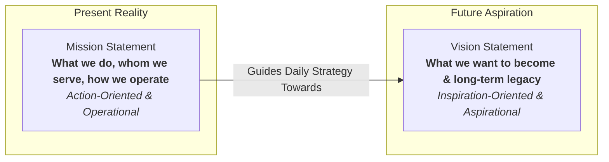
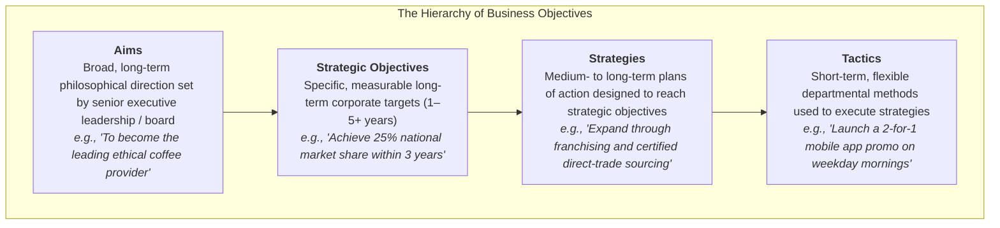
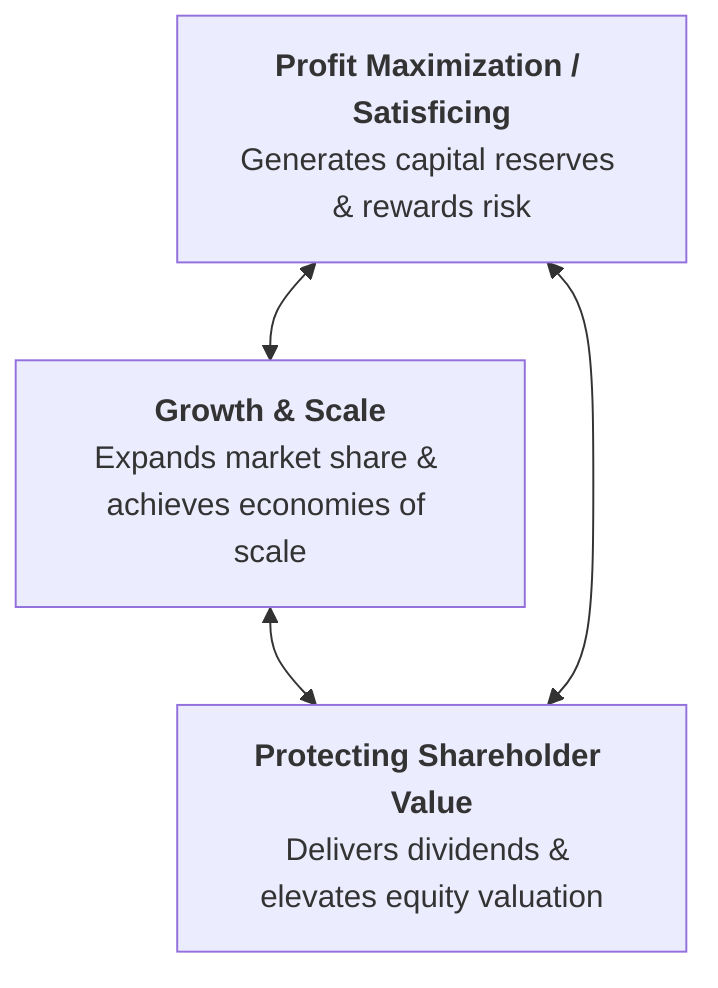
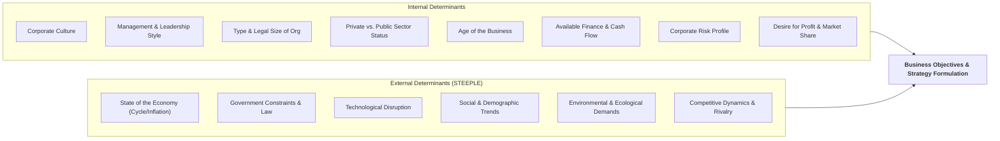
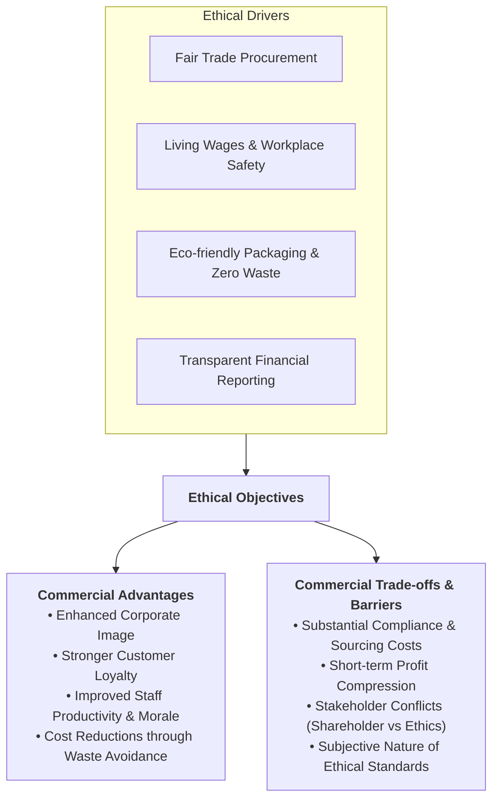
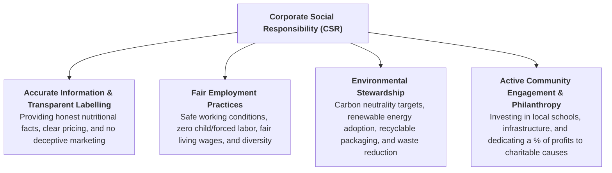

# 1.3 Business Objectives

> **IB Business Management | Unit 1: Business Organization and Environment**  
> **Topic:** 1.3 Business Objectives (SL/HL Core)

---

## 1. Vision and Mission Statements

Vision and mission statements form the philosophical foundation of any organization. They articulate an organization's core identity, establishing why it exists today and where it aspires to be in the future.

### Mission Statement

* **Definition & Purpose:** A formal declaration that describes an organization's current purpose, its fundamental reason for existence, and the distinct value it provides to customers, employees, and society.
* **Temporal Focus:** Anchored strictly in the **present**—what the organization does now, whom it serves, and the tangible methods it employs to deliver value.
* **Tone & Orientation:** **Action-oriented** and pragmatic. It outlines concrete goals, core operational practices, and the company's direct approach to satisfying stakeholder needs.
* **Student Notes Reference Example:**
  > *"To provide high-quality, affordable healthcare products to improve the well-being of our customers."*

### Vision Statement

* **Definition & Purpose:** A forward-looking declaration outlining the desired future state, long-term aspirations, and ultimate destiny of the organization. It paints a picture of what the business hopes to achieve or become over an extended time horizon.
* **Temporal Focus:** Anchored firmly in the **future**—where the business is heading and what ultimate legacy it seeks to accomplish.
* **Tone & Orientation:** **Inspiration-oriented** and motivational. It serves to excite, challenge, and inspire internal employees and external stakeholders.
* **Student Notes Reference Example:**
  > *"To be the global leader in sustainable healthcare solutions."*

### Comparative Analysis: Mission vs. Vision

| Dimension | Mission Statement | Vision Statement |
| :--- | :--- | :--- |
| **Core Question** | *"What is our business and what do we do today?"* | *"What do we want to become in the future?"* |
| **Temporal Focus** | Present reality and ongoing operations. | Long-term future aspirations (5–20+ years). |
| **Tone** | Action-oriented, practical, clear, measurable. | Inspirational, visionary, ambitious, motivational. |
| **Primary Audience** | Current employees, immediate customers, operational partners. | Strategic leaders, future talent, investors, community. |
| **Change Frequency** | Can be revised as operations, products, or markets evolve. | Rarely changes; provides enduring strategic direction. |
| **Failure Risk** | Cynicism if daily operations contradict the stated mission. | Disillusionment if the vision is perceived as purely fictional. |

### Real-World Corporate Examples

* **Nike:**
  * *Mission:* *"Bring inspiration and innovation to every athlete* in the world (*if you have a body, you are an athlete)."*
  * *Vision:* *"To remain the most authentic, connected, and distinctive brand in sport culture."*
* **Tesla:**
  * *Mission:* *"To accelerate the world's transition to sustainable energy."*
  * *Vision:* *"To create the most compelling car company of the 21st century by driving the world's transition to electric vehicles."*
* **Google (Alphabet):**
  * *Mission:* *"To organize the world's information and make it universally accessible and useful."*
  * *Vision:* *"To provide access to the world's information in one click."*

---

## 2. Business and Organizational Objectives

### What are Business Objectives?

**Business objectives** (or organizational objectives) are the specific, quantifiable targets and measurable goals that an organization strives to achieve within a given timeframe, formulated strictly in line with its overarching mission statement. 

> [!IMPORTANT]
> Without clear objectives, a business has no unified sense of direction, lacks criteria for evaluating success, and risks operational drift where departments work at cross-purposes.

### Three Crucial Functions of Business Objectives

As established in foundational business management theory and confirmed in student syllabus materials, objectives are indispensable for three primary reasons:

1. **Adequate Resource Allocation:**
   * Business resources (financial capital, human labor, physical machinery, executive time) are finite and scarce.
   * Clear objectives ensure management deploys capital and assigns personnel to priority activities rather than squandering resources on redundant or low-return tasks.
2. **Measurement and Accountability:**
   * Objectives provide quantifiable benchmarks and control standards against which actual corporate performance can be monitored and assessed.
   * Managers can calculate variance between targets and actual results, identifying underperformance and holding individual teams accountable.
3. **Motivation, Direction, and Coordination:**
   * Objectives unite disparate individuals and functional departments (finance, marketing, operations, HR) around a unified corporate destination.
   * Having unambiguous, ambitious targets provides intrinsic and extrinsic motivation for managers and workers, preventing organizational silos.

---

## 3. The Hierarchy of Objectives

Organizational decision-making is structured hierarchically. Broad aspirations at the top filter down into increasingly granular, time-bound targets and operational routines at lower levels.

### Granular Breakdown of Hierarchy Tiers

1. **Aims:**
   * General, long-term statements of purpose and overall philosophy.
   * Typically qualitative rather than quantitative (e.g., *"To deliver exceptional value and promote environmental sustainability"*).
   * Formulated by the Board of Directors and senior executive management.
2. **Strategic Objectives:**
   * Specific, measurable, and time-bound goals that translate broad aims into workable benchmarks.
   * Cover the entire organization over a medium to long-term horizon (typically 3 to 5 years).
   * Examples include targeted market share growth, return on capital employed (ROCE), or revenue milestones.
3. **Strategies:**
   * The comprehensive plans of action and major operational commitments formulated to realize strategic objectives.
   * Medium to long-term in scope, requiring substantial capital investment and senior management coordination.
4. **Tactics:**
   * Short-term, concrete operational methods and routines designed to implement strategies on a daily, weekly, or monthly basis.
   * Confined to specific departments, functional sections, or local branches of the organization.
   * Highly adaptable and responsive to immediate competitor moves or local conditions.

### The SMART Criteria for Objectives

To be effective, organizational objectives should satisfy the **SMART** framework:

* **S – Specific:** Unambiguous and focused on a clearly defined outcome (e.g., *"Increase sales of electric bicycles"* rather than *"Do better in sales"*).
* **M – Measurable:** Quantified using numerical metrics or financial KPIs (e.g., *"by 15%"*).
* **A – Achievable / Agreed:** Realistic enough to avoid demoralizing staff, agreed upon by both management and team members.
* **R – Realistic / Relevant:** Feasible given the firm's financial, human, and technological resources, and aligned with overall corporate aims.
* **T – Time-bound:** Bounded by an explicit deadline or completion schedule (e.g., *"by Q4 2027"*).

---

## 4. Strategic vs. Tactical Objectives

A fundamental distinction in IB Business Management is the contrast between long-term strategic objectives and immediate tactical objectives.

| Dimension | Strategic Objectives | Tactical Objectives |
| :--- | :--- | :--- |
| **Time Horizon** | Long term (typically 3 to 5+ years). | Short term (days, weeks, up to 1 year). |
| **Organizational Scope** | Whole organization across all departments. | Specific section, department, or individual unit. |
| **Formulated By** | Senior executive leadership / Board of Directors. | Middle managers, department heads, line supervisors. |
| **Reversibility** | Difficult and expensive to reverse once committed. | Relatively easy and inexpensive to adjust or pivot. |
| **Resource Commitment** | High capital expenditure (CapEx) and strategic planning. | Moderate or low operational expenditure (OpEx). |
| **Core Exam Examples** | • **Market Standing:** Establishing brand authority. • **Image and Reputation:** Building long-term public goodwill. • **Market Share:** Growing from 12% to 25% nationally. • **Shareholder Value:** Maximizing long-term equity growth. | • **Survival:** Staying liquid during an unexpected crisis. • **Revenue Maximization:** Hitting short-term sales targets. • **Departmental Budgeting:** Cutting scrap rate by 3% this month. • **Local Promotion:** Running a flash weekend discount campaign. |

### Case Distinction: Survival as Tactical vs. Strategic

> [!NOTE]
> While long-term survival is an inherent corporate aim, **immediate survival** in the face of an acute crisis (such as the onset of a pandemic, sudden loss of a primary supplier, or immediate liquidity shortfall) is classified as a **tactical objective**. The firm must execute immediate cash-preservation tactics (e.g., factoring debtors, delaying capital projects, freezing hiring) simply to stay solvent until normal operations can resume.

---

## 5. Core Business Objectives

While organizations pursue diverse milestones, private sector enterprises center their strategic agendas on three interrelated pillars:

### 1. Profit
* **Nature:** The primary financial engine and standard measure of performance for private sector enterprises.
* **Role in Entrepreneurship:** Profit serves as the necessary financial return that compensates entrepreneurs and investors for bearing capital risk.
* **Maximization vs. Satisficing:**
  * *Profit Maximization:* Striving to generate the highest possible absolute financial surplus (where marginal revenue equals marginal cost, $MR = MC$).
  * *Profit Satisficing:* Aiming for a level of profit that satisfies shareholders' dividend expectations while allowing leadership to pursue other goals (such as ethical procurement, employee welfare, or environmental protection).

### 2. Growth
* **Nature:** The expansion of an organization's operating scale, measured through sales revenue, volume output, customer numbers, or market share.
* **Strategic Necessity:** Essential for long-term commercial survival. Stagnant businesses are vulnerable to aggressive competitors who capture consumer attention and gain market power.
* **Benefits of Growth:**
  * Unlocks internal **economies of scale** (purchasing, managerial, financial, technical), lowering average unit costs ($ATC$).
  * Increases bargaining power over suppliers and distributors.
  * Elevates brand awareness, defensive resilience, and pricing leverage.

### 3. Protecting and Maximizing Shareholder Value
* **Nature:** Generating sustainable, long-term financial wealth for the legal equity owners (shareholders) of an incorporated enterprise.
* **Mechanisms of Value Creation:**
  * **Dividend Yields:** Distributing a portion of retained net profits to shareholders as periodic cash payments.
  * **Capital Appreciation:** Elevating the company's market capitalization and stock price through consistent earnings growth and strategic positioning.
* **Time Horizon Balance:** Modern governance requires boards to protect shareholder value over the long run rather than boosting short-term earnings at the expense of vital R&D or ethical integrity.

---

## 6. Factors Determining & Affecting Business Objectives

Business objectives do not exist in a vacuum. They are continuously shaped, constrained, and modified by internal dynamics and external forces.

### Internal Factors

1. **Corporate Culture:**
   * The shared values, beliefs, and behavioral norms of an organization. An aggressive, performance-driven culture prioritizes rapid market conquest, whereas a collaborative, welfare-focused culture emphasizes employee well-being and customer care.
2. **Company Management and Leadership Style:**
   * Autocratic leaders may mandate aggressive cost-slashing and revenue targets, whereas democratic or paternalistic leaders may emphasize consensus-building, training, and corporate responsibility.
3. **Type and Size of Organization:**
   * A small sole trader may prioritize local customer intimacy and manageable work-life balance, whereas a public limited company ($PLC$) faces immense pressure from stock markets to post quarterly revenue gains.
4. **Private versus Public Sector Status:**
   * Private enterprises seek commercial profit, market dominance, and shareholder returns. Public sector bodies (state hospitals, municipal transit) prioritize universal service access, affordability, social equity, and public welfare.
5. **Age of the Business:**
   * Startups and newly founded ventures focus almost exclusively on **cash liquidity, customer acquisition, and survival**. Established mature firms focus on **market defense, brand extension, diversification, and dividend growth**.
6. **Available Finance:**
   * Capital constraints dictate ambition. Firms with high debt burdens or limited retained earnings must pursue cautious, low-capital tactics, whereas cash-rich firms can fund aggressive R&D and global market development.
7. **Risk Profile:**
   * Risk-averse boards pursue conservative growth (market penetration in familiar sectors). Risk-tolerant boards embrace high-risk innovations and unrelated diversification.
8. **Desire to Remain Competitive and Maximize Profit:**
   * The intensity of rival pressures compels firms to continually raise efficiency targets and upgrade strategic goals.

### External Factors

1. **State of the Economy:**
   * Macroeconomic conditions (recession, boom, inflation rates, interest rates, exchange rates). During a severe recession, strategic expansion is deferred in favor of short-term cost-cutting and cash preservation.
2. **Government Constraints and Regulations:**
   * Statutory legal frameworks, including minimum wage legislation, environmental emission caps, antitrust laws, consumer protection acts, and tariffs.
3. **New Technologies:**
   * The emergence of generative AI, automated manufacturing, or e-commerce platforms forces organizations to rewrite strategic objectives to avoid technological obsolescence.
4. **Social and Demographic Shifts:**
   * Aging populations in developed nations, heightened consumer wellness consciousness, and demand for sustainable packaging force firms to alter product lines and operational targets.

---

## 7. Ethical Objectives

### What are Ethical Objectives?

**Ethical objectives** are organizational goals and targets grounded in the **moral principles** that guide decision-making and business strategy. Business ethics define the actions and behaviors that organizations consider to be morally right, fair, and just, transcending mere compliance with minimum legal mandates.

### Advantages of Setting Ethical Objectives

1. **Enhanced Corporate Image and Brand Equity:**
   * Modern consumers gravitate toward brands perceived as fair, honest, and socially conscious. A verified ethical track record serves as a powerful unique selling point (USP).
2. **Increased Customer Loyalty:**
   * Consumers are willing to remain loyal—and even pay a premium—to businesses that uphold strong moral stances (e.g., Patagonia, The Body Shop, Tony's Chocolonely).
3. **Cost Reductions through Sustainable Practices:**
   * Minimizing packaging, cutting toxic emissions, conserving water, and improving energy efficiency directly lower operational overhead and eliminate waste.
4. **Improved Employee Productivity, Motivation, and Loyalty:**
   * High ethical standards foster workplace pride. Qualified talent is easier to recruit and retain, lowering expensive labor turnover and absenteeism while elevating daily engagement.
5. **Mitigation of Legal and Regulatory Risks:**
   * Proactive ethics shield the business from costly civil lawsuits, regulatory penalties, investigative media exposés, and consumer boycotts.

### Disadvantages, Trade-offs, and Implementation Barriers

1. **High Compliance and Procurement Costs:**
   * Sourcing ethically certified raw materials (e.g., Fairtrade coffee, organic cotton) and paying living wages substantially raises direct production costs ($COGS$), squeezing short-term profit margins.
2. **Stakeholder Conflicts:**
   * Classic agency dilemma: Institutional shareholders demanding immediate quarterly dividends may oppose expensive ethical capital outlays, viewing social expenditures as a diversion of capital.
3. **Subjective Nature of Business Ethics:**
   * What is considered morally virtuous in one country or culture may be regarded as neutral, unnecessary, or unacceptable in another. Defining an absolute moral standard across global supply chains creates operational ambiguity.
4. **Risk of Greenwashing Allegations:**
   * If a business markets ethical claims that are later discovered to be overstated or misleading, the resulting reputational backlash can be far more catastrophic than if no claims had been made at all.

---

## 8. Corporate Social Responsibility (CSR)

### What is Corporate Social Responsibility?

**Corporate Social Responsibility (CSR)** is the conscientious, sustained consideration of ethical, social, and environmental practices related to all facets of business activity. 

> [!NOTE]
> Ethical objectives are the explicit operational goals that a business sets to integrate CSR into its commercial DNA and day-to-day business model.

### Core Dimensions and Practical Examples of CSR

1. **Accurate Information and Transparent Labelling:**
   * Providing consumers with genuine, verifiable product details without deceptive marketing or hidden fees (e.g., clearly disclosing allergens, nutritional contents, and true environmental footprints).
2. **Fair Employment Practices:**
   * Safeguarding employee physical and mental well-being, enforcing fair grievance procedures, ensuring equal pay for equal work, and auditing global Tier-1 and Tier-2 suppliers to stamp out forced labor.
3. **Environmental Considerations:**
   * Measuring and curbing greenhouse gas emissions, adopting circular packaging systems, phasing out non-biodegradable plastics, and protecting regional biodiversity.
4. **Active Community Engagement and Philanthropy:**
   * Sponsoring civic initiatives, funding educational workshops in underrepresented areas, providing disaster relief, and encouraging employee volunteerism during paid hours.

### External Pressures Driving CSR Adoption

* **Pervasive Media Exposure & Digital Scrutiny:**
   * 24/7 global news cycles, smartphone cameras, and social media platforms mean corporate missteps are instantly broadcast worldwide. Large multinational corporations ($MNCs$) face societal expectations to act as benevolent global citizens and donate portions of profits to public welfare causes.
* **Ethical Consumerism and Boycott Movements:**
   * Consumers actively research supply chain ethics. Boycotts against sweatshops, animal testing, and deforestation can wipe out millions in market value within days.
* **Institutional ESG (Environmental, Social, Governance) Investment:**
   * Major asset managers (e.g., BlackRock, Vanguard) increasingly allocate capital based on strict ESG scores. Companies with poor social or environmental records face restricted access to equity and debt capital.

### Barriers to Fulfilling CSR Commitments

* **Financial and Capital Constraints:** High capital outlay required for renewable plant upgrades, sustainable supply chain restructuring, and audit systems.
* **Shareholder Resistance to Profit Diversion:** Pressure for immediate quarterly dividends can discourage long-term societal investments.
* **Macroeconomic Hardships:** During economic recessions or sharp cost crises, CSR initiatives are frequently the first programs defunded in an effort to maintain solvency.
* **Global Supply Chain Complexity:** Monitoring hundreds of sub-tier overseas contractors creates severe enforcement and verification bottlenecks.

---

## 9. Syllabus Summary Checklist & Review

| Concept | Key Exam Takeaway |
| :--- | :--- |
| **Mission Statement** | Grounded in the **present**; action-oriented declaration of corporate purpose, target audience, and operational approach. |
| **Vision Statement** | Grounded in the **future**; aspirational, motivational vision of long-term destiny and legacy. |
| **Hierarchy of Objectives** | Aims $\rightarrow$ Strategic Objectives $\rightarrow$ Strategies $\rightarrow$ Tactics. Filtered from broad board-level philosophy down to daily shop-floor actions. |
| **SMART Framework** | Objectives must be Specific, Measurable, Achievable, Realistic, and Time-bound. |
| **Strategic vs. Tactical** | Strategic is long-term, high-risk, whole-company; Tactical is short-term, low-risk, departmental/sectional. |
| **Core Objectives** | Profit maximization/satisficing, business growth/market share, protecting shareholder value. |
| **Internal & External Determinants** | Internal: culture, leadership, finance, size, age, risk profile. External: economic cycle, legislation, technology, competition. |
| **Ethical Objectives** | Moral guidelines beyond statutory law; enhances brand loyalty and morale, but raises direct operating costs and triggers stakeholder friction. |
| **Corporate Social Responsibility (CSR)** | Holistic operational framework considering social, environmental, and ethical impacts of business decisions. |
