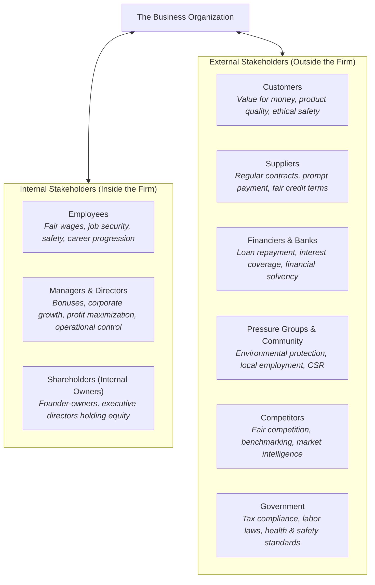
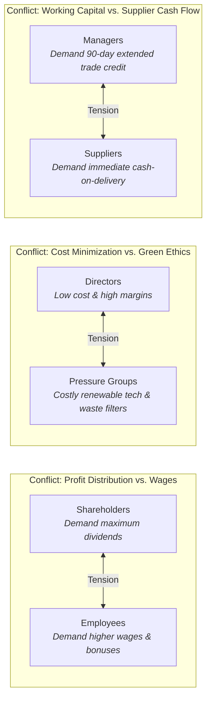

# 1.4 Stakeholders

> **IB Business Management | Unit 1: Business Organization and Environment**  
> **Topic:** 1.4 Stakeholders (SL/HL Core)  
> **Depth of Teaching:** AO2 Application & Analysis

---

## 1. Stakeholder Concept & Core Distinctions

The word **"stake"** signifies having an interest, a financial investment, or being directly involved in and impacted by something. 

### What is a Stakeholder?
A **stakeholder** is any individual, group, or organization with a direct interest or involvement in the operations, decisions, and overall performance of a business. Stakeholders are intrinsically impacted by organizational activities and, conversely, possess varying degrees of influence over business conduct.



---

### Critical IB Distinction: Stakeholders vs. Shareholders

> [!WARNING]
> **Most Common IB Exam Mistake:** Many students use the terms *stakeholders* and *shareholders* interchangeably. They are fundamentally different concepts!

| Dimension | Stakeholders | Shareholders (Stockholders) |
| :--- | :--- | :--- |
| **Definition** | **Any** individual, group, or entity with an interest in, or affected by, business operations. | An individual or institution that legally **owns shares** of capital in a limited liability company (private or public). |
| **Scope** | Broad umbrella category encompassing employees, customers, suppliers, government, community, and owners. | Specific, narrow subset of internal/external stakeholders representing legal equity owners. |
| **Voting Rights** | Generally no voting rights in corporate governance (unless they also hold voting shares). | Possess statutory voting rights at the Annual General Meeting (AGM) to elect the Board of Directors. |
| **Financial Reward** | Wages (employees), trade credit/revenue (suppliers), interest (banks), tax revenues (government). | **Dividends** (annual share of distributed net profit) and **Capital Gains** (increase in share market value). |
| **Logical Relationship** | **All shareholders are stakeholders, but NOT all stakeholders are shareholders.** | A distinct class of financial stakeholder exclusive to incorporated business entities. |

---

## 2. Internal Stakeholders

**Internal stakeholders** are members of the organization who operate from within the business entity:

### {i} Employees
* **Role & Nature:** The collective workforce producing goods, delivering services, and interacting directly with clients.
* **Core Interests & Objectives:**
  * Competitive financial remuneration (basic pay, overtime, performance-related bonuses).
  * Safe, ergonomic, and non-discriminatory working conditions.
  * Job security, fair employment contracts, and pensions.
  * Opportunities for training, career development, and internal promotion.
* **Theoretical Grounding:**
  * **Charles Handy** asserts that employees are an organization's most valuable asset.
  * **Fred Allen:** *"Treat employees like partners and they act as partners."*
  * **Sir Richard Branson (Virgin Group):** Branson famously operates by the philosophy: **"Employees first, customers second, and shareholders third."** He argues that highly motivated, respected staff deliver superior customer service, which organically generates long-term shareholder value.
* **Industrial Friction Risk:** Demotivated or mistreated employees can initiate industrial action (strikes, go-slows, work-to-rule).
  * *Textbook Example:* In 2013, 40,000 BMW workers went on strike in South Africa, causing vehicle export sales to plummet by 75%.
  * *Textbook Example:* In 2019, a pilot strike at British Airways cost the airline approximately €215 million ($245m) in lost earnings.

### {ii} Managers and Directors
* **Role & Nature:**
  * **Managers:** Oversee day-to-day operations, lead departmental teams, and coordinate operational tasks.
  * **Directors:** Senior executives elected by shareholders to govern company operations on behalf of owners (forming the Board of Directors).
* **Core Interests & Objectives:**
  * Maximizing corporate profits to ensure operational continuity and justify executive bonuses.
  * Long-term strategic health, retaining earnings for research, development, and capacity expansion.
  * Professional status, corporate prestige, and executive perquisites (perks).
  * Defending against hostile takeovers and safeguarding executive job tenure.

### {iii} Shareholders (Owners)
* **Role & Nature:** Investors who purchase shares of equity in a limited liability company (Ltd or PLC).
* **Core Interests & Objectives:**
  * **Dividend Yield:** Regular distribution of after-tax corporate profits.
  * **Capital Gain:** Appreciation of share market price over time.
  * Exercising democratic voting power at AGMs to steer strategic trajectory.
* **Dual Nature Note:** Shareholders can be **internal** (e.g., founder-directors, worker-shareholders under employee share schemes) or **external** (institutional funds, individual retail investors without operational involvement).

---

## 3. External Stakeholders

**External stakeholders** are individuals and organizations that do not form part of the business itself, but have a direct interest in its conduct, performance, and ethical footprint:

### {i} Customers
* **Interests:** High quality, safe, reliable products; fair and competitive pricing; excellent customer service; ethical and sustainable corporate conduct.
* **Significance:** In competitive markets with low switching costs, customer loyalty dictates organizational survival. As Sam Walton (Walmart) emphasized, customers can fire everyone in a company simply by spending their money elsewhere. Dissatisfied customers serve as crucial sources of organizational learning (Bill Gates).

### {ii} Suppliers
* **Interests:** Regular, predictable orders; competitive purchasing prices; prompt payment within agreed credit terms (e.g., 30–60 days); mutual collaboration and long-term contracts.
* **Significance:** Reliable supplier relationships guarantee uninterrupted just-in-time delivery of components and raw materials. Preferential trade credit from supportive suppliers significantly strengthens a firm's working capital and liquidity.

### {iii} Financiers (Banks, Lenders, Business Angels)
* **Interests:** Punctual repayment of loan principal; timely payment of contractual interest; assessing business creditworthiness and financial solvency; maintaining low debt-to-equity gearing ratios.
* **Significance:** Commercial banks and angel investors inject essential debt and equity capital required for initial start-up, working capital, and long-term asset expansion.

### {iv} Pressure Groups and Local Community
* **Interests:**
  * **Pressure Groups:** Campaigning against ecological destruction, deforestation, animal cruelty, child labor exploitation, and carbon emissions (e.g., Greenpeace, Friends of the Earth, WWF).
  * **Local Community:** Local employment opportunities, infrastructure development, minimizing negative externalities (noise, air pollution, traffic congestion, litter), and corporate sponsorship of communal initiatives.
* **Significance:** Pressure groups leverage digital media campaigns and consumer boycotts to compel legislative change and ethical operational reforms.

### {v} Competitors
* **Interests:** Fair market conduct, observing antitrust/competition laws, benchmarking operational performance, monitoring rivals' innovations and marketing strategies.
* **Cross-Shareholding Dynamics:** In modern global industries, competitors frequently hold minority equity stakes in each other. For example, Cathay Pacific is partially owned by Air China (28.2%) and Qatar Airways (9.4%); Porsche holds over 31% in Audi.

### {vi} Government
* **Interests:**
  * Collection of statutory corporate income taxes and value-added taxes (VAT).
  * Strict compliance with employment legislation (minimum wage, anti-discrimination).
  * Enforcement of occupational health and safety standards.
  * Consumer protection compliance and antitrust regulation.
  * Economic growth, low unemployment, and national export generation.
* **Significance:** Governments possess the power to regulate, fine, incentivize (via subsidies/tax breaks), or even break up anti-competitive monopolies (e.g., historical antitrust litigation against Microsoft). Governments can also hold significant equity stakes in commercial enterprises (e.g., Albania owning 51% of Air Albania; Japan owning 53.4% of Tokyo Metro).

---

## 4. Stakeholder Conflict & Trade-offs

### The Inevitability of Stakeholder Conflict
**Stakeholder conflict** refers to irreconcilable differences in the varying needs, priorities, and objectives of different stakeholder groups. Because financial, physical, and executive resources are inherently finite, **it is impossible for a business to satisfy all stakeholder demands simultaneously.**



### Classic Sources of Stakeholder Conflict

| Stakeholder A | Stakeholder B | Nature of Conflict | Real-World Exam Vignette |
| :--- | :--- | :--- | :--- |
| **Shareholders** | **Employees** | **Profit Allocation:** High dividend payouts reduce the retained profit available for wage increases and staff welfare programs. | *Skoda Auto (2007):* European assembly workers struck over remuneration while management prioritized capital for China market expansion. |
| **Shareholders & Employees** | **Directors / CEOs** | **Executive Remuneration:** Excessive executive bonuses and stock options are viewed as unjustified corporate greed that depresses staff wages and shareholder dividends. | Top US CEOs earned **351 times** the wage of average workers in 2021 (Economic Policy Institute). |
| **Management** | **Suppliers** | **Credit Terms & Pricing:** Firms seek volume discounts and extended 60–90 day payment terms to bolster cash flow, whereas suppliers need immediate payment and full price to sustain their own liquidity. | Long-haul airlines requiring catering suppliers to absorb rising food costs. |
| **Management** | **Local Community & Pressure Groups** | **Externalities vs. Growth:** Rapid plant expansion creates noise, traffic congestion, and carbon emissions, degrading the local quality of life despite creating some jobs. | Holiday destinations damaged by mass tourism infrastructure (litter, ecological harm). |
| **Customers** | **Shareholders** | **Pricing vs. Profit Margins:** Customers demand lower retail prices and higher product quality, whereas shareholders demand higher profit margins and cost-cutting. | Telecom operators cutting customer service staff to boost quarterly EBITDA. |

---

## 5. Strategic Conflict Resolution & Modern Stakeholder Theory

### The Mutual Benefits Paradigm (Win-Win Synergy)
While conflict is naturally occurring, modern business theory highlights the **mutual benefits** of fulfilling multiple stakeholder needs over the medium to long term:
* Fulfilling employee needs (training, living wages, supportive culture) generates high morale, lower absenteeism, and reduced labor turnover.
* Motivated employees craft superior quality products and deliver exceptional customer care.
* Delighted customers remain loyal, write glowing reviews, and recommend the brand, driving market share expansion.
* Expanded revenues and profit margins yield larger long-term dividend distributions for shareholders.
* The community prospers through job creation and corporate social investment.

> **Philosophical Synthesis:** Jack Ma (Alibaba) echoed this principle: *"Customers first, employees second, and shareholders third. If the customer is happy, the business is happy and the shareholders are happy."*

### Key Determinants of Stakeholder Priority
When trade-offs are unavoidable, executive decision-makers prioritize stakeholders based on three criteria:
1. **Type of Business Entity:** A private sole trader or family partnership may prioritize customer satisfaction and community ties, whereas a public limited company (PLC) must remain accountable to institutional shareholders demanding financial returns.
2. **Organizational Objectives & Life-Cycle Stage:** A business striving for rapid growth or turnaround will prioritize senior management's strategic plans and capital retention over short-term dividend payouts.
3. **Source and Degree of Stakeholder Power:** Highly unionized workforces or monopolistic suppliers wield immense bargaining leverage; conversely, fragmented consumers in mass markets possess minimal individual influence unless organized through digital social media.

---

## 6. Stakeholder Mapping (Mendelow's Matrix)

**Stakeholder Mapping** is a strategic management tool that plots stakeholder groups along two axes: their **Level of Power (Influence)** and their **Level of Interest** in the organization's decisions.

```mermaid
quadrantChart
    title Mendelow's Stakeholder Power-Interest Matrix
    x-axis Low Interest --> High Interest
    y-axis Low Power --> High Power
    quadrant-1 Quadrant B: Keep Informed
    quadrant-2 Quadrant D: Key Players (Maximum Effort)
    quadrant-3 Quadrant A: Minimum Effort
    quadrant-4 Quadrant C: Keep Satisfied
    "Small Retail Shareholder": [0.85, 0.2]
    "Local Residents (Small Facility)": [0.25, 0.15]
    "Institutional Mega-Investor": [0.88, 0.85]
    "Gov. Health & Safety Regulator": [0.22, 0.88]
    "Key Parts Supplier": [0.75, 0.72]
    "National Trade Union": [0.82, 0.80]
```

### The Four Quadrants & Strategic Engagement Protocols

```
                      LEVEL OF INTEREST
                     Low             High
              +---------------+---------------+
         Low  |  QUADRANT A   |  QUADRANT B   |
  POWER       | Minimum Effort| Keep Informed |
  LEVEL       +---------------+---------------+
         High |  QUADRANT C   |  QUADRANT D   |
              | Keep Satisfied| Key Players   |
              |               |(Maximum Effort|
              +---------------+---------------+
```

### 1. Quadrant A: Low Power, Low Interest $\rightarrow$ Minimum Effort
* **Characteristics:** Possess neither significant influence over corporate operations nor high active interest in strategic decisions.
* **Examples:** Passive local residents living far from commercial operations, casual customers purchasing low-involvement convenience goods, small peripheral contractors.
* **Engagement Protocol:** Allocate minimal organizational resources; monitor periodically to ensure power or interest does not suddenly escalate.

### 2. Quadrant B: Low Power, High Interest $\rightarrow$ Keep Informed
* **Characteristics:** Deeply invested in and impacted by organizational decisions, but lack formal executive power or legal voting authority to dictate policy.
* **Examples:** Factory assembly-line workers without union backing, local community residents directly adjacent to a proposed development, environmental pressure groups with niche followings, minority retail shareholders.
* **Engagement Protocol:** Maintain transparent communication channels, newsletters, regular town halls, and informational consultations. Fostering goodwill prevents them from organizing to build collective power (e.g., through media lobbying).

### 3. Quadrant C: High Power, Low Interest $\rightarrow$ Keep Satisfied
* **Characteristics:** Wield tremendous legal, financial, or regulatory authority to halt or alter business activity, but remain largely indifferent to daily operations unless provoked.
* **Examples:** National tax authorities, environmental protection agencies, institutional commercial banks providing credit facilities, local municipal licensing boards.
* **Engagement Protocol:** Strictly observe all statutory laws, maintain debt covenants, fulfill financial liabilities on time, and ensure compliance to prevent these powerful entities from intervening actively.

### 4. Quadrant D: High Power, High Interest $\rightarrow$ Key Players (Maximum Effort)
* **Characteristics:** Crucial stakeholders whose active buy-in, collaboration, and satisfaction are imperative to corporate survival and strategic execution.
* **Examples:** Majority equity shareholders, executive directors, major labor unions representing critical technical staff, key single-source component suppliers, anchor customers providing 40%+ of corporate revenue.
* **Engagement Protocol:** Full collaboration, direct inclusion in decision-making processes, tailored executive consultations, and highest prioritization of resource allocation.

---

## 7. Textbook Case Study Syntheses

### Case 4.1: Nokia & Microsoft (2013)
* **Context:** Nokia lost its global market leadership (dropping from 49.4% share to 3%, with its share price plunging 93%) due to Apple and Samsung smartphones. In November 2013, 99.5% of Nokia's 3,900 shareholders voted to sell the mobile business to Microsoft for €5.4 billion ($7.3bn).
* **Stakeholder Impact:**
  * *Shareholders:* Approved the sale to salvage capital gains and stem catastrophic financial losses.
  * *Employees:* 32,000 Finnish and global mobile division employees were transferred to Microsoft, facing organizational cultural disruption and subsequent mass layoffs.
  * *Finnish Government/Community:* Lost a national industrial champion and premier taxpayer, creating economic strain in Helsinki.

### Case 4.4: Skoda Auto & Labor Strikes (2007)
* **Context:** Skoda Auto (part of the Volkswagen Group) embarked on geographic expansion into China. In the same year, its European workforce executed prolonged industrial strike action over wage remuneration.
* **Stakeholder Conflict:** Management allocated capital to overseas production facilities while domestic labor demanded higher pay, costing Skoda 60 million crowns ($2.9m) per day in lost output.
* **Resolution & Outcome:** Management negotiated wage settlements to restore operational stability; China subsequently became Skoda's primary export market (accounting for 1 in 4 vehicles sold).

---

## 8. High-Yield Glossary Terms

1. **Stakeholder:** Any individual, group, or organization with a direct interest or involvement in the operations and performance of a business.
2. **Internal Stakeholders:** Members of the business entity who operate from within, specifically employees, managers, directors, and internal owners.
3. **External Stakeholders:** Individuals and organizations outside the business that have a direct interest in its operations, including customers, suppliers, financiers, competitors, pressure groups, and government.
4. **Shareholder (Stockholder):** An individual or institution that legally owns equity shares in a limited liability company, entitled to voting rights and financial dividends.
5. **Stakeholder Conflict:** The inevitable friction and disagreement arising from the incompatible needs, priorities, and objectives of different stakeholder groups.
6. **Stakeholder Mapping (Mendelow's Matrix):** A strategic management framework that assesses and categorizes stakeholders according to their relative power (influence) and interest in business operations.
7. **Remuneration:** The total financial package received by employees and executives, encompassing basic salary, overtime pay, bonuses, commissions, and non-monetary perks.
8. **Pressure Group:** A special-interest organization of individuals seeking to influence business decisions, public opinion, and government legislation regarding specific causes (e.g., environmental protection).
9. **Financiers:** Financial institutions (commercial banks) and private investors (business angels) that provide debt or equity capital to an enterprise in return for interest or dividends.
10. **Mutual Benefits (Synergy):** The modern stakeholder management principle demonstrating that satisfying the needs of employees and customers ultimately maximizes long-term shareholder returns and community well-being.
