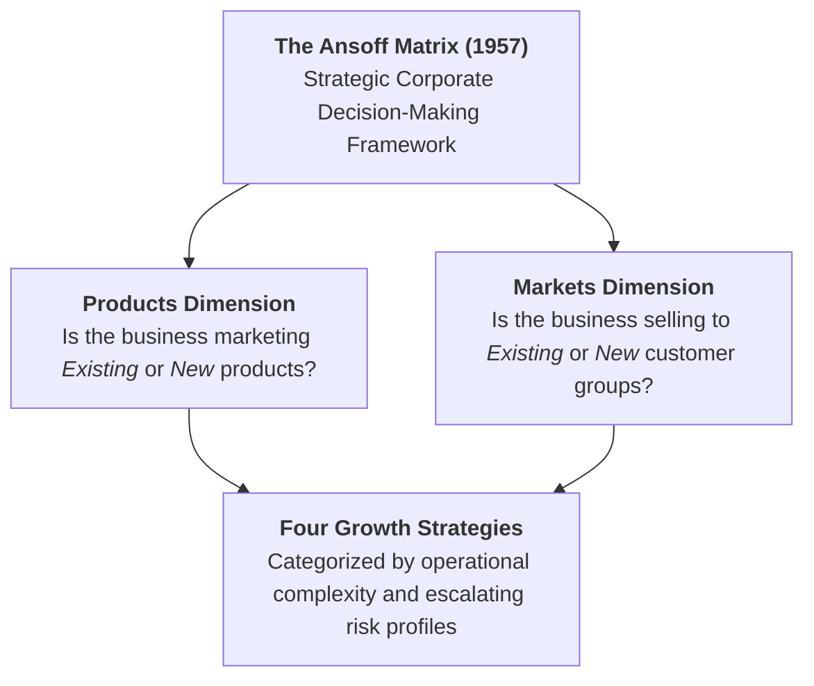
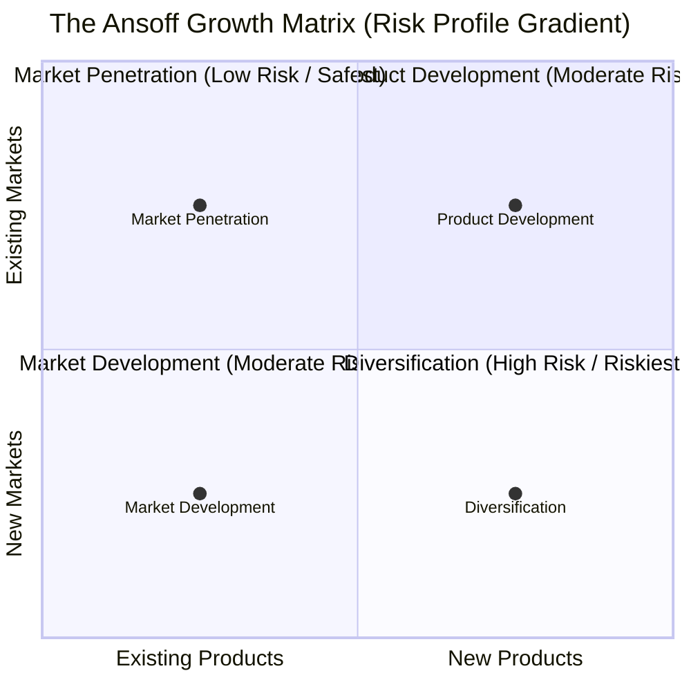
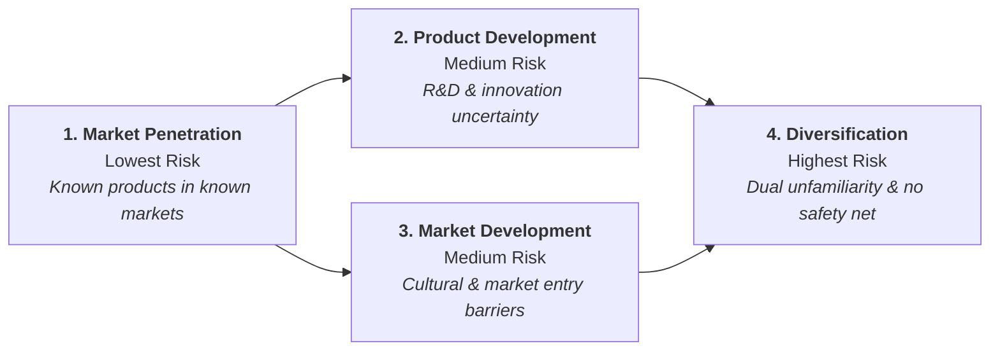
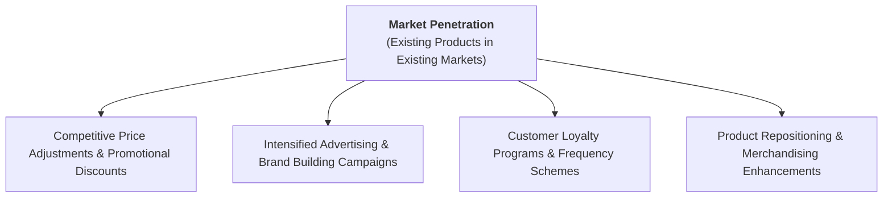
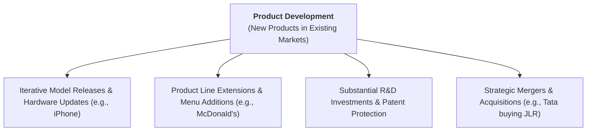
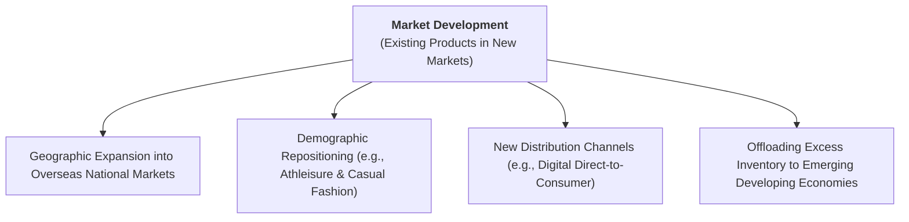
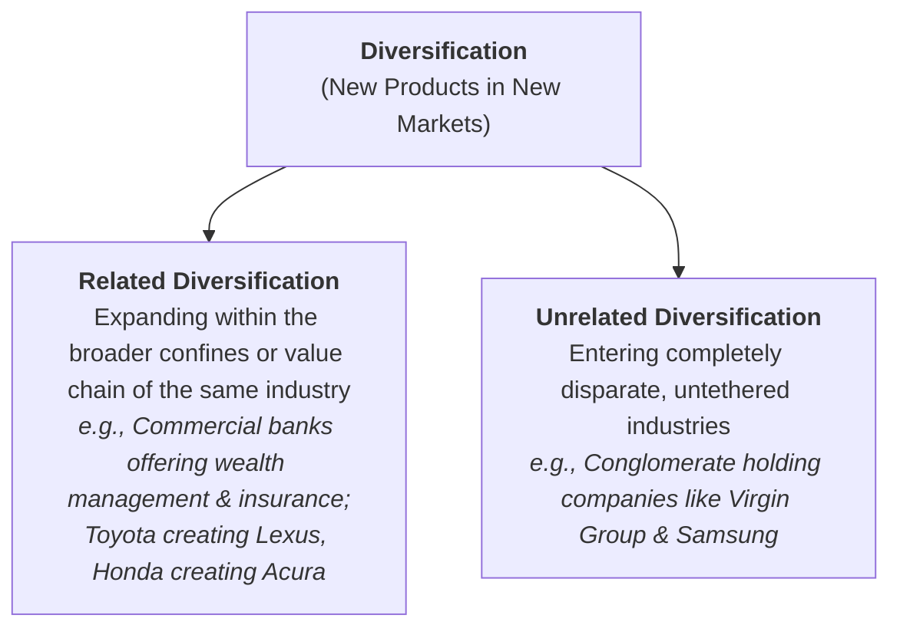
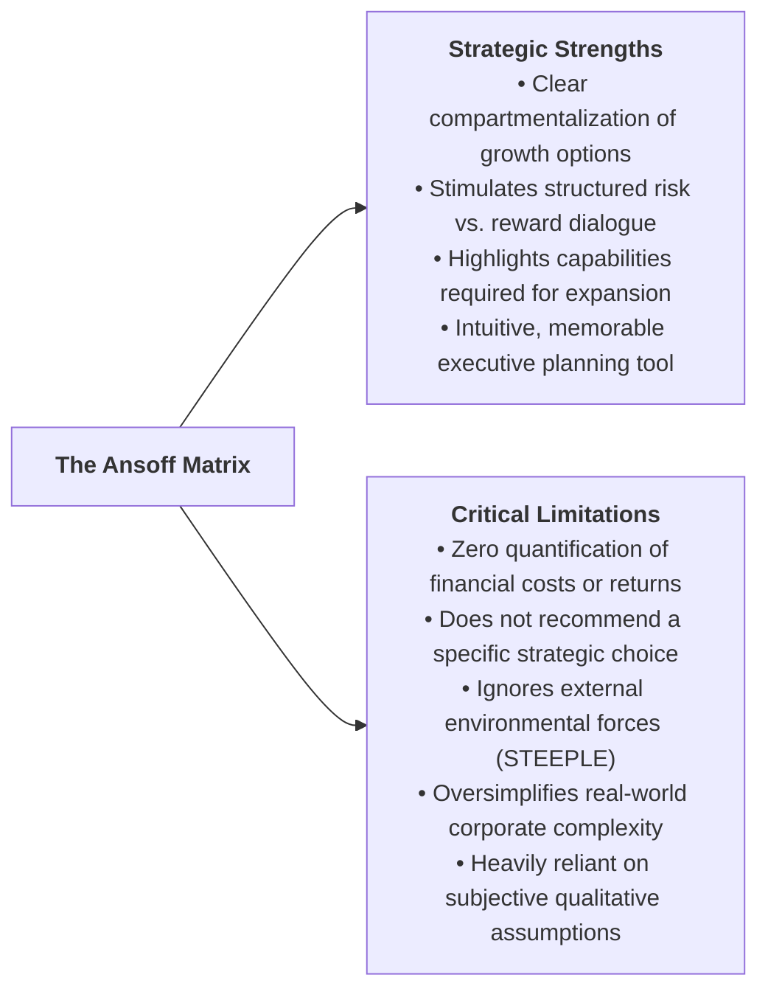

# Business Management Toolkit 2: The Ansoff Matrix

> **IB Business Management | Business Management Toolkit (BMT)**  
> **Tool:** BMT 2 – The Ansoff Matrix (SL/HL Core)

---

## 1. Origin, Definition, and Strategic Role

The **Ansoff Matrix** is a classic analytical decision-making framework formulated in 1957 by Russian-American applied mathematician and strategic management pioneer **Professor Igor Ansoff** (1918–2002), widely recognized as the *"Father of Strategic Management"*.

### Purpose and Function in Strategic Management

In the IB Business Management curriculum, the Ansoff Matrix is classified as a **decision-making tool**. Its primary functions include:

* **Structuring Growth Options:** Providing executive leaders and entrepreneurs with a logical, four-quadrant model to analyze and choose corporate growth vectors.
* **Evaluating Strategic Risk:** Mapping out the inherent uncertainty and risk profile associated with each strategic option, enabling firms to balance capital outlay against potential failure.
* **Resource and Capability Alignment:** Assisting managers in determining whether corporate expansion requires optimizing existing operational assets or developing entirely new technological and marketing competencies.

---

## 2. The 2x2 Matrix Structure & Risk Gradient

The model maps **Products** (Existing vs. New) along the horizontal axis against **Markets** (Existing vs. New) along the vertical axis, creating four distinct strategic growth pathways:

### The 2x2 Matrix Layout

| | **Existing Products** | **New Products** |
| :---: | :---: | :---: |
| **Existing Markets** | **Market Penetration** *(Low Risk — Safest Option)* | **Product Development** *(Medium / Moderate Risk)* |
| **New Markets** | **Market Development** *(Medium / Moderate Risk)* | **Diversification** *(High Risk — Riskiest Option)* |

### The Ascending Risk Continuum

Risk escalates systematically as a business ventures further from its established knowledge base:

1. **Market Penetration (Lowest Risk):** Operates entirely within known territory—established products sold to familiar customer demographics. Market research and product development expenses are minimized.
2. **Product Development & Market Development (Moderate Risk):** Carry intermediate risk because the firm steps into one dimension of unfamiliarity (either designing an unproven product or navigating an unfamiliar customer segment/region).
3. **Diversification (Highest Risk):** Represents the ultimate corporate gamble. The enterprise must master new product technologies while simultaneously attempting to appeal to unfamiliar customer groups without any preexisting brand equity.

---

## 3. Deep Breakdown of the Four Growth Strategies

---

### Strategy 1: Market Penetration (Existing Products $\times$ Existing Markets)

**Market Penetration** is a growth strategy centered on maximizing sales revenue and market share by selling existing products to existing customer segments.

#### Core Operational Approaches & Tactics
* **Competitive Pricing:** Lowering retail prices (discounting, loss leaders, price matching) to lure price-sensitive customers away from direct rivals.
* **Enhanced Advertising & Promotion:** Launching aggressive marketing blitzes across digital and traditional media to elevate brand recall and encourage heavier usage.
* **Customer Loyalty Schemes:** Rewarding repeat purchases through membership programs, points cards, and exclusive perks (e.g., Starbucks Rewards, airline frequent flyer programs).
* **Brand Repositioning:** Refreshing packaging, visual identity, or retail displays to make the existing product line more appealing to current buyers without modifying its underlying formula.

#### Strategic Advantages
* **Lowest Risk Profile:** Safest of the four strategies because management leverages deep, existing institutional knowledge of customer behavior and market dynamics.
* **Capital Efficiency:** Eliminates expensive R&D, product testing, and new factory tooling costs, keeping market research expenses minimal.
* **Immediate Economies of Scale:** Driving higher production volumes through existing facilities lowers average unit costs ($ATC$).

#### Inherent Limitations & Strategic Risks
* **Aggressive Competitor Retaliation:** Rivals will not surrender market share passively; aggressive price discounting frequently triggers devastating **price wars** that decimate profit margins across the industry.
* **Market Saturation Ceiling:** Once an existing market reaches maturity or saturation, customer acquisition costs soar and incremental growth becomes mathematically impossible, forcing the firm to adopt alternative growth strategies.

---

### Strategy 2: Product Development (New Products $\times$ Existing Markets)

**Product Development** involves creating and launching completely new, modified, or updated products targeted at the firm's established customer base.

#### Core Operational Approaches & Real-World Examples
* **Iterative Upgrades & Annual Product Cycles:**
  * **Apple Inc.:** Apple introduced the revolutionary iPhone in 2007 and has since generated hundreds of billions by releasing sequential model iterations (iPhone 12, 13, 14, 15, 16) to its fiercely loyal user base.
  * **Automotive Manufacturers:** Car makers frequently launch new vehicle lines, facelifts, electric vehicle ($EV$) conversions, and limited-edition trims to retain existing motorists.
* **Product Line Extensions & Menu Additions:**
  * **McDonald's:** Frequently develops new breakfast sandwiches, seasonal wraps, artisan McCafé beverages, and plant-based burgers (McPlant) to boost average customer spend inside established restaurants.
* **Brand Leveraging:**
  * Globally trusted powerhouses like **Sony** or **Nike** can launch new electronics or apparel items with reduced adoption risk because customers already trust the master brand umbrella.
* **Mergers & Acquisitions (M&A) for Rapid Product Addition:**
  * Rather than spending a decade developing luxury automotive engineering from scratch, Indian automaker **Tata Motors** acquired British luxury icons **Jaguar and Land Rover** in 2008 for \$2.3 billion, instantly acquiring a premium product line to sell to affluent motorists.

#### Strategic Advantages
* **Caters to Evolving Customer Demands:** Keeps existing customers engaged, prevents brand fatigue, and defends against competitors who introduce newer technologies.
* **Prolongs the Product Life Cycle:** Functions as a vital **product extension strategy**, revitalizing revenues when legacy product lines enter saturation or decline.
* **High Customer Trust:** Existing customers are predisposed to trial new offerings due to preexisting brand loyalty and familiarity.

#### Inherent Limitations & Strategic Risks
* **Exorbitant R&D and Tooling Costs:** Heavy capital commitments required for design prototypes, engineering validation, patent filing, and promotional rollouts.
* **Risk of Cannibalization:** The new product may capture sales directly from the firm's own profitable legacy products rather than taking share from competitors.
* **Execution Failure:** Introducing an inferior or defective new product into a familiar, competitive market can permanently tarnish the master brand's hard-won reputation.

---

### Strategy 3: Market Development (Existing Products $\times$ New Markets)

**Market Development** is a growth strategy centered on marketing established products to entirely new customer segments or geographic territories.

#### Core Operational Approaches & Real-World Examples
* **Geographic Expansion (Overseas / International Trade):**
  * Opening retail stores, hiring local distributors, or establishing foreign subsidiaries in previously unserved countries.
* **Demographic Targeting & Repositioning:**
  * **Nike and Adidas:** Successfully marketed technical running, tennis, and basketball athletic footwear as high-fashion casual streetwear (*athleisure*), capturing an enormous demographic of non-athletic lifestyle consumers.
* **New Distribution Channels:**
  * **Adidas & E-Commerce:** The COVID-19 pandemic severely disrupted physical retail, prompting Adidas to pivot aggressively to digital distribution channels and direct-to-consumer e-commerce, committing to double online revenues to over €9 billion.
* **Targeting Lower-Income Emerging Markets:**
  * **Nokia:** Faced with rapid smartphone upgrade cycles in saturated Western markets, Nokia redirected large volumes of durable, cost-effective mobile devices to rapidly growing lower-income economies such as Sri Lanka, Indonesia, and Nigeria.

#### Strategic Advantages
* **Product Familiarity:** Management possesses complete technical certainty regarding the product's performance, supply chain, and manufacturing tolerances.
* **Life Cycle Extension Without R&D Outlay:** Extends commercial profitability without requiring redesign, reformulating, or retooling expenses.
* **Diversified Revenue Base:** Shields the company from macroeconomic downturns isolated to its domestic home market.

#### Inherent Limitations & High-Profile Corporate Failures

Entering an unfamiliar market carries severe operational, cultural, and competitive risks:

* **Target Corporation's Canadian Collapse (2013–2015):**
  * U.S. retail giant Target expanded into Canada by opening 133 stores almost simultaneously. It failed completely due to profound supply chain breakdowns (empty shelves), uncompetitive pricing, and a fundamental misunderstanding of Canadian consumer expectations. Target shuttered all Canadian operations in 2015, liquidating the business with cumulative losses exceeding **\$2 billion**.
* **Carrefour's Retreat from Southeast Asia (2010):**
  * French hypermarket behemoth Carrefour struggled to adapt to local shopping habits, regulatory constraints, and entrenched domestic competitors, forcing it to pull out of Thailand, Malaysia, and Singapore.
* **Google in Mainland China:**
  * Despite global search dominance, Google was unable to outcompete local Chinese champion **Baidu** (which held ~85% domestic market share), eventually redirecting search services due to regulatory censorship and local competitive dynamics.

---

### Strategy 4: Diversification (New Products $\times$ New Markets)

**Diversification** is the sale of entirely new products in completely new, untapped markets. It represents the boldest, most radical, and **highest-risk** growth option in strategic management.

#### The Two Dimensions of Diversification

##### 1. Related Diversification
* **Definition:** Entering new customer segments or market categories that remain connected to the firm's broader industry, supply chain, or core technical capabilities.
* **Risk Profile:** **Moderate to High**—significantly safer than unrelated diversification because the firm transfers relevant product know-how and supplier networks.
* **Examples:**
  * **Financial Institutions:** Commercial retail banks diversifying into wealth management, private banking, commercial mortgages, and insurance policies.
  * **Automotive Luxury Tiers:** Mainstream Japanese car manufacturers successfully launching dedicated upmarket luxury automotive brands to capture affluent motorists: **Toyota $\rightarrow$ Lexus**, **Nissan $\rightarrow$ Infiniti**, and **Honda $\rightarrow$ Acura**.

##### 2. Unrelated Diversification (Conglomerate Integration)
* **Definition:** Expanding into completely disparate, unrelated industries where the business shares zero marketing, operational, or technical synergies.
* **Risk Profile:** **Extreme Risk**—the enterprise operates without any established domain expertise or customer familiarity.
* **The Holding Company / Conglomerate Model:**
  * A **holding company (or parent company)** owns controlling shareholdings in a diverse portfolio of subsidiary operating companies across different global industries.
  * **WarnerMedia (Holding Company):** Controls a sprawling empire of entertainment subsidiaries, including Warner Bros, Cinemax, DC Comics, CNN, HBO, and Cartoon Network.
  * **Virgin Group Ltd.:** Co-founded by Sir Richard Branson in 1970, Virgin grew from a small mail-order record retailer into a multinational conglomerate spanning airlines (Virgin Atlantic), telecommunications (Virgin Media), health clinics (Virgin Care), fitness (Virgin Active), financial services (Virgin Money), hospitality (Virgin Hotels), cruise liners (Virgin Voyages), and commercial spaceflight (Virgin Galactic).
  * **Samsung Group:** Massive South Korean *chaebol* with autonomous business units spanning smartphones and microchips (Samsung Electronics), massive container ships (Samsung Heavy Industries), skyscraper engineering (Samsung C&T), petrochemicals, and life insurance.
  * **Honda Motor Co.:** Renowned for passenger cars and motorcycles, Honda expanded into robotic lawnmowers, marine outboard engines, power generators, and executive business aircraft (HondaJet).

#### Rationale for Pursuing Diversification
* **Risk Spreading:** Building a balanced conglomerate portfolio ensures that economic downturns in one sector (e.g., commercial aerospace) are cushioned by profitable stability in another (e.g., consumer broadband or healthcare).
* **Escape from Dying / Saturated Markets:** If a firm's core industry faces permanent terminal decline (e.g., tobacco manufacturing, coal mining), aggressive diversification is an existential necessity for long-term corporate survival.

#### High-Profile Failures & Diversification Disasters

Operating outside core competencies frequently results in catastrophic capital destruction:

* **Harley-Davidson Perfume & Aftershave (1990s):**
  * Iconic motorcycle brand Harley-Davidson launched a line of colognes and aftershaves (*"Hot Rod"*). Loyal, hardcore motorcycle enthusiasts viewed the product as a ludicrous brand betrayal, causing deep offense and embarrassing brand dilution. The line was swiftly discontinued.
* **Next Plc's Tablet Computers (2010):**
  * Prominent UK high-street fashion and home retailer Next attempted to enter the consumer electronics sector by releasing an own-brand Android tablet computer. With zero technical credibility, buggy hardware, and fierce competition from Apple and Samsung, the initiative flopped completely.
* **Virgin Cola (1994):**
  * Richard Branson launched Virgin Cola to challenge the global duopoly of Coca-Cola and Pepsi. Despite massive publicity stunts (driving a tank into Times Square), Virgin was ruthlessly outmaneuvered by Coca-Cola's global distribution contracts and retail shelf dominance. Virgin Cola captured a meager 3% UK market share before folding.
* **Loss of Strategic Focus:** Distracted management teams spend disproportionate energy trying to rescue failing non-core subsidiaries, leaving the core profit-generating business vulnerable to focused rivals.

---

## 4. Comprehensive Comparison Table of Ansoff Strategies

Below is the definitive syllabus comparison matrix synthesizing the four growth strategies (aligned with Paul Hoang Table 45.1 and IB assessment criteria):

| Strategic Dimension | Market Penetration | Product Development | Market Development | Diversification |
| :--- | :--- | :--- | :--- | :--- |
| **Product Type** | **Existing** Products | **New** Products | **Existing** Products | **New** Products |
| **Target Market** | **Existing** Customers | **Existing** Customers | **New** Customer Groups | **New** Customer Groups |
| **Relative Risk Level** | **Lowest Risk (Safest)** | **Moderate / Medium Risk** | **Moderate / Medium Risk** | **Highest Risk (Riskiest)** |
| **Primary Corporate Goal** | Protect or expand market share in known territory | Innovate to replace maturing products; deepen customer wallet share | Exploit geographic expansion or unlock new demographic segments | Spread risk across diverse industries; overcome market saturation |
| **Key Operational Drivers** | Competitive pricing, loyalty rewards, heavy promotions, brand repositioning | High R&D expenditure, prototype testing, product extension, brand equity | Export licensing, local distributor partnerships, cultural adaptation, digital channels | Mergers & acquisitions, holding company governance, autonomous business units |
| **Competitive Dynamics** | Fierce rivalry; high threat of retaliatory **price wars** | Threat of customer resistance or self-cannibalization | Threat from entrenched domestic rivals and foreign regulatory hurdles | Operating without core competencies; severe risk of managerial distraction |

---

## 5. Critical Evaluation of the Ansoff Matrix

To attain maximum marks in IB evaluative essays (AO3 Analysis and Evaluation), students must understand both the strategic utility and the structural shortcomings of the Ansoff Matrix.

### Strategic Strengths & Advantages

1. **Structured Compartmentalization:**
   * It provides senior executives and board members with a clean, disciplined framework to categorize strategic growth vectors rather than pursuing ad-hoc expansion.
2. **Prompts Rigorous Risk Assessment:**
   * By framing growth choices around unfamiliarity, it compels decision-makers to evaluate whether the business possesses the risk tolerance, cash reserves, and organizational capabilities to execute the strategy.
3. **Facilitates Executive Consensus:**
   * It serves as a visual catalyst during strategic retreats, helping diverse stakeholders align on corporate priorities and resource allocation.

### Inherent Limitations & Analytical Deficiencies

1. **Absence of Quantitative Modeling:**
   * The matrix does not calculate probabilities of success, return on investment (ROI), net present value (NPV), or payback periods. It treats risk purely as a qualitative concept.
2. **Does Not Prescribe a Specific Decision:**
   * Unlike formal decision trees, the Ansoff Matrix cannot tell a board of directors *which* of the four options to finance. The final choice remains entirely dependent on managerial intuition and external research.
3. **Ignores Macro-Environmental Context (STEEPLE):**
   * The matrix looks inward at products and markets while ignoring vital external variables such as economic recessions, antitrust legislation, currency exchange fluctuations, and ecological pressures.
4. **Neglects Competitor Dynamics:**
   * The model assumes a static competitive landscape, failing to anticipate how aggressive rivals will react when a firm launches a new product or enters their geographic market.
5. **Real-World Multinationals Pursue Multiple Strategies Concurrently:**
   * In reality, large multinational corporations do not restrict themselves to a single quadrant. An enterprise like Apple or Nike simultaneously executes **Market Penetration** (advertising sneakers/phones), **Product Development** (introducing smartwatches/wearables), **Market Development** (expanding across Latin America/India), and **Diversification** (investing in streaming entertainment/electric car tech).

> [!IMPORTANT]
> **Syllabus Integration:** The Ansoff Matrix is most effective when deployed as part of an integrated toolkit. Decision-makers should combine it with **SWOT Analysis** (to audit internal capabilities), **STEEPLE Analysis** (to evaluate external market conditions), and **Decision Trees / Investment Appraisal** (to quantify financial risk and projected returns).

---

## 6. IB Exam Practice & Application Guide

When answering IB examination questions on the Ansoff Matrix, students should adhere to the following best-practice protocols:

* **Identify the Starting Baseline:** In any case study stimulus, always identify what the business *currently* manufactures and to whom it *currently* sells before evaluating a proposed expansion.
* **Distinguish Between Related and Unrelated Diversification:** If an exam question asks about Diversification, distinguish whether the business is expanding into an adjacent value-chain sector (Related) or a completely disconnected industry (Unrelated). This nuance demonstrates superior subject mastery.
* **Highlight Risk-Adjusted Resource Allocation:** Never recommend Diversification without explicitly addressing the company's financial liquidity, debt gearing, and whether management has the bandwidth to manage an unfamiliar enterprise.
