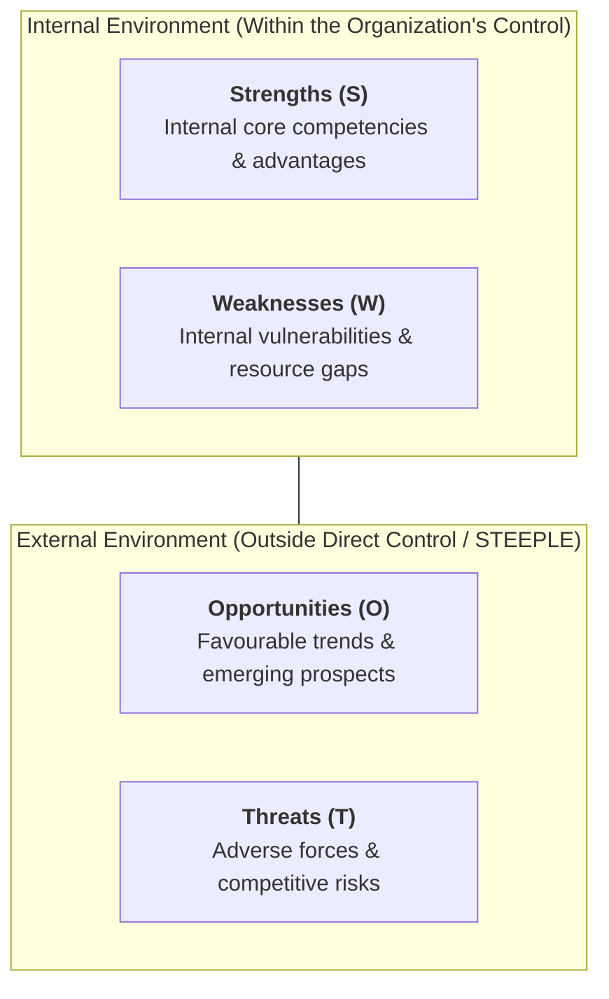
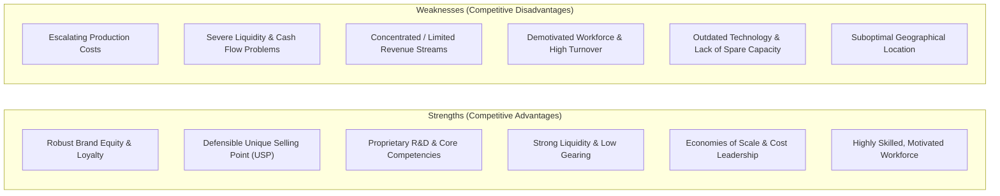
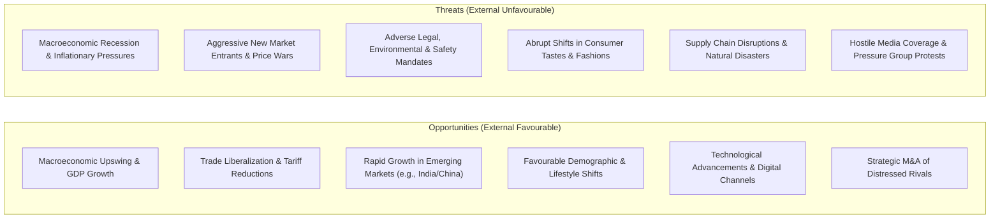
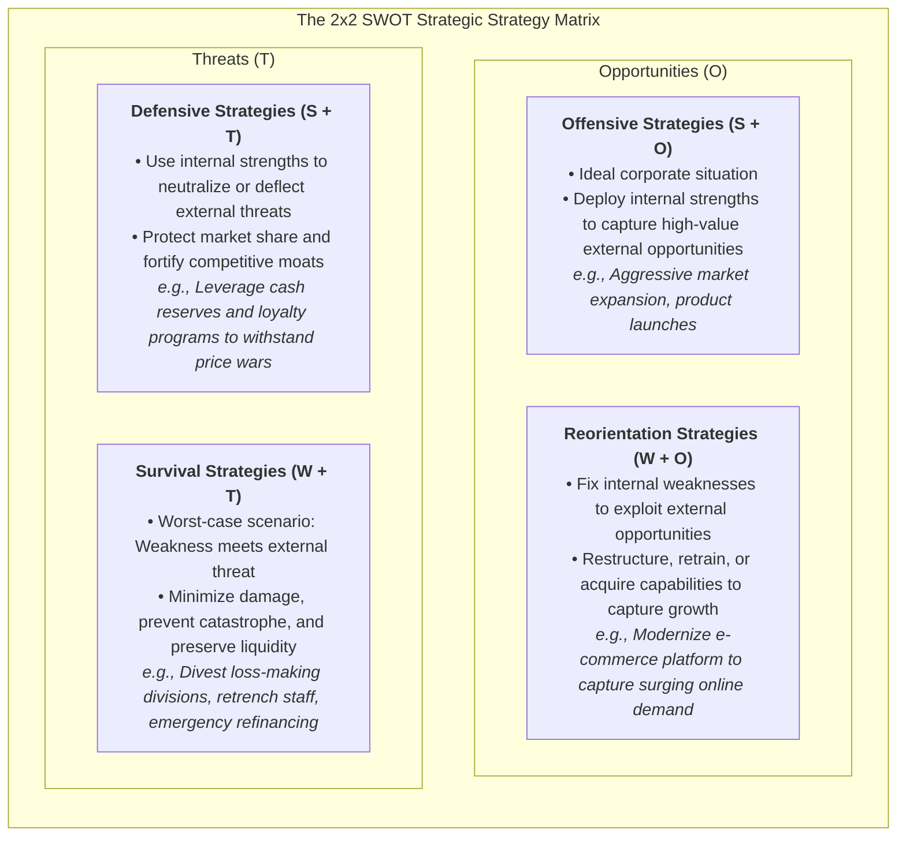
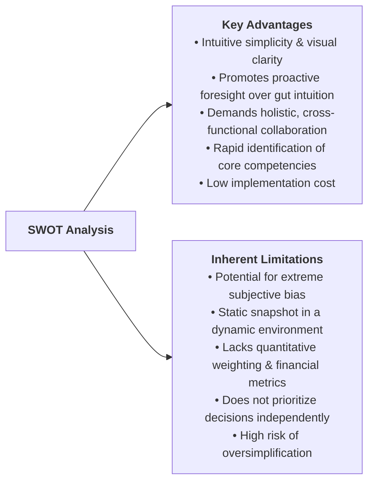

# Business Management Toolkit 1: SWOT Analysis

> **IB Business Management | Business Management Toolkit (BMT)**  
> **Tool:** BMT 1 – SWOT Analysis (SL/HL Core)

---

## 1. Introduction & Overview

**SWOT Analysis** is a foundational strategic management and situational analysis tool used to evaluate the internal factors (**Strengths** and **Weaknesses**) and external environmental conditions (**Opportunities** and **Threats**) of an organization or project.

### The Role of SWOT as a Situational Tool

In the IB Business Management syllabus, SWOT is classified primarily as a **situational analysis tool**. It provides a structured, visual diagnostic snapshot of an enterprise at a specific point in time, enabling decision-makers to:

1. **Conduct Competitor Analysis:** Systematically compare internal assets and market positioning against direct and indirect industry rivals.
2. **Assess Future Opportunities:** Identify promising product lines, market segments, or geographic territories for expansion.
3. **Perform Strategic Risk Assessment:** Gauge the organizational risk profile before committing capital to major investments, mergers, or relocations.
4. **Review Corporate Strategy:** Determine whether the current corporate direction aligns with changing market dynamics or whether a strategic pivot is required.
5. **Formulate Planning Frameworks:** Guide complex decisions such as entering international markets, pursuing diversification, or restructuring operations.

> [!NOTE]
> The internal/external boundary is crucial for IB assessments:
> * **Internal factors (S & W)** relate to the organization's current resources, operational processes, and capabilities. Management exercises direct control over them.
> * **External factors (O & T)** originate from the macro-environment (STEEPLE: Social, Technological, Economic, Environmental, Political, Legal, and Ethical forces). Management cannot directly control them, but must strategically respond and adapt to them.

---

## 2. Internal Factors: Strengths & Weaknesses

Internal factors reflect an organization's tangible assets, human capabilities, brand equity, and operational efficiencies compared directly with its competitors.

### Strengths (Internal & Favourable)

* **Definition:** Internal organizational capabilities, resources, and favorable attributes that give an enterprise a clear competitive advantage over its rivals.
* **Strategic Role:** Strengths help the business achieve its organizational objectives. Management must actively protect, develop, and leverage these core competencies.
* **Core Real-World Examples:**
  * **Brand Awareness & Loyalty:** Apple's dedicated customer ecosystem; Nike's global brand recognition.
  * **Unique Selling Point (USP):** Dyson's patented cyclone airflow technology; Tesla's proprietary Supercharger network.
  * **Core Competencies & Quality:** Toyota's lean production system ($Kaizen$ / Just-in-Time); Hermès' master leather craftsmanship.
  * **Financial Health:** High retained cash balances allowing opportunistic acquisitions without incurring burdensome debt.
  * **Geographical Advantage:** Prime retail storefronts on Fifth Avenue or Bond Street ensuring massive pedestrian footfall.

### Weaknesses (Internal & Unfavourable)

* **Definition:** Internal limitations, resource deficiencies, or operational bottlenecks that place an enterprise at a competitive disadvantage relative to rivals.
* **Strategic Role:** Weaknesses hinder or delay the organization from reaching its targets. To survive and remain competitive, management must eliminate, reduce, or reverse these deficiencies.
* **Core Real-World Examples:**
  * **Poor Cash Flow & Liquidity Squeezes:** Insufficient working capital leading to missed supplier discounts or delayed payroll.
  * **Escalating Production Costs:** Obsolete machinery requiring frequent repairs and generating excessive scrap waste.
  * **Restricted Product Range & Revenue Concentration:** Relying on a single flagship product (e.g., a software company dependent on one enterprise contract).
  * **Demotivated / Unproductive Workforce:** Poor labor relations, high absenteeism, and elevated staff turnover requiring continuous recruiting expenditure.
  * **Lack of Spare Capacity:** Operating at 100% capacity utilization, preventing the business from accepting sudden high-volume customer orders.

---

## 3. External Factors: Opportunities & Threats

External factors emerge from the surrounding macro-economic, competitive, and regulatory environment. They represent changing circumstances that the business must navigate.

### Opportunities (External & Favourable)

* **Definition:** External possibilities, developments, and favorable conditions in the macro-environment that an organization can exploit to fuel growth and improve profitability.
* **Strategic Role:** Represent future prospects that management can harness through proactive product development or market expansion strategies.
* **Core Real-World Examples:**
  * **Rapidly Expanding Emerging Markets:** The burgeoning middle classes in India and Southeast Asia creating massive consumer demand for consumer electronics, travel, and personal luxury goods.
  * **Trade Liberalization & Bilateral Free Trade Agreements:** Lowered customs duties and harmonized import standards enabling low-cost cross-border exporting.
  * **Favourable Currency Movements:** A depreciating domestic currency that makes exported goods significantly cheaper and more attractive in overseas markets.
  * **Demographic & Lifestyle Trends:** An aging population fueling demand for specialized healthcare, retirement services, and pharmaceutical innovations.
  * **Government Support Programmes:** Subsidies, tax incentives, and green infrastructure grants for renewable energy providers.

### Threats (External & Unfavourable)

* **Definition:** External developments, constraints, or hazards in the macro-environment that jeopardize the commercial viability, profitability, or market position of an enterprise.
* **Strategic Role:** Threats cause direct harm if ignored. Management must implement defensive contingency measures and risk-mitigation plans to insulate the firm.
* **Core Real-World Examples:**
  * **Severe Economic Downturn / Stagflation:** High inflation eroding household disposable income while soaring raw material and energy costs squeeze corporate margins.
  * **Aggressive New Market Entrants & Disruptors:** Low-cost budget carriers (e.g., Ryanair, Southwest) disrupting legacy airlines; digital streaming disrupting legacy cable television.
  * **Regulatory & Environmental Sanctions:** Stricter carbon emission caps, sugar taxes, or elevated statutory minimum wage rates increasing compliance overhead.
  * **Technological Disruption & Systemic Breakdowns:** Rapid emergence of generative artificial intelligence rendering traditional knowledge-work workflows obsolete; catastrophic cybersecurity breaches.
  * **Adverse Changes in Fashions & Consumer Sentiment:** Sudden decline in demand for single-use plastics or animal-tested cosmetics following viral social media campaigns.

---

## 4. Comprehensive SWOT Analysis Template

Below is the definitive illustrative template (adapted from the IB syllabus and Paul Hoang's curriculum standards) synthesizing internal and external factors:

| Factor Type | Positive / Favourable Attributes | Negative / Unfavourable Attributes |
| :--- | :--- | :--- |
| **Internal Factors** *(Organization-specific)* | **STRENGTHS (S)** • Defensible Unique Selling Point (USP) • Superior brand awareness and customer loyalty • Deep organizational experience, skills, and intellectual property • Dominant market share and scale advantages • Positive corporate reputation and high ethical standing • Official industry accreditations and regulatory endorsements • Distinctive core competencies (e.g., proprietary software, craftsmanship) • Strategic, prime geographical locations • Exceptional value proposition (quality-to-price ratio) | **WEAKNESSES (W)** • Vulnerable, single-stream revenue dependence • Escalating unit costs of production and high scrap rates • Acute cash flow insolvency and working capital deficiencies • Higher retail pricing compared to direct competitors • Demotivated, unproductive, or poorly trained workforce • Severely restricted access to external debt and equity finance • Inadequate spare capacity to absorb peak demand • Outdated, narrow, or obsolete product portfolio • Suboptimal, inaccessible geographical location |
| **External Factors** *(Macro-environment)* | **OPPORTUNITIES (O)** • Robust economic growth and cyclical upswings • Free trade liberalization and tariff reductions • Weakening domestic exchange rate boosting export sales • Breakthrough technological developments (e.g., automation, AI) • Significant state investment in transport and logistics infrastructure • Industry-wide market growth and expanding consumer pools • High-potential emerging markets and untargeted demographics • Favourable shifts in consumer lifestyles and health consciousness • Government subsidies, grants, and stimulus funding • Distressed rival acquisitions and joint venture prospects | **THREATS (T)** • Influx of well-funded, disruptive new market competitors • Severe macroeconomic recession or consumer confidence collapse • Rapid inflationary pressures driving up energy and wage inputs • Hostile pressure group boycotts and activist shareholder campaigns • Onerous social, environmental, and workplace legal mandates • Viral negative media coverage and public relations crises • Unfavourable seasonality, extreme weather events, or natural disasters • Abrupt shifts in consumer fashion, dietary trends, or cultural tastes • Systemic geopolitical crises, trade wars, or energy supply outages |

> [!TIP]
> **Contextual Relativity:** What constitutes a strength for one firm might represent a weakness for another. For example, a vast physical retail footprint is a strength for an established luxury house providing bespoke client experiences, but a crippling cost weakness for a discount bookseller competing with Amazon. Similarly, an exceptionally cold winter is a catastrophic threat to an outdoor theme park, but a lucrative opportunity for a ski resort operator.

---

## 5. The 2x2 Strategic Matrix Formulation

Merely listing strengths, weaknesses, opportunities, and threats provides minimal value to senior managers. A SWOT analysis becomes truly powerful when the four quadrants are systematically combined to generate **actionable strategic choices**.

### The Four Strategic Quadrants

#### 1. Offensive Strategies (Strengths + Opportunities)
* **Strategic Posture:** **Maxi-Maxi (Aggressive Growth)**.
* **Context:** The ideal strategic scenario where a company possesses formidable internal strengths that directly align with expanding external opportunities.
* **Action:** Deploy capital aggressively to capture dominant market share, enter high-growth sectors, and maximize commercial advantage.
* **Exam Application Example:** An athletic footwear giant with strong global brand equity and billions in cash reserves (Strengths) uses those resources to launch a premium direct-to-consumer digital fitness app in rapidly growing Asian markets (Opportunities).

#### 2. Defensive Strategies (Strengths + Threats)
* **Strategic Posture:** **Maxi-Mini (Protection & Resilience)**.
* **Context:** The business faces severe external environmental threats, but possesses robust internal strengths that can be leveraged to shield the company from disruption.
* **Action:** Utilize financial muscle, brand loyalty, or proprietary technology to neutralize rival maneuvers, erect barriers to entry, and protect existing market standing.
* **Exam Application Example:** A legacy automotive manufacturer with a global dealership network and massive supply chain clout (Strengths) leverages those assets to absorb temporary tariff increases and outlast budget competitors entering the domestic territory (Threats).

#### 3. Reorientation Strategies (Weaknesses + Opportunities)
* **Strategic Posture:** **Mini-Maxi (Turnaround & Capability Building)**.
* **Context:** An attractive external opportunity exists, but the enterprise is currently incapable of capitalizing on it due to an acute internal weakness or bottleneck.
* **Action:** Reorient internal operational policies, retrain personnel, recapitalize, or form strategic alliances to eliminate the weakness so the opportunity can be seized.
* **Exam Application Example:** A traditional brick-and-mortar grocery chain with an outdated inventory IT system (Weakness) partners with a specialized logistics software company or raises equity to overhaul its supply chain, allowing it to serve the booming home-delivery grocery sector (Opportunity).

#### 4. Survival Strategies (Weaknesses + Threats)
* **Strategic Posture:** **Mini-Mini (Damage Limitation & Retrenchment)**.
* **Context:** The most perilous, high-risk situation imaginable. Internal vulnerabilities directly expose the firm to external threats, threatening commercial insolvency.
* **Action:** Immediate damage control, cost rationalization, debt restructuring, divesting non-core subsidiaries, and retrenching headcount to prevent business failure.
* **Exam Application Example:** An indebted regional department store chain with high rental overhead and falling footfall (Weakness) faces a severe macroeconomic recession and aggressive online discount rivalry (Threats). It closes 40 unprofitable outlets, lays off administrative personnel, and renegotiates debt terms with creditors simply to avoid bankruptcy.

---

## 6. Critical Evaluation of SWOT Analysis

To attain top marks in IB assessments (Evaluation AO3), students must critically appraise the utility and inherent constraints of SWOT analysis.

### Advantages & Strengths of the Model

1. **Simplicity and Visual Clarity:**
   * It provides an accessible, standardized visual framework that simplifies complex strategic variables into an easily digestible format for board directors and frontline managers alike.
2. **Encourages Foresight and Proactive Thinking:**
   * It forces leaders to look beyond day-to-day firefighting and intuitive reactions, encouraging deliberate forward-looking planning and contingency readiness.
3. **Fosters Holistic and Collaborative Strategy:**
   * Developing a SWOT analysis brings together leaders from finance, marketing, operations, and human resources, breaking down corporate silos and encouraging a shared strategic consensus.
4. **Uncovers Core Competencies:**
   * It systematically isolates the distinct, defensible capabilities of the enterprise, ensuring that subsequent strategic decisions build upon authentic organizational advantages.
5. **Cost-Effective Diagnostic:**
   * It does not mandate complex mathematical simulations or expensive software, making it accessible to small startups and multinational conglomerates alike.

### Disadvantages & Inherent Limitations

1. **Potential for Subjective Bias and Blind Spots:**
   * The selection of items is highly subjective. Executive teams may downplay glaring organizational weaknesses or exaggerate minor competencies due to corporate vanity or political self-preservation.
2. **Static Snapshot of a Rapidly Changing Reality:**
   * A SWOT analysis captures conditions at a single point in time. In fast-paced industries (e.g., artificial intelligence, consumer electronics), technological disruption or regulatory shifts can render a SWOT obsolete within months.
3. **Absence of Quantitative Weighting:**
   * Standard SWOT diagrams do not assign numerical weights, probabilities, or financial values to items. It does not measure the dollar cost of fixing an internal weakness against the projected revenue return from pursuing an opportunity.
4. **Does Not Independently Prioritize Strategic Decisions:**
   * While it generates strategic options (Offensive, Defensive, Reorientation, Survival), it provides no internal algorithmic criteria to determine which specific project should be financed first.
5. **Risk of Oversimplification:**
   * Compressing intricate market complexities into single bullet points risks stripping out vital contextual nuances, potentially misleading strategic leaders into overly simplistic decisions.

> [!IMPORTANT]
> **Syllabus Recommendation:** A SWOT analysis should **never be used in isolation**. For robust strategic planning, decision-makers must cross-reference SWOT findings with **STEEPLE analysis** (to rigorously derive Opportunities and Threats), **Decision Trees** (to model quantitative payoffs and probabilities), and **Force Field Analysis** (to evaluate internal resistance to change).

---

## 7. IB Exam Tips & Application Technique

* **Avoid the Tabular Trap:** In IB examinations, do not merely present a SWOT analysis as a 2x2 grid containing isolated two-word bullet points. Examiners demand full, written analytical justifications showing the precise operational mechanisms and commercial consequences of each factor.
* **Explicitly Link External Factors to STEEPLE:** When explaining Opportunities and Threats, explicitly credit the macro-environmental STEEPLE dimension (e.g., *"This demographic shift represents a Social opportunity under STEEPLE..."*).
* **Ground in Case Study Context:** Never write generic answers. In Paper 1 and Paper 2 exams, ensure every single strength, weakness, opportunity, and threat is directly cited from the provided case study stimulus text.
