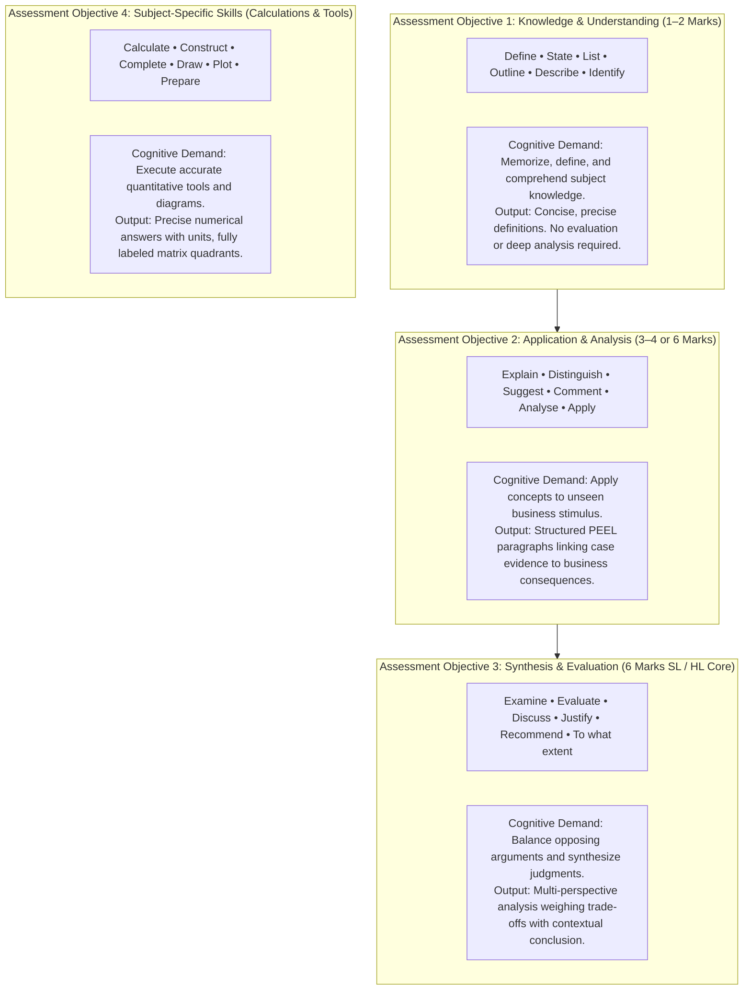

# IB Business Management: Extracted Question Bank & Assessment Guide

> **Syllabus Coverage:** Unit 1.1 (What is a Business?), Unit 1.2 (Types of Business Entities), Unit 1.3 (Business Objectives), Chapter 44 (SWOT Analysis Toolkit), Chapter 45 (Ansoff Matrix Toolkit), and Chapter 61 (External Assessment & Command Terms).  
> **Target Audience:** IB Business Management SL & HL Students preparing for Paper 1 and Paper 2 examinations.  
> **Assessment Scope:** MCQs, 2-Mark (AO1), 4-Mark (AO2), and 6-Mark (AO2/AO3) questions.  
> **Assessment Notice:** All 10-mark extended evaluation questions have been strictly excluded from this bank in accordance with modular unit test specifications.

---

## Table of Contents
1. [Section 1: Multiple Choice Questions (MCQs)](#section-1-multiple-choice-questions-mcqs)
   - [Unit 1.1: What is a Business? (Q1–Q6)](#unit-11-what-is-a-business)
   - [Unit 1.2: Types of Business Entities (Q7–Q13)](#unit-12-types-of-business-entities)
   - [Unit 1.3: Business Objectives (Q14–Q20)](#unit-13-business-objectives)
   - [Chapter 44: SWOT Analysis Toolkit (Q21–Q25)](#chapter-44-swot-analysis-toolkit)
   - [Chapter 45: Ansoff Matrix Toolkit (Q26–Q30)](#chapter-45-ansoff-matrix-toolkit)
2. [Section 2: 2-Mark Questions (AO1 Knowledge & Definition)](#section-2-2-mark-questions-ao1-knowledge--definition)
   - [Unit 1.1 Definitions & Knowledge Checks](#unit-11-definitions--knowledge-checks)
   - [Unit 1.2 Definitions & Business Entities](#unit-12-definitions--business-entities)
   - [Unit 1.3 Definitions & Objectives](#unit-13-definitions--objectives)
   - [Chapter 44 SWOT Analysis Knowledge Checks & Factor Classification](#chapter-44-swot-analysis-knowledge-checks--factor-classification)
   - [Chapter 45 Ansoff Matrix Knowledge Checks](#chapter-45-ansoff-matrix-knowledge-checks)
3. [Section 3: 4-Mark Questions (AO2 Application & Explanation)](#section-3-4-mark-questions-ao2-application--explanation)
   - [Structured PEEL Model Answers with Case Contexts](#structured-peel-model-answers-with-case-contexts)
4. [Section 4: 6-Mark Questions (AO2/AO3 Analysis & Examination)](#section-4-6-mark-questions-ao2ao3-analysis--examination)
   - [Two-Sided Balanced Analytical Model Answers with Mark Schemas](#two-sided-balanced-analytical-model-answers-with-mark-schemas)
5. [Section 5: IB Assessment Command Terms Guide](#section-5-ib-assessment-command-terms-guide)
   - [Figure 61.1 AO1–AO4 Taxonomy & Examiner Strategies](#figure-611-ao1ao4-taxonomy--examiner-strategies)

---

# Section 1: Multiple Choice Questions (MCQs)

### Unit 1.1: What is a Business?

#### Question 1
What is the fundamental economic purpose of business activity?
* A. To maximize tax revenue paid to national governments.
* B. To combine inputs through a transformation process to produce goods and services that satisfy human needs and wants.
* C. To convert non-renewable natural resources exclusively into consumer durable goods.
* D. To eliminate market competition by creating monopolistic barriers to entry.

> **Answer:** **B**  
> **Explanation:** Businesses exist as transformation systems taking inputs (factors of production: land, labor, capital, enterprise) and converting them into outputs (tangible goods or intangible services) that fulfill customer needs (necessities) or wants (desires). Option A is an externality/government objective. Option C is false because businesses also produce services, non-durable goods, and capital equipment. Option D describes anti-competitive strategy, not the fundamental purpose of business activity.

---

#### Question 2
Which factor of production encompasses the human skill, initiative, and financial risk-taking required to manage and coordinate resources in pursuit of business opportunities?
* A. Land
* B. Labor
* C. Capital
* D. Enterprise

> **Answer:** **D**  
> **Explanation:** Enterprise (or entrepreneurship) is the distinct factor of production that organizes and coordinates the other three factors (land, labor, capital), takes calculated business risks, and identifies market opportunities to earn a profit. Land (A) refers to natural physical resources; Labor (B) is the physical and mental workforce effort; Capital (C) refers to non-natural, man-made assets such as machinery, tools, and finance.

---

#### Question 3
How do capital goods differ fundamentally from consumer goods?
* A. Capital goods are sold to final households for immediate consumption, whereas consumer goods are sold to corporations.
* B. Capital goods are physical goods used by other businesses to produce further goods and services, whereas consumer goods satisfy individual end-user desires.
* C. Capital goods are always intangible services, whereas consumer goods are tangible physical products.
* D. Capital goods do not depreciate in financial value over time.

> **Answer:** **B**  
> **Explanation:** Capital goods (producer goods) are commercial assets (such as industrial machinery, commercial aircraft, delivery vans, and office computers) purchased by businesses to produce other goods or services. Consumer goods (such as clothing, food, personal smartphones) are purchased directly by private individuals/households for final consumption. Both can be tangible physical items, and capital goods do depreciate.

---

#### Question 4
An economy experiences a long-term structural shift where national employment moves from agricultural farming and mineral extraction to electronic manufacturing and industrial assembly. Which sector transition does this represent?
* A. Primary sector to Secondary sector
* B. Secondary sector to Tertiary sector
* C. Tertiary sector to Quaternary sector
* D. Quaternary sector to Primary sector

> **Answer:** **A**  
> **Explanation:** Agricultural farming and mineral extraction involve extracting and cultivating natural raw materials, which defines the **primary sector**. Manufacturing, industrial assembly, and construction transform raw materials into finished or semi-finished goods, defining the **secondary sector**. A shift between these two is known as industrialization.

---

#### Question 5
Which business function is directly responsible for identifying consumer needs, determining competitive pricing, promoting brand awareness, and managing channels of product distribution?
* A. Operations Management
* B. Finance and Accounts
* C. Human Resource Management
* D. Marketing

> **Answer:** **D**  
> **Explanation:** Marketing is responsible for identifying, anticipating, and satisfying customer requirements profitably through the 4 Ps (Product, Price, Place, Promotion). Operations Management (A) oversees the transformation of inputs into finished outputs. Finance and Accounts (B) manages financial records, budgeting, and liquidity. Human Resource Management (C) manages recruitment, training, appraisal, and employment legislation.

---

#### Question 6
Why do approximately 20% to 25% of new business start-ups fail within their first year of trading?
* A. Over-reliance on public stock exchange equity flotation.
* B. Poor cash flow management and insufficient working capital to survive extended customer credit periods.
* C. Being subjected to corporate income taxes before making any revenue.
* D. An excess of skilled labor and high production capacity.

> **Answer:** **B**  
> **Explanation:** The primary reason for early start-up failure is liquidity and cash flow crisis. Start-ups often offer 30-to-60 day trade credit to secure initial clients while immediately owing suppliers, rent, and staff wages. If cash reserves (working capital) run dry, the business suffers insolvency despite potential accounting profitability on paper. Start-ups cannot access public stock exchanges (A), and income taxes are levied on net profits, not pre-revenue operations (C).

---

### Unit 1.2: Types of Business Entities

#### Question 7
What is the legal consequence of operating as an unincorporated business entity, such as a sole trader or ordinary partnership?
* A. The business has a legal personality completely distinct from its owners.
* B. The owners possess limited liability restricted to their invested capital.
* C. The owners have unlimited liability, meaning personal assets can be seized to settle business debts.
* D. The business is mandated by law to publish audited financial statements publicly.

> **Answer:** **C**  
> **Explanation:** An unincorporated business lacks a separate legal identity from its owner(s). Under the law, the owner is the business. Consequently, the owners carry **unlimited liability**, meaning that if the business accumulates unpaid liabilities or goes bankrupt, creditors and courts can seize the owners' personal assets (e.g., family home, personal savings) to satisfy business debts.

---

#### Question 8
Which document formally outlines the capital contribution, voting rights, profit-sharing ratios, and dispute resolution procedures among partners in a partnership?
* A. Memorandum of Association
* B. Articles of Association
* C. Deed of Partnership
* D. Certificate of Incorporation

> **Answer:** **C**  
> **Explanation:** A Deed of Partnership (or Partnership Agreement) is the legal contract executed by partners specifying the business name, duration, capital invested by each partner, profit/loss distribution percentages, partner salaries, and withdrawal/dissolution clauses. The Memorandum and Articles of Association (A, B) and Certificate of Incorporation (D) apply specifically to incorporated limited companies.

---

#### Question 9
How does a privately held company (private limited company / Ltd) differ from a publicly held company (public limited company / PLC)?
* A. A privately held company cannot offer its shares to the general public on an open stock exchange.
* B. A privately held company is owned by the government, whereas a publicly held company is privately owned.
* C. A privately held company's owners face unlimited liability.
* D. A publicly held company cannot issue shares with voting rights.

> **Answer:** **A**  
> **Explanation:** Privately held companies (Ltd) are incorporated businesses whose shares are sold privately to family, friends, or selected private investors; their shares **cannot** be advertised or traded on a public stock exchange. Publicly held companies (PLC) are listed on stock exchanges (e.g., NYSE, LSE) and can sell shares to the general public. Both are limited liability private sector entities; neither is state-owned (B).

---

#### Question 10
What primary protection does the concept of **limited liability** provide to corporate shareholders?
* A. It limits the maximum tax rate paid by the corporation to 10%.
* B. It restricts a shareholder's potential financial loss to the exact amount of money invested in purchasing company shares.
* C. It prevents the company from ever declaring bankruptcy.
* D. It protects company directors from civil lawsuits involving employee negligence.

> **Answer:** **B**  
> **Explanation:** Limited liability ensures that shareholders (as separate legal entities from the incorporated company) cannot be held personally liable for the company's debts. The maximum financial loss a shareholder can incur is strictly limited to the value of the share capital they invested. Personal properties and independent bank accounts are legally ring-fenced from company creditors.

---

#### Question 11
What is the core governance principle distinguishing a cooperative from a standard joint-stock limited company?
* A. Voting rights in a cooperative are proportional to the number of shares owned (1 share = 1 vote).
* B. Cooperatives operate strictly as non-profit charitable bodies exempt from commercial competition.
* C. Cooperatives operate on democratic member control where each member has one vote regardless of capital contributed (1 member = 1 vote).
* D. Cooperatives cannot hire salaried non-member employees.

> **Answer:** **C**  
> **Explanation:** Cooperatives are for-profit social enterprises established to serve the mutual interests of their members (worker cooperatives, consumer cooperatives, agricultural producer cooperatives). Their defining governance mechanism is democratic control: "one member, one vote," unlike standard limited companies where voting influence corresponds to equity share volume (one share, one vote).

---

#### Question 12
Which characteristic uniquely identifies a **Non-Governmental Organization (NGO)**?
* A. It is established, funded, and managed directly by central government ministries.
* B. It operates within the private sector, pursues social or environmental objectives, and does not distribute profits to private shareholders.
* C. It sells equity shares to retail investors on national stock exchanges to fund operations.
* D. It operates exclusively within primary extraction industries.

> **Answer:** **B**  
> **Explanation:** NGOs are private sector, not-for-profit social enterprises set up to benefit society, humanitarian causes, or the environment (e.g., Oxfam, Greenpeace, Amnesty International). They are non-governmental (independent of state control) and any surplus revenue generated is reinvested entirely into their operational mission rather than distributed as shareholder dividends.

---

#### Question 13
Hong Kong Disneyland is jointly owned by the Hong Kong Special Administrative Region Government (52% majority stake) and The Walt Disney Company (48% stake). How is this entity categorized in IB Business Management?
* A. A sole proprietorship
* B. A public-private partnership (PPP) / Public sector company operated for commercial return
* C. An unincorporated worker cooperative
* D. A non-governmental charitable foundation

> **Answer:** **B**  
> **Explanation:** Hong Kong Disneyland (HKDL) operates as a public sector company / public-private enterprise where the government maintains majority equity ownership alongside a multinational private corporation to generate commercial returns, stimulate tourism, and generate broad economic benefits for the territory.

---

### Unit 1.3: Business Objectives

#### Question 14
Which statement accurately differentiates a **vision statement** from a **mission statement**?
* A. A vision statement explains the daily operational tasks, whereas a mission statement outlines the historical origin of the founders.
* B. A vision statement sets out an organization's long-term aspirational future ("where we want to be"), while a mission statement declares its current core purpose and identity ("what we do and why").
* C. A vision statement contains quantitative financial targets, while a mission statement never changes.
* D. Vision statements are required by law for incorporation, whereas mission statements are purely voluntary.

> **Answer:** **B**  
> **Explanation:** A vision statement represents the inspiring, long-term dream or ultimate aspiration of the business (long-term focus: "where the organization strives to be in the future"). A mission statement defines the fundamental purpose, values, and present operational scope of the organization (current focus: "who we are, what we do, and whom we serve today").

---

#### Question 15
In the hierarchy of objectives, how do **strategic objectives** differ from **tactical objectives**?
* A. Strategic objectives are short-term departmental targets, whereas tactical objectives govern long-term corporate vision.
* B. Strategic objectives are medium-to-long-term company-wide goals set by senior management, while tactical objectives are short-term operational targets set by middle/departmental managers.
* C. Strategic objectives are unquantifiable, whereas tactical objectives are always ethical.
* D. Tactical objectives cannot be revised once declared.

> **Answer:** **B**  
> **Explanation:** Strategic objectives are long-term, high-level corporate goals (e.g., entering a new continental market, achieving 25% ROI over 5 years) formulated by senior executives and boards of directors. Tactical objectives are short-term, specific steps and departmental targets (e.g., increasing sales by 5% this quarter, reducing factory scrap rate by 2% next month) designed by middle managers to execute the broader corporate strategy.

---

#### Question 16
What does the term **market share** measure?
* A. The total monetary profit generated by a firm divided by its capital employed.
* B. The proportion of total sales revenue (or unit volume) within a specific industry held by a particular business.
* C. The percentage of shares owned by institutional investors on the stock market.
* D. The market value of a business divided by its total liabilities.

> **Answer:** **B**  
> **Explanation:** Market share measures a firm's sales revenue (or volume of units sold) expressed as a percentage of the total sales revenue (or volume) of the entire industry market:  
> $\text{Market Share} = \left(\frac{\text{Firm's Sales}}{\text{Total Industry Sales}}\right) \times 100\%$.

---

#### Question 17
A company implements an **Ethical Code of Practice**. What is the direct operational purpose of this document?
* A. To guarantee minimum legal compliance while avoiding tax payments.
* B. To provide employees and managers with clear behavioral guidelines reflecting organizational morals and acceptable practices.
* C. To mandate that customer satisfaction overrides company solvency in every transaction.
* D. To replace external commercial law with company-specific internal rules.

> **Answer:** **B**  
> **Explanation:** An ethical code of practice is a formal, documented set of moral principles, standards, and values adopted by a business to guide managerial decisions and employee conduct regarding integrity, fair trade, safety, diversity, and environmental sustainability.

---

#### Question 18
Which of the following scenarios illustrates a classic **internal stakeholder conflict** arising from business objectives?
* A. Suppliers demanding higher bulk orders while shipping companies lower freight rates.
* B. Shareholders demanding maximum short-term dividend payouts while management seeks to retain profits to fund long-term R&D and improve worker remuneration.
* C. Local community members and environmental groups both lobbying for reduced carbon emissions.
* D. Customers demanding premium product quality while competing rivals leave the market.

> **Answer:** **B**  
> **Explanation:** Shareholders seek immediate financial return on investment via high dividends and share price appreciation. Conversely, internal managers and employees often prioritize business longevity, employee compensation, and capital reinvestment in R&D, creating a direct conflict over the allocation of net operating surplus.

---

#### Question 19
What is the formula and definition of **labour turnover**?
* A. Total revenue divided by total employees in a financial year.
* B. The percentage of an organization's workforce that leaves the business during a specified time period, usually one year.
* C. The average number of overtime hours worked by factory personnel.
* D. The ratio of senior executives to frontline workers.

> **Answer:** **B**  
> **Explanation:** Labour turnover measures the rate at which employees leave a firm over a given timeframe (typically annually):  
> $\text{Labour Turnover Rate} = \left(\frac{\text{Number of staff leaving during year}}{\text{Average total number of staff employed}}\right) \times 100\%$. High turnover indicates poor morale, inadequate compensation, or poor managerial culture.

---

#### Question 20
Which of the following is a primary internal commercial benefit to a multinational corporation of adopting genuine Corporate Social Responsibility (CSR) policies?
* A. Instant immunity from all national regulatory laws.
* B. Enhanced corporate brand reputation, facilitating customer brand loyalty and attracting higher-calibre job applicants.
* C. Elimination of all operational and compliance costs.
* D. A guaranteed short-term reduction in production expenses.

> **Answer:** **B**  
> **Explanation:** While CSR often increases compliance expenses in the short run (e.g., ethically sourced inputs, fair wages, eco-friendly packaging), it delivers substantial competitive advantage by elevating brand prestige, fostering customer goodwill, justifying premium pricing, and attracting motivated employees who seek ethical employers.

---

### Chapter 44: SWOT Analysis Toolkit

#### Question 21
In a SWOT analysis, which elements represent **internal** factors that are directly under the operational control of the organization?
* A. Strengths and Opportunities
* B. Opportunities and Threats
* C. Strengths and Weaknesses
* D. Weaknesses and Threats

> **Answer:** **C**  
> **Explanation:** **Strengths** (internal competencies, patents, loyal staff, strong brand equity) and **Weaknesses** (antiquated machinery, high debt, poor cash flow, skills gaps) are internal to the business. In contrast, **Opportunities** (market growth, deregulation, demographic trends) and **Threats** (new entrants, recession, changing regulations) originate from the external macro-environment (STEEPLE).

---

#### Question 22
A small London bakery faces rising wholesale flour prices due to poor global wheat harvests and severe supply chain delays. In the bakery's SWOT matrix, how should this factor be classified?
* A. Weakness
* B. Threat
* C. Strength
* D. Opportunity

> **Answer:** **B**  
> **Explanation:** Global wheat shortages and international supply chain disruptions originate outside the business in the macro-environment and negatively impact the firm's cost structure. Because the business cannot control global weather or international supply chains, this is an external **Threat**. (If the bakery had inefficient ovens that wasted flour, that would be an internal Weakness).

---

#### Question 23
When pairing SWOT quadrants to formulate corporate strategy, what does an **SO (Maxi-Maxi) strategy** entail?
* A. Using external opportunities to rectify internal company weaknesses.
* B. Utilizing internal strengths to exploit external market opportunities.
* C. Minimizing internal weaknesses to defend against external environmental threats.
* D. Leveraging internal strengths to neutralize external market threats.

> **Answer:** **B**  
> **Explanation:** An SO (Strengths-Opportunities or Maxi-Maxi) strategy seeks to deploy the firm's core internal competencies and distinctive advantages to seize attractive emerging opportunities in the external marketplace (e.g., using strong brand equity and cash reserves to expand into a rapidly growing geographic market).

---

#### Question 24
Which of the following is a recognized **methodological limitation** of SWOT analysis?
* A. It requires complex linear programming and expensive regression software to compute.
* B. It is qualitative, descriptive, and prone to subjective managerial bias without assigning numerical weightings or prioritizing issues.
* C. It focuses exclusively on macroeconomic variables and ignores internal departments.
* D. It automatically generates operational implementation budgets.

> **Answer:** **B**  
> **Explanation:** A major limitation of SWOT analysis is that it provides a static qualitative snapshot. It does not quantify the monetary impact of factors, does not rank issues by urgency or importance, and is susceptible to managerial bias (where leaders overstate strengths and minimize weaknesses).

---

#### Question 25
Kidzplay Bouncy Castles operates a party rental business in London. If the firm possesses a brand-new, mobile-responsive e-commerce website but currently engages in **minimal digital marketing**, this lack of promotional visibility is classified as:
* A. An external Threat
* B. An internal Weakness
* C. An external Opportunity
* D. An internal Strength

> **Answer:** **B**  
> **Explanation:** Marketing execution and promotional budgets are internal managerial decisions directly within the firm's control. Failing to adequately promote an existing website represents an internal deficiency or vulnerability, which is an internal **Weakness**.

---

### Chapter 45: Ansoff Matrix Toolkit

#### Question 26
What are the two foundational dimensions used in Igor Ansoff's Growth Matrix to categorize strategic growth options?
* A. Price Level and Product Quality
* B. Market Share and Industry Growth Rate
* C. Products (Existing vs New) and Markets (Existing vs New)
* D. Internal Strengths and External Weaknesses

> **Answer:** **C**  
> **Explanation:** The Ansoff Matrix is a 2x2 decision-making framework based on two dimensions: **Products** (Existing vs. New) and **Markets** (Existing vs. New). (Price/Quality relates to Bowman's Strategy Clock; Market Share/Growth Rate defines the Boston Consulting Group Matrix).

---

#### Question 27
A supermarket chain runs a promotional campaign offering loyalty card reward points and 2-for-1 bundle discounts on its existing brand-name cereal lines to existing neighborhood customers. Which Ansoff growth strategy is being executed?
* A. Product Development
* B. Market Development
* C. Market Penetration
* D. Diversification

> **Answer:** **C**  
> **Explanation:** Selling **existing products** to **existing markets** to increase market share, drive higher sales frequency, or entice customers away from rivals is the definition of **Market Penetration**. This represents the lowest-risk quadrant because the business operates within known customer segments using familiar products.

---

#### Question 28
Toyota, an established automotive manufacturer, creates a completely new luxury marque called **Lexus** to target high-net-worth consumers seeking luxury vehicles, a segment Toyota previously did not serve. In Ansoff's matrix, this is primarily classified as:
* A. Market Penetration
* B. Diversification
* C. Market Development
* D. Product Development

> **Answer:** **B** (or related Development depending on framing, but strictly: **Diversification**)  
> **Explanation:** By engineering new upmarket luxury vehicles (**new product**) and targeting an entirely distinct customer demographic of wealthy executive buyers (**new market segment**), Toyota entered the **Diversification** quadrant (or targeted market development via new luxury products). When both product line and customer socio-economic profile are entirely new, it embodies the risks of diversification.

---

#### Question 29
Why is **Diversification** classified as the highest-risk strategy in the Ansoff Matrix?
* A. It requires selling existing products at predatory pricing below cost.
* B. It forces the business to enter an unfamiliar market with a product it has never previously manufactured, lacking both operational expertise and customer familiarity.
* C. It violates international antitrust trade regulations.
* D. It requires the business to convert from a limited company into an unincorporated partnership.

> **Answer:** **B**  
> **Explanation:** Diversification involves launching **new products** into **new, untested markets**. The firm cannot leverage past product engineering experience or existing customer goodwill and channel relationships. The double unfamiliarity creates high capital requirements and a steep learning curve, yielding high failure rates.

---

#### Question 30
During the COVID-19 pandemic, sportswear brand Adidas experienced retail store closures and responded by shifting its distribution from physical retail stores to expanding its direct-to-consumer **e-commerce and mail-order platforms**, targeting new global online shopper demographics with its athletic merchandise. This strategy is an example of:
* A. Market Development
* B. Product Development
* C. Defensive Retrenchment
* D. Backward Vertical Integration

> **Answer:** **A**  
> **Explanation:** Selling **existing products** (athletic apparel and footwear) to **new markets or customer segments** via new distribution channels (global digital e-commerce reaching customers who previously did not visit physical retail stores) is the classic definition of **Market Development**.

---

# Section 2: 2-Mark Questions (AO1 Knowledge & Definition)

> **Assessment Guidance for 2-Mark AO1 Questions:**  
> - **[1 Mark]:** Partial, vague, or incomplete definition; shows basic awareness but lacks key business terminology or conceptual depth.  
> - **[2 Marks]:** Clear, complete, and accurate definition utilizing precise business terminology and capturing all core dimensions of the syllabus concept.

---

### Unit 1.1 Definitions & Knowledge Checks

#### Question 1.1.1: What is a business? [2 marks]
* **Mark Scheme:**  
  - Award [1 mark] for recognizing that it is an organization that makes products or provides services.  
  - Award [2 marks] for stating that it is a decision-making organization that combines inputs (factors of production) to produce goods and/or services to satisfy customer needs or wants.
* **Model Answer:**  
  A **business** is a decision-making entity that combines inputs—namely the factors of production (land, labor, capital, and enterprise)—through a transformation process to produce finished goods or provide services that satisfy customer needs and wants.

---

#### Question 1.1.2: How do goods and services differ from each other? [2 marks]
* **Mark Scheme:**  
  - Award [1 mark] for a basic distinction (e.g., goods you can touch, services you cannot).  
  - Award [2 marks] for a precise contrast explaining that goods are tangible physical products that can be stored and inspected, whereas services are intangible activities or benefits consumed at the time of delivery.
* **Model Answer:**  
  **Goods** are tangible, physical products (such as books, cars, or laptops) that can be touched, inspected, stored, and ownership transferred. **Services** are intangible activities, tasks, or experiences (such as healthcare, banking, teaching, or air transport) that cannot be held in inventory and are consumed simultaneously as they are delivered.

---

#### Question 1.1.3: How do consumer needs and wants differ? [2 marks]
* **Mark Scheme:**  
  - Award [1 mark] for a general example or incomplete distinction.  
  - Award [2 marks] for explicitly defining needs as basic physical survival necessities and wants as non-essential human desires.
* **Model Answer:**  
  **Needs** are the essential physiological goods and services required for human survival, including nutritious food, clean water, adequate clothing, and shelter. **Wants** are discretionary human desires for non-essential goods and services that elevate living standards or provide luxury, such as smartphones, fine dining, designer clothing, and overseas vacations.

---

#### Question 1.1.4: How do customers and consumers differ from each other? [2 marks]
* **Mark Scheme:**  
  - Award [1 mark] for recognizing one buys and the other uses.  
  - Award [2 marks] for clearly articulating that the customer purchases the product, whereas the consumer actually uses or consumes it.
* **Model Answer:**  
  A **customer** is the individual or entity that purchases and pays for a good or service from a business. A **consumer** is the end-user who actually utilizes, consumes, or benefits from the product. (For example, a parent is the customer who buys a children's book, while the child is the consumer).

---

#### Question 1.1.5: What is meant by adding value? [2 marks]
* **Mark Scheme:**  
  - Award [1 mark] for stating that a business sells a product for more than the cost of its materials.  
  - Award [2 marks] for defining adding value as the process of increasing the worth of inputs so that the selling price of the finished output exceeds the cost of bought-in raw materials and components used in production.
* **Model Answer:**  
  **Adding value** is the operational and marketing process of transforming inputs so that the selling price of the final output is greater than the cost of the raw materials and intermediate components consumed during production ($\text{Value Added} = \text{Selling Price} - \text{Cost of Bought-in Inputs}$).

---

#### Question 1.1.6: What is meant by the chain of production? [2 marks]
* **Mark Scheme:**  
  - Award [1 mark] for mentioning the steps to make a product.  
  - Award [2 marks] for defining it as the sequential stages of production through which raw materials pass across economic sectors (primary, secondary, tertiary, and quaternary) until reaching the final consumer.
* **Model Answer:**  
  The **chain of production** refers to the interrelated, sequential stages of economic activity through which a product passes—from the extraction of raw materials in the primary sector, to processing and manufacturing in the secondary sector, to distribution and retail services in the tertiary sector, supported by quaternary research.

---

#### Question 1.1.7: State two common challenges faced by business start-ups. [2 marks]
* **Mark Scheme:**  
  - Award [1 mark] for each valid, distinct challenge identified (up to 2 marks).
* **Model Answer:**  
  1. **Working capital and cash flow shortages:** Difficulty maintaining sufficient liquidity to cover fixed recurring overheads (rent, wages, supplies) before sales revenues materialize or while waiting for customer invoice settlements.  
  2. **Unestablished customer base and brand awareness:** Intense difficulty attracting market share away from established competitors due to a lack of customer loyalty, reputation, and marketing reach.

---

### Unit 1.2 Definitions & Business Entities

#### Question 1.2.1: Define the term sole trader (Question 2.2a). [2 marks]
* **Mark Scheme:**  
  - Award [1 mark] for stating that it is a business owned by one person.  
  - Award [2 marks] for explaining that it is an unincorporated business entity owned, financed, and managed by a single individual who possesses unlimited liability for all business debts.
* **Model Answer:**  
  A **sole trader** (or sole proprietorship) is an unincorporated commercial business owned, financed, and operated by a single individual. The owner retains all net profits after tax, bears sole decision-making authority, and carries **unlimited liability** for all legal and financial debts incurred by the enterprise.

---

#### Question 1.2.2: Define the term partnership in the context of business entities (Question 2.3a). [2 marks]
* **Mark Scheme:**  
  - Award [1 mark] for mentioning a business owned by two or more people.  
  - Award [2 marks] for defining it as an unincorporated commercial enterprise formed and co-owned by 2 to 20 individuals who pool financial capital, share operational management, distribute net profits, and bear joint unlimited liability.
* **Model Answer:**  
  A **partnership** is an unincorporated commercial business structure owned and operated by two or more individuals (traditionally between 2 and 20 partners) under a partnership agreement. The partners jointly contribute capital, share administrative responsibilities, divide profits, and carry joint and several **unlimited liability** for business debts.

---

#### Question 1.2.3: Define the term privately held company (Question 2.4a). [2 marks]
* **Mark Scheme:**  
  - Award [1 mark] for identifying it as a limited company whose shares are not on the stock exchange.  
  - Award [2 marks] for defining it as an incorporated business entity possessing limited liability and separate legal identity, whose equity shares are owned privately by family, friends, or private investors and cannot be sold to the general public on an open stock exchange.
* **Model Answer:**  
  A **privately held company** (private limited company / Ltd) is an incorporated business entity with a separate legal personality from its owners, granting shareholders **limited liability**. Its share capital is held privately (often by founders, family, or venture capitalists) and its shares **cannot** be advertised or traded publicly on an open stock exchange.

---

#### Question 1.2.4: Define the term shareholder (Question 2.5a(i)). [2 marks]
* **Mark Scheme:**  
  - Award [1 mark] for stating a person who owns shares in a business.  
  - Award [2 marks] for defining a shareholder as an individual or institutional investor who owns equity shares in an incorporated company, representing partial ownership, voting rights, and entitlement to dividends.
* **Model Answer:**  
  A **shareholder** (or stockholder) is an individual, group, or institution that owns at least one equity share in an incorporated limited liability company. Shareholders represent the legal owners of the company, holding residual equity rights, entitlement to declared dividend distributions, and the right to vote on board appointments at Annual General Meetings.

---

#### Question 1.2.5: Define the term public sector company (Question 2.5a(ii)). [2 marks]
* **Mark Scheme:**  
  - Award [1 mark] for stating a company run or owned by the government.  
  - Award [2 marks] for explaining that it is a state-owned enterprise (wholly or majority-owned by the government) that engages in commercial activities to provide public services while generating revenue.
* **Model Answer:**  
  A **public sector company** (or state-owned enterprise) is a legally incorporated business entity that is wholly or majority-owned and controlled by the government. It operates commercially to provide vital public services or infrastructure (such as transport, utilities, or communications) while generating revenue for the state.

---

#### Question 1.2.6: State the meaning of limited liability. [2 marks]
* **Mark Scheme:**  
  - Award [1 mark] for stating owners don't lose personal property.  
  - Award [2 marks] for explaining that it is a legal provision protecting shareholders of incorporated businesses such that their financial liability for company debts is strictly restricted to the amount of capital they invested.
* **Model Answer:**  
  **Limited liability** is a legal status applicable to incorporated companies where the financial liability of shareholders for company debts is legally capped at the nominal value of their share investment. Shareholders' personal assets and private wealth are legally protected from company creditors in the event of insolvency or liquidation.

---

#### Question 1.2.7: What is a cooperative? [2 marks]
* **Mark Scheme:**  
  - Award [1 mark] for stating it is a business owned by its workers or customers.  
  - Award [2 marks] for defining it as a for-profit social enterprise owned, democratically governed, and operated by its members (employees, producers, or consumers), sharing profits and operating under the principle of one member, one vote.
* **Model Answer:**  
  A **cooperative** is a member-owned, for-profit social enterprise established to meet the common economic, social, and cultural needs of its members (such as workers, consumers, or agricultural producers). It is governed democratically under the principle of "one member, one vote," with profits distributed as dividends based on member participation.

---

#### Question 1.2.8: What is a non-governmental organization (NGO)? [2 marks]
* **Mark Scheme:**  
  - Award [1 mark] for stating a non-profit not run by the government.  
  - Award [2 marks] for defining it as a legally constituted, private-sector non-profit organization that operates independently of government control to pursue humanitarian, developmental, or environmental objectives.
* **Model Answer:**  
  A **Non-Governmental Organization (NGO)** is a private-sector, not-for-profit social enterprise that operates independently of state or government control. NGOs are organized on a local, national, or international scale to advance public welfare, humanitarian relief, human rights, or environmental protection, reinvesting all surplus funds into their mission.

---

### Unit 1.3 Definitions & Objectives

#### Question 1.3.1: Define the term mission statement (Question 3.1a). [2 marks]
* **Mark Scheme:**  
  - Award [1 mark] for stating a summary of what a company does.  
  - Award [2 marks] for defining it as a formal declaration of an organization's core purpose, values, primary activities, and target stakeholders, serving as an ongoing operational compass for decision-making.
* **Model Answer:**  
  A **mission statement** is a formal, concise declaration of an organization's fundamental purpose, core operational values, and immediate objectives. It defines what the business does, who its customers are, and how it seeks to satisfy them in its day-to-day operations.

---

#### Question 1.3.2: Define the term strategy (Question 3.2a(i)). [2 marks]
* **Mark Scheme:**  
  - Award [1 mark] for stating a business plan.  
  - Award [2 marks] for defining it as a long-term, comprehensive course of action or plan devised by senior leadership to achieve the primary strategic objectives and competitive advantages of the business.
* **Model Answer:**  
  A **strategy** is a broad, long-term plan of action formulated by senior management that coordinates resources and directs organizational activities toward achieving long-term corporate objectives and sustainable competitive advantage.

---

#### Question 1.3.3: Define the term market share (Question 3.2a(ii)). [2 marks]
* **Mark Scheme:**  
  - Award [1 mark] for mentioning the percentage of a market a firm has.  
  - Award [2 marks] for defining it as the percentage of total industry sales revenue (or sales volume) captured by a specific business over a given time period.
* **Model Answer:**  
  **Market share** is the proportion of total sales value (or volume) in a specific industry or market accounted for by a single business entity, expressed mathematically as:  
  $$\text{Market Share} = \left(\frac{\text{Firm's Total Sales Revenue}}{\text{Total Industry Sales Revenue}}\right) \times 100\%$$

---

#### Question 1.3.4: Define the term non-profit organization (Question 3.3a). [2 marks]
* **Mark Scheme:**  
  - Award [1 mark] for stating a business that doesn't make a profit.  
  - Award [2 marks] for defining it as an organization whose primary goal is to achieve social, educational, or charitable objectives rather than generating financial profits for private owners or shareholders, reinvesting all operational surpluses.
* **Model Answer:**  
  A **non-profit organization** (NPO) is a legally registered entity that operates for public, social, or charitable benefit rather than for commercial financial gain. Any financial surplus generated is strictly retained and reinvested into fulfilling the organization's stated purpose rather than distributed to private owners or shareholders.

---

#### Question 1.3.5: Define the term labour turnover (Question 3.4a). [2 marks]
* **Mark Scheme:**  
  - Award [1 mark] for stating the rate at which workers leave.  
  - Award [2 marks] for defining it as the percentage of a firm's total workforce that voluntarily or involuntarily leaves the organization during a specified period (usually one year).
* **Model Answer:**  
  **Labour turnover** is a human resource metric measuring the proportion of an organization's employees who leave the business over a specific time period (typically one year), expressed as:  
  $$\text{Labour Turnover} = \left(\frac{\text{Number of Leavers in Year}}{\text{Average Total Number of Staff}}\right) \times 100\%$$

---

#### Question 1.3.6: State two possible barriers to a business behaving in a corporate socially responsible way (Question 3.4b). [2 marks]
* **Mark Scheme:**  
  - Award [1 mark] for each valid, distinct barrier stated in context (up to 2 marks).
* **Model Answer:**  
  1. **High financial compliance costs:** Significant expenditures required to source certified ethical supplies, upgrade emissions-scrubbing machinery, and pay above-market living wages, which can compress operating profit margins.  
  2. **Short-term shareholder profit pressure:** Demands from external equity investors for immediate quarterly earnings and high dividend distributions, disincentivizing long-term ethical capital investments.

---

#### Question 1.3.7: Define Corporate Social Responsibility (CSR). [2 marks]
* **Mark Scheme:**  
  - Award [1 mark] for stating being good to society and the environment.  
  - Award [2 marks] for defining CSR as the continuing commitment and conscientious consideration by a business to act morally and ethically toward all internal and external stakeholders, the local community, and the natural environment beyond mere legal compliance.
* **Model Answer:**  
  **Corporate Social Responsibility (CSR)** is the voluntary commitment by a business to conduct its operations in an ethical, socially accountable, and environmentally sustainable manner, actively addressing the welfare of all stakeholders (employees, suppliers, local communities, environment) beyond statutory legal requirements.

---

### Chapter 44 SWOT Analysis Knowledge Checks & Factor Classification

#### Question 1.4.1: What is a SWOT analysis? [2 marks]
* **Mark Scheme:**  
  - Award [1 mark] for naming Strengths, Weaknesses, Opportunities, Threats.  
  - Award [2 marks] for defining it as a strategic, situational analytical tool that assesses the internal strengths and weaknesses of an organization alongside the external opportunities and threats in its trading environment.
* **Model Answer:**  
  A **SWOT analysis** is a strategic decision-making framework used to audit an organization's current situational position by evaluating its internal competencies (**Strengths**) and internal limitations (**Weaknesses**), paired with external market possibilities (**Opportunities**) and external environmental challenges (**Threats**).

---

#### Question 1.4.2: Kidzplay Bouncy Castles SWOT Factor Classification (Question 44.1 a–e) [10 marks total; 2 marks each]
* **Context:** Kidzplay Bouncy Castles is a private limited company that operates in a niche market, catering for children's parties and events in London, UK. Outline whether each of the following scenarios represents a strength, weakness, opportunity, or threat to Kidzplay Bouncy Castles.

1. **(a) Limited competition in a niche market [2 marks]**  
   * **Classification:** **Opportunity** (External) / **Strength** (Internal if exclusive domain).  
   * **Justification:** Limited rivalry in a specialized niche market is an external market condition that allows the firm to capture high market share and maintain pricing power without aggressive price wars.
2. **(b) Limited marketing on its new website [2 marks]**  
   * **Classification:** **Weakness** (Internal).  
   * **Justification:** Marketing expenditure and web promotion are direct operational responsibilities of management. Failing to promote its digital storefront restricts customer reach and sales conversion, representing an internal operational deficiency.
3. **(c) Issues of recruiting and retaining staff [2 marks]**  
   * **Classification:** **Weakness** (Internal).  
   * **Justification:** Inability to recruit and retain dependable event staff is an internal human resource vulnerability that disrupts booking fulfillment, raises labor turnover costs, and threatens customer service quality.
4. **(d) Demand in the winter months is low [2 marks]**  
   * **Classification:** **Threat** (External).  
   * **Justification:** Seasonality and unfavorable winter weather patterns in the UK are external climatic variables beyond the firm's control that depress customer demand for outdoor bouncy castle rentals.
5. **(e) Large profit margins could attract new competitors [2 marks]**  
   * **Classification:** **Threat** (External).  
   * **Justification:** High profitability signals commercial attractiveness, creating an external threat that entrepreneurial competitors will enter the niche market, increasing rivalry and eroding pricing power.

---

### Chapter 45 Ansoff Matrix Knowledge Checks

#### Question 1.5.1: Define the term market development (Question 45.2a). [2 marks]
* **Mark Scheme:**  
  - Award [1 mark] for stating finding new markets for products.  
  - Award [2 marks] for defining it as an Ansoff growth strategy that entails marketing existing products to new customer segments, geographic territories, or alternative distribution channels.
* **Model Answer:**  
  **Market development** is a medium-risk growth strategy in the Ansoff Matrix whereby a business seeks to sell its **existing products** into **new markets**, such as entering new international geographic regions, targeting new demographic segments, or deploying new distribution channels (e.g., e-commerce).

---

#### Question 1.5.2: Define the term distribution channels (Question 45.2b). [2 marks]
* **Mark Scheme:**  
  - Award [1 mark] for saying how products get to customers.  
  - Award [2 marks] for defining it as the intermediate network, pathways, or organizations through which goods and services pass from the original manufacturer to the final end-consumer.
* **Model Answer:**  
  A **distribution channel** is the pathway or chain of intermediaries (such as wholesalers, retailers, distributors, agents, and digital e-commerce platforms) through which a product travels from the manufacturer to the final consumer.

---

#### Question 1.5.3: Define market penetration. [2 marks]
* **Mark Scheme:**  
  - Award [1 mark] for stating selling more products to existing customers.  
  - Award [2 marks] for defining it as a low-risk Ansoff growth strategy focused on expanding market share by selling existing products to existing customer markets through aggressive marketing, pricing, or promotion.
* **Model Answer:**  
  **Market penetration** is a growth strategy in the Ansoff Matrix that focuses on increasing the sales volume and market share of **existing products** within **existing markets**, achieved through competitive pricing, loyalty programs, enhanced customer service, or intensive promotion.

---

#### Question 1.5.4: Define diversification. [2 marks]
* **Mark Scheme:**  
  - Award [1 mark] for stating selling new products to new markets.  
  - Award [2 marks] for defining it as the highest-risk Ansoff growth strategy, involving an organization launching completely new products into completely new, unfamiliar markets.
* **Model Answer:**  
  **Diversification** is a high-risk growth strategy in the Ansoff Matrix in which a business develops and markets entirely **new products** targeted at completely **new markets** outside its core operational domain, spreading business risk across varied industries.

---

# Section 3: 4-Mark Questions (AO2 Application & Explanation)

> **Assessment Guidance for 4-Mark AO2 Questions:**  
> - **[1–2 Marks]:** Descriptive or theoretical business knowledge with minimal or purely nominal application to the stimulus. Fails to construct an analytical chain of cause-and-effect.  
> - **[3–4 Marks]:** Complete, applied explanation structured around **two distinct points** using the **PEEL** framework (Point, Evidence/Context, Explanation, Link). Both points directly integrate stimulus data/case context to demonstrate how the business concept functions within the specific scenario.

---

### Question 3.1: Distinguish between revenue and costs (Question 1.1a) [4 marks]

#### Case Stimulus
> *Education is big business. Schools can earn revenue from numerous sources, such as tuition fees (for fee-paying schools), grants from the government and fund-raising events. They might also lease out their facilities (such as classrooms, sports facilities, drama studios and swimming pools) during the evenings, weekends and school holidays.*  
> *Schools use these revenues to finance their costs, such as staff salaries, utility bills and the maintenance of the buildings. In addition to school fees, parents might also have to pay for items such as school uniform, textbooks, stationery, sports equipment and food.*

#### Structured PEEL Model Answer

* **Point 1 (Revenue Definition & School Application):**  
  * **Point:** **Revenue** represents the total monetary proceeds generated by an organization from its operational and trading activities over a specified period.  
  * **Evidence:** In the school context, revenue is accrued from tuition fees paid by fee-paying parents, statutory government grants, fund-raising events, and commercial leasing of sports facilities or swimming pools during evenings and holidays.  
  * **Explanation:** These funds represent inbound cash inflows earned without factoring in the expenses incurred to operate the school.  
  * **Link:** Generating diversified revenue streams is crucial for the school to establish an operating budget capable of funding its educational programs.

* **Point 2 (Costs Definition & Contrast with School Context):**  
  * **Point:** In contrast, **costs** represent the financial expenditures and resource outflows that an organization must disburse to deliver its services.  
  * **Evidence:** For the school, costs encompass fixed and variable operating expenditures, specifically teaching and administrative staff salaries, classroom utility bills, building maintenance, and facility overheads.  
  * **Explanation:** Unlike revenue, which increases financial balances, costs deplete financial reserves. Profitability (or budget surplus in non-profit schools) only occurs when total revenues exceed these cumulative operating costs ($\text{Surplus} = \text{Total Revenue} - \text{Total Costs}$).  
  * **Link:** Effective cost containment on utilities and maintenance enables the school to protect its financial solvency.

---

### Question 3.2: Distinguish between the aims of public and private sector organizations (Question 2.1a) [4 marks]

#### Case Stimulus
> *Education, housing and healthcare services can be provided by both private sector businesses and the public sector.*

#### Structured PEEL Model Answer

* **Point 1 (Public Sector Primary Aims & Service Orientation):**  
  * **Point:** Public sector organizations are state-owned bodies whose overarching aim is **social welfare maximization** and universal accessibility rather than financial profitability.  
  * **Evidence:** In public healthcare, state housing, and public schooling, services are provided to all citizens regardless of income, funded primarily through general taxation.  
  * **Explanation:** Because their priority is providing merit goods and essential services that private markets would under-provide, public sector entities prioritize equity, service reliability, and community well-being over commercial margins.  
  * **Link:** Their success is measured by social indicators (e.g., patient wait times, literacy rates, housing availability) rather than net bottom-line earnings.

* **Point 2 (Private Sector Primary Aims & Commercial Return):**  
  * **Point:** In contrast, private sector businesses are privately owned entities whose principal aim is **profit maximization** and maximizing shareholder wealth.  
  * **Evidence:** Private hospitals, independent fee-charging schools, and commercial property developers charge market-driven prices to generate a financial return on invested capital.  
  * **Explanation:** Private businesses survive only if customer revenues exceed operating expenditures; hence, they allocate resources based on consumer purchasing power, operational efficiency, and market return.  
  * **Link:** Failure to generate profit threatens the private enterprise with insolvency, making profitability and market competitiveness non-negotiable strategic priorities.

---

### Question 3.3: Explain two advantages of running EXP as a partnership (Question 2.3b) [4 marks]

#### Case Stimulus
> *EXP is a small Chinese restaurant with take-away service located in London. It was established in 2016 by partners Keith and Tonina Hoang. EXP is run as a partnership with each partner having 50% of the stake in the business. They have a workforce of 12 people, including chefs, counter staff and delivery crew. EXP relies heavily on local customers but faces competition from nearby pizza outlets and Indian and Italian restaurants.*  
> *EXP's popularity has grown with a loyal customer base. Keith and Tonina had to discontinue with the distribution of take-away menus in the local area as EXP is already operating near full capacity. Keith and Tonina thought it best to maintain the quality of their food and the punctuality of their home deliveries to maintain the reputation that they have established.*

#### Structured PEEL Model Answer

* **Point 1 (Division of Labour & Functional Specialization):**  
  * **Point:** A major advantage of operating EXP as a partnership is the ability to share executive workload and specialize management functions between the partners.  
  * **Evidence:** Operating a busy 12-person restaurant running at "near full capacity" involves managing chefs, counter staff, punctuality of delivery crews, food quality, and supplier ordering.  
  * **Explanation:** Having a 50/50 partnership allows Keith and Tonina to divide daily responsibilities—for instance, one partner managing culinary kitchen operations and quality assurance while the other oversees delivery logistics, customer service, and finances.  
  * **Link:** This division of labor reduces operational burnout and ensures EXP maintains the punctuality and food quality essential to its brand reputation.

* **Point 2 (Pooled Capital & Shared Financial Risk):**  
  * **Point:** A second advantage is access to larger initial capital and shared financial risk compared to a sole trader structure.  
  * **Evidence:** Establishing and expanding a London restaurant in 2016 required substantial upfront capital for commercial kitchen fit-outs, dining furniture, delivery vehicles, and wage reserves for 12 employees.  
  * **Explanation:** By combining the personal savings and borrowing capacities of both Keith and Tonina, EXP secured necessary start-up funding without taking on extortionate debt. Furthermore, the financial burden of business liabilities is shared equally (50% stake each).  
  * **Link:** This shared financial foundation strengthened EXP's balance sheet, allowing it to compete effectively against surrounding pizza, Indian, and Italian restaurant rivals.

---

### Question 3.4: Explain the role of vision and mission statements in business organizations (Question 3.1b) [4 marks]

#### Case Stimulus
> *Examples of organizational vision and mission statements include:*  
> - *To be the most successful premium manufacturer in the industry – BMW*  
> - *The company exists to benefit and refresh everyone it touches – Coca-Cola*  
> - *To organise the world's information and make it universally accessible and useful – Google*  
> - *Creating the finest ice cream – Häagen-Dazs*  
> - *Inspire and develop the builders of tomorrow – Lego*  
> - *To help people and businesses throughout the world realise their full potential – Microsoft*  
> - *A just world without poverty – Oxfam*  
> - *To make people happy – Walt Disney Company*

#### Structured PEEL Model Answer

* **Point 1 (Providing Strategic Direction and Alignment):**  
  * **Point:** Vision and mission statements establish clear strategic direction, aligning all departmental activities and employees toward unified corporate goals.  
  * **Evidence:** For example, Google's statement "To organise the world's information and make it universally accessible and useful" and BMW's focus on being the "most successful premium manufacturer" provide an unambiguous operating compass.  
  * **Explanation:** When teams formulate operational strategies—such as software engineering at Google or vehicle styling at BMW—these statements filter out misaligned initiatives, ensuring resources are concentrated on core competencies.  
  * **Link:** This strategic alignment prevents fragmented decision-making across global subsidiaries, ensuring organizational coherence.

* **Point 2 (Motivating Stakeholders and Inspiring Corporate Culture):**  
  * **Point:** Secondly, these statements serve as vital motivational tools that build corporate culture, unify employee pride, and communicate ethical purpose to external customers.  
  * **Evidence:** Lego's ambition to "Inspire and develop the builders of tomorrow" and Oxfam's vision of "A just world without poverty" emotionally engage employees and donors beyond transactional exchanges.  
  * **Explanation:** A compelling vision provides employees with an intrinsic sense of purpose, driving engagement and job retention, while signaling shared values to ethical consumers and benefactors.  
  * **Link:** Consequently, strong mission statements elevate brand loyalty and employee productivity, driving long-term organizational success.

---

### Question 3.5: Explain why it is important for Lenovo to specify its organizational objectives (Question 3.2b) [4 marks]

#### Case Stimulus
> *Chinese multinational technology company Lenovo acquired the personal computers division of IBM in 2005. Lenovo's goal was to establish itself outside of the Asian market by owning IBM's globally recognized brands such as ThinkPad laptops. Lenovo is committed to four key values: Customer service, Trust and integrity, Teamwork across cultures, Innovation and entrepreneurial spirit.*  
> *Lenovo strives to increase its market presence by sponsoring key sporting events and teams, such as McLaren, the British Formula One Team, the Williams Formula One team, the NBA, and the 2008 Beijing Olympic Games. In 2012, Lenovo became the official sponsor of the NFL, its largest sponsorship in America. Its strategy has helped the company to gain market share around the world.*

#### Structured PEEL Model Answer

* **Point 1 (Focusing Corporate Strategy Across International Acquisitions):**  
  * **Point:** Specifying organizational objectives is critical to guide complex cross-border strategies and align disparate international divisions following major acquisitions.  
  * **Evidence:** After acquiring IBM's personal computer division in 2005, Lenovo set the explicit objective to "establish itself outside of the Asian market" using the ThinkPad brand.  
  * **Explanation:** Having a well-defined strategic objective enabled senior executives to focus capital and marketing efforts into Western markets, bridging Chinese corporate leadership with Western operations under shared values like "teamwork across cultures."  
  * **Link:** Without this clear objective, Lenovo risked strategic drift, post-merger culture clash, and failing to leverage IBM's brand assets.

* **Point 2 (Providing Benchmarks for Marketing Performance and Control):**  
  * **Point:** Explicit objectives provide measurable targets that allow management to monitor, assess, and justify major financial marketing expenditures.  
  * **Evidence:** Lenovo committed massive financial capital to high-profile sporting sponsorships (McLaren F1, NBA, Beijing Olympics, and NFL in America) to achieve its stated objective of "gaining market share around the world."  
  * **Explanation:** Clear objectives enable marketing directors to evaluate return on investment (ROI): managers can directly track whether brand awareness metrics and global PC market share increased in regions where NFL and F1 sponsorships aired.  
  * **Link:** This measurement function ensures financial accountability and justifies ongoing marketing outlays to company shareholders.

---

### Question 3.6: In the context of the case studies, explain the meaning of ethical business behaviour (Question 3.3b) [4 marks]

#### Case Stimulus
> *Ronald McDonald House Charities (RMHC) is a non-profit organization, created by McDonald's. The charity's mission statement is to "directly improve the health and well-being of children". Operating in 64 countries and regions, RMHC has helped to make a difference to millions of seriously ill children and their families.*  
> *Burger King, the world's second largest fast-food chain and the largest rival of McDonald's, has used humanely sourced meats and eggs since 2007. This means Burger King gives priority and better deals to suppliers that provide cage-free chickens and free-range pigs. Burger King operates two national charitable organizations: the Have It Your Way Foundation and the McLamore Foundation.*

#### Structured PEEL Model Answer

* **Point 1 (Voluntary Moral Standards Exceeding Statutory Obligations):**  
  * **Point:** **Ethical business behaviour** refers to organizational actions, decisions, and strategies that are guided by moral principles, fairness, and human rights, going well beyond statutory legal minimums.  
  * **Evidence:** Burger King actively implemented policies using "humanely sourced meats and eggs since 2007," deliberately contracting with suppliers providing "cage-free chickens and free-range pigs."  
  * **Explanation:** While conventional industrial battery farming was legally permissible, Burger King adopted moral accountability for animal welfare and consumer health, accepting potentially higher supply chain costs to uphold ethical standards.  
  * **Link:** This demonstrates ethical behavior because the company prioritizes humane moral principles over unconstrained cost minimization.

* **Point 2 (Philanthropic Responsibility toward Community Stakeholders):**  
  * **Point:** Ethical behavior also entails active corporate social responsibility (CSR) where businesses share economic surplus to improve the welfare of wider societal stakeholders.  
  * **Evidence:** McDonald's established and supports Ronald McDonald House Charities (RMHC), which operates in 64 countries to "directly improve the health and well-being of children" by accommodating families of seriously ill children.  
  * **Explanation:** Rather than focusing solely on commercial fast-food sales, McDonald's directs financial and organizational resources into philanthropic health infrastructure, supporting vulnerable families during healthcare crises.  
  * **Link:** Upholding such moral commitments enhances corporate reputation and reinforces trust with society.

---

### Question 3.7: Distinguish between vision and mission statements in the context of RMHC and Burger King (Question 3.3c) [4 marks]

#### Case Stimulus
> *Ronald McDonald House Charities (RMHC) is a non-profit organization, created by McDonald's. The charity's mission statement is to "directly improve the health and well-being of children". Operating in 64 countries and regions, RMHC has helped to make a difference to millions of seriously ill children and their families.*  
> *Burger King operates two national charitable organizations: the Have It Your Way Foundation (which focuses on hunger alleviation, disease prevention and community education) and the McLamore Foundation (providing scholarships to students since 2000).*

#### Structured PEEL Model Answer

* **Point 1 (Mission Statement Definition & Operational Focus):**  
  * **Point:** A **mission statement** articulates the current core operational purpose, target beneficiaries, and day-to-day actionable values of an organization.  
  * **Evidence:** RMHC's explicit mission statement is to "directly improve the health and well-being of children" across 64 operating countries.  
  * **Explanation:** This provides immediate guidance on where current funds and staffing must be allocated—specifically building houses, providing amenities, and supporting families of hospitalized children in the present.  
  * **Link:** The mission outlines the tangible operational baseline by which daily charitable performance is managed.

* **Point 2 (Vision Statement Contrast & Aspirational Horizon):**  
  * **Point:** Conversely, a **vision statement** is long-term and aspirational, outlining the ultimate future state or dream the organization hopes to achieve.  
  * **Evidence:** While an organization like Burger King's Have It Your Way Foundation tackles current hunger alleviation, its overarching vision would be an inspiring future state—such as "a world free from childhood hunger and educational poverty."  
  * **Explanation:** Unlike the grounded mission statement ("what we do today"), the vision statement is open-ended and inspirational ("where we aspire to be tomorrow"), motivating stakeholders toward long-term systemic change.  
  * **Link:** While the mission describes the practical vehicle, the vision depicts the ultimate destination.

---

### Question 3.8: Ansoff Matrix Application: Cadbury New Products (Question 45.1a) [4 marks]

#### Case Context
> *Cadbury, the chocolate manufacturer, launches new products under the names of Crème Eggs, Flake, Crunchie and Heroes to compete with existing rival brands.*

#### Structured PEEL Model Answer

* **Point:** In the Ansoff Matrix, Cadbury's strategy is classified as **Product Development**.  
* **Evidence:** Cadbury is introducing newly created, distinct confectionery lines ("Crème Eggs, Flake, Crunchie, and Heroes") targeted at its **existing market** of chocolate and sweet consumers to compete against rival brands.  
* **Explanation:** Because Cadbury already commands brand recognition and distribution channels in supermarkets and convenience stores, it leverages its existing customer base while innovating new physical recipes and brand extensions.  
* **Link:** This strategy carries medium risk: while Cadbury incurs substantial R&D and launching costs, customer familiarity with the Cadbury umbrella brand lowers the risk of consumer rejection.

---

### Question 3.9: Ansoff Matrix Application: Toyota Lexus Brand (Question 45.1b) [4 marks]

#### Case Context
> *Toyota, the world's largest car manufacturer, launches a new line of upmarket cars under the Lexus brand to cater for wealthier customers.*

#### Structured PEEL Model Answer

* **Point:** In the Ansoff Matrix, Toyota's strategy is classified as **Diversification** (or targeted Market Development via new product lines).  
* **Evidence:** Toyota engineered an entirely new line of upmarket luxury vehicles (the **new product** line under the "Lexus" name) specifically to target wealthy executive consumers (a **new customer market segment** distinct from standard mass-market Toyota buyers).  
* **Explanation:** Toyota could not use its existing economy brand image to appeal to high-net-worth buyers, necessitating both a brand-new luxury vehicle platform and a distinct premium retail and customer segment.  
* **Link:** This strategy carried high risk because Toyota entered an unfamiliar premium market segment dominated by established luxury European marques (Mercedes-Benz, BMW), requiring massive capital outlays in engineering and brand repositioning.

---

### Question 3.10: Ansoff Matrix Application: Tesco Petrol and Financial Services (Question 45.1c) [4 marks]

#### Case Context
> *Tesco, one of the world's largest supermarket chains, expands by providing petrol and financial services to its customers.*

#### Structured PEEL Model Answer

* **Point:** In the Ansoff Matrix, Tesco's strategy is classified as **Product Development**.  
* **Evidence:** Tesco introduced entirely new service offerings—automotive fuel stations and personal banking/financial credit services (**new products/services**)—tailored specifically to its vast **existing retail customer base**.  
* **Explanation:** Rather than seeking new demographic groups, Tesco capitalizes on the massive footfall and consumer trust established in its grocery stores, cross-selling fuel and credit cards to shoppers through its Clubcard loyalty infrastructure.  
* **Link:** This medium-risk strategy allowed Tesco to capture a higher share of wallet from existing customers without having to establish a brand-new customer base from scratch.

---

### Question 3.11: Ansoff Matrix Application: McDonald's McWedding Services (Question 45.1d) [4 marks]

#### Case Context
> *McDonald's introduces wedding services under the McWedding brand name.*

#### Structured PEEL Model Answer

* **Point:** In the Ansoff Matrix, McDonald's strategy is classified as **Diversification**.  
* **Evidence:** McDonald's launched formal event management and wedding reception hosting (**an entirely new service**) into the celebratory matrimonial events sector (**an entirely new market segment** far removed from fast-food dining).  
* **Explanation:** McDonald's had no historical operational expertise in wedding planning, high-end hospitality, or bridal coordination, and had to attract couples seeking non-traditional wedding venues.  
* **Link:** This strategy is characterized by the highest risk level in the Ansoff framework, as it risks brand dilution if consumers perceive fast-food dining as incompatible with milestone wedding celebrations.

---

### Question 3.12: Explain one advantage and one disadvantage of Adidas's market development strategy (Question 45.2c) [4 marks]

#### Case Stimulus
> *According to its corporate website, Adidas strives "to be the best sports brand in the world." This mission statement is supported by the company's growth strategy of market development across the world... The COVID-19 pandemic caused sales revenues at Adidas to fall by 16% in 2020 to €19.84bn ($22.44bn). This caused the company to change its growth strategy to develop new distribution channels, with a shift from selling its goods in retail outlets to using e-commerce and mail order. The company's growth strategy includes plans to double its e-commerce business to €9bn ($10.2bn) by 2025.*

#### Structured PEEL Model Answer

* **Point 1 (Advantage: Higher Profit Margins & Global Market Access):**  
  * **Point:** A primary advantage of Adidas's market development strategy via direct-to-consumer e-commerce is the expansion of global market reach and the capture of higher gross profit margins.  
  * **Evidence:** Shifting from physical third-party retail stores to proprietary e-commerce platforms targeting €9bn ($10.2bn) by 2025 allows Adidas to bypass retail intermediaries.  
  * **Explanation:** Selling directly to consumers over the Internet eliminates the wholesale margin cuts demanded by independent sports department stores. Additionally, e-commerce reaches shoppers 24/7 globally, bypassing lockdowns and geographic limitations.  
  * **Link:** This drives higher net profitability and provides resilience against retail store closures.

* **Point 2 (Disadvantage: High Capital Investment & Logistics Complexity):**  
  * **Point:** A significant disadvantage is the substantial capital expenditure, cyber vulnerability, and operational complexity associated with global digital fulfillment.  
  * **Evidence:** Doubling e-commerce sales to €9bn necessitates massive infrastructure investments in automated distribution centers, return logistics, and IT security.  
  * **Explanation:** Unlike bulk deliveries to retail outlets, e-commerce requires picking, packaging, and shipping individual shoeboxes to residential addresses, leading to high shipping costs and high product return rates (often 30%+ in apparel).  
  * **Link:** These elevated logistics and customer return costs can squeeze operating margins and expose Adidas to digital supply chain bottlenecks.

---

# Section 4: 6-Mark Questions (AO2/AO3 Analysis & Examination)

> **Assessment Guidance for 6-Mark AO2/AO3 Questions:**  
> - **Level 1 [1–2 Marks]:** Demonstrates basic knowledge of the concept but is one-sided, highly descriptive, or lacks relevant contextual application to the case stimulus.  
> - **Level 2 [3–4 Marks]:** Provides an analytical response applied to the stimulus, but either examines only one side in depth or provides a superficial two-sided view lacking analytical rigor and integration.  
> - **Level 3 [5–6 Marks]:** Delivers a thorough, balanced, two-sided examination or analysis with subject-specific terminology. Fully integrates specific contextual evidence from the stimulus and offers a coherent synthesis or evaluative conclusion weighing the trade-offs.

---

### Question 4.1: Examine how business functions operate in an organization such as a school (Question 1.1b) [6 marks]

#### Case Stimulus
> *Education is big business. Schools can earn revenue from numerous sources, such as tuition fees (for fee-paying schools), grants from the government and fund-raising events. They might also lease out their facilities (such as classrooms, sports facilities, drama studios and swimming pools) during the evenings, weekends and school holidays.*  
> *Schools use these revenues to finance their costs, such as staff salaries, utility bills and the maintenance of the buildings. In addition to school fees, parents might also have to pay for items such as school uniform, textbooks, stationery, sports equipment and food.*

#### Level Breakdown
* **[1–2 Marks]:** Simple listing of the four business functions (HRM, Finance, Operations, Marketing) without direct school context.  
* **[3–4 Marks]:** Explains how 2 or 3 business functions operate in a school with some application, but lacks discussion of departmental interdependence or trade-offs.  
* **[5–6 Marks]:** Thorough examination of all four business functions applied specifically to the school context, highlighting how these functions are deeply interrelated and examining the challenges of balancing conflicting functional priorities.

#### Model Examination Answer

##### Perspective 1: Operations Management and Human Resource Management (HRM)
In a school, **Operations Management** forms the core service delivery system, responsible for scheduling timetables, delivering curriculum lessons, managing sports facilities and science laboratories, and maintaining campus safety. However, because education is an intensely labor-dependent service, operations relies fundamentally on **Human Resource Management (HRM)**. HRM is tasked with recruiting, vetting, training, and retaining accredited teachers, administrative clerks, and maintenance teams, as well as managing teacher appraisals and collective bargaining. 

As highlighted in the case, the school's primary operating cost is "staff salaries." If HRM fails to hire qualified teachers or suffers high teacher turnover, operational quality plummets, resulting in overcrowded classrooms and parent dissatisfaction.

##### Perspective 2: Finance & Accounts and Marketing Interdependence
Simultaneously, **Finance and Accounts** manages the school's revenue streams—budgeting tuition fee collections, securing government grants, administering facility leasing, and controlling expenditures like "utility bills and building maintenance." However, Finance cannot generate sufficient revenue in isolation; it depends directly on **Marketing**. 

Marketing is responsible for promoting the school's academic reputation, managing open-house days, building community relationships, and advertising rentable facilities ("drama studios and swimming pools") during evenings and holidays. Effective marketing maintains robust student enrollment; without sufficient fee-paying students, the Finance department faces severe cash flow deficits, forcing budget freezes that compromise educational resources and faculty recruitment.

##### Synthesis & Examination
In conclusion, business functions in a school do not operate in functional silos; they are intensely interdependent. A decision made by the Finance department to curtail building maintenance or freeze salary bands directly hampers HRM's ability to retain talent and degrades Operations' educational environment. 

Conversely, effective operational performance in exams and sports equips Marketing with compelling success stories to drive future enrollment. Therefore, the overall effectiveness of a school relies entirely on cross-functional coordination, where financial constraints are harmonized with educational delivery.

---

### Question 4.2: Production Sectors: Identification and Comparative Analysis (Question 1.2a & b) [9 marks total: 3 marks ID + 6 marks Analysis]

#### Case Stimulus
> *Study the data below and answer the questions that follow. A, B and C represent three countries: France, Bangladesh and the Philippines (although not necessarily in that order).*
>
> | Sector | Country A (%) | Country B (%) | Country C (%) |
> | :--- | :---: | :---: | :---: |
> | **Agriculture** | 33 | 4 | 45 |
> | **Manufacturing** | 15 | 24 | 30 |
> | **Services** | 52 | 72 | 25 |
>
> *(a) Identify the countries A, B and C. [3 marks]*  
> *(b) With reference to the data above, explain your answer to Question 1.2 (a). [6 marks]*

#### Part (a) Identification [3 marks]
* **Country A:** **The Philippines** [1 mark]
* **Country B:** **France** [1 mark]
* **Country C:** **Bangladesh** [1 mark]

---

#### Part (b) Comparative Examination [6 marks]

##### Level Breakdown
* **[1–2 Marks]:** Identifies general sector trends without quoting specific data percentages or linking them directly to national stages of economic development.  
* **[3–4 Marks]:** Explains the allocation of one or two countries using data percentages, but lacks comparative depth across primary, secondary, and tertiary sectors.  
* **[5–6 Marks]:** Rigorous, data-backed comparative examination justifying all three country identifications based on economic development patterns, deindustrialization, industrialization, and tertiary sector dominance.

##### Model Answer

##### Analysis of Country B (France – Economically Developed Country)
Country B is conclusively **France**, representing an economically advanced, post-industrial developed nation. Economically developed countries exhibit a massive concentration of national labor in the **tertiary (service) sector**, alongside minimal employment in primary agriculture due to high agricultural mechanization. 
* The data demonstrates that Country B allocates a dominant **72% of its workforce to services** (banking, tourism, education, healthcare) and a negligible **4% to agriculture**. 
* Furthermore, Country B maintains a **24% manufacturing base**, characteristic of high-technology, automated secondary industries. 
* As national GDP per capita rises, consumer demand shifts from basic physical commodities toward intangible consumer and financial services, fully corroborating France's profile.

##### Analysis of Country C (Bangladesh – Developing / Industrializing Economy)
Country C represents **Bangladesh**, an emerging economy in the earlier phases of industrialization with a heavy historical dependency on primary agriculture.
* The data indicates that Country C has the highest agricultural employment at **45%**, showing that nearly half the populace relies on subsistence farming or primary cultivation.
* Notably, its manufacturing sector stands at **30%**, which is significantly higher than Country A (15%) and Country B (24%). This aligns with Bangladesh's global role as a prime textile, garment, and footwear manufacturing hub, where labor-intensive secondary production has grown rapidly.
* Its service sector remains underdeveloped at only **25%**, reflecting lower domestic disposable income to support consumer services.

##### Analysis of Country A (The Philippines – Transitioning Developing Economy)
Country A corresponds to **The Philippines**, a middle-income developing nation experiencing rapid tertiary transition driven by globalized business process outsourcing (BPO).
* Country A exhibits a transitional structure: **33% in agriculture** (lower than Bangladesh's 45% but far above France's 4%), reflecting ongoing agrarian rural activity.
* Its manufacturing sector is relatively small at **15%**, reflecting domestic deindustrialization or reliance on imported goods.
* Crucially, **52% of employment is situated in services**. This substantial tertiary footprint reflects the Philippines' boom in international call centers, customer support outsourcing, and telecommunications services serving Western multinational corporations.

##### Synthesis
In summary, the progression from Country C (Bangladesh: 45% primary, 30% secondary) to Country A (Philippines: 33% primary, 52% tertiary) and Country B (France: 4% primary, 72% tertiary) illustrates the structural economic transformation of labor: transitioning from primary extraction to secondary manufacturing, and ultimately to tertiary service dominance as an economy matures.

---

### Question 4.3: Examine how housing provided by a housing cooperative might differ from that provided by a private sector business (Question 2.1b) [6 marks]

#### Case Stimulus
> *Education, housing and healthcare services can be provided by both private sector businesses and the public sector.*

#### Level Breakdown
* **[1–2 Marks]:** Basic definitions of a cooperative and a private business with generalized remarks about rent prices.  
* **[3–4 Marks]:** Explains differences in aims, ownership, or pricing, but remains largely one-sided or fails to examine potential limitations of the cooperative model.  
* **[5–6 Marks]:** Balanced, nuanced examination analyzing differences in organizational objectives, governance, pricing structures, and maintenance quality, while weighing the operational limitations (e.g., capital constraints) of housing cooperatives versus private commercial developers.

#### Model Examination Answer

##### Perspective 1: Aims, Pricing, and Security of Tenure (The Cooperative Advantage)
Housing provided by a **housing cooperative** differs fundamentally from private commercial housing in its core organizational mission and pricing mechanism. A housing cooperative is a member-owned, for-profit social enterprise governed by the democratic principle of "one member, one vote." 
* Because its primary aim is to provide affordable, stable shelter rather than maximizing shareholder dividends, rental charges are pegged directly to actual maintenance and operational costs rather than speculative market rates. 
* Cooperative residents are democratic members with equal voting rights over community rules, repair schedules, and rent adjustments, ensuring long-term security of tenure and shielding tenants from arbitrary evictions or predatory rent increases common in the private market. 
* Furthermore, community cohesion and social welfare are prioritized, fostering safer, highly engaged residential environments.

##### Perspective 2: Profit Motive, Efficiency, and Capital Access (The Private Sector Reality)
Conversely, housing provided by a **private sector commercial business** (such as a corporate landlord or property development company) is driven by **profit maximization** and capital appreciation.
* Private developers possess access to substantial commercial finance, bank loans, and equity capital, enabling them to build large-scale housing complexes rapidly, implement cutting-edge smart architectural technology, and offer premium on-site amenities (such as concierges, private gyms, and subterranean parking) that cooperatives rarely afford.
* However, private landlords treat tenants as commercial customers; rent is set at the highest rate the market will bear. Failure to pay leads to immediate legal eviction, and maintenance can be deferred if landlords cut costs to protect net profit margins.
* On the other hand, housing cooperatives often suffer from financial capital constraints, bureaucratic decision-making by inexperienced resident committees, and long waiting lists due to limited housing stock.

##### Synthesis & Evaluation
In conclusion, the fundamental difference lies in **social utility versus commercial profitability**. Housing cooperatives provide high tenure security, democratic empowerment, and below-market rental stability, making them superior for community affordability. 

However, private sector housing delivers greater responsiveness to aggregate housing demand, faster construction scaling, and higher luxury specifications, albeit at the expense of affordability and tenant security.

---

### Question 4.4: Examine the costs and benefits to Cam Tran operating her business as a sole trader (Question 2.2b) [6 marks]

#### Case Stimulus
> *Cam Tran is a sole trader who operates a small florist shop called Flowers by Cam in Montpellier, France. She arranges and delivers flowers to local hospitals, hotels and schools in the local area. At times, she receives large orders for weddings and funerals. She is also busy as a single mother of two school-aged children.*

#### Level Breakdown
* **[1–2 Marks]:** Lists generic advantages and disadvantages of sole traders (e.g., keeps all profit, unlimited liability) with no mention of Cam's floral business or family circumstances.  
* **[3–4 Marks]:** Analyzes costs and benefits applied to the florist context, but lacks balance or fails to weigh her dual role as a business owner and single mother.  
* **[5–6 Marks]:** Comprehensive, balanced examination directly contrasting the strategic and personal benefits of sole proprietorship with its severe operational, financial, and personal costs, integrated with case facts (wedding spikes, hospitals, schools, two children).

#### Model Examination Answer

##### Perspective 1: Strategic Benefits to Cam Tran
Operating *Flowers by Cam* as a **sole trader** confers significant strategic autonomy and personal flexibility, which is vital given her domestic responsibilities.
* **Autonomy & Flexible Scheduling:** As the sole owner, Cam has total decision-making control over product offerings, flower sourcing, pricing, and working hours without having to consult partners or directors. This flexibility allows her to adjust her daily schedule around the school commitments of her two school-aged children.
* **Direct Customer Relationships:** Delivering flowers personally to "local hospitals, hotels and schools" enables Cam to offer customized, responsive service that builds loyal client relationships and secures repeat commercial contracts.
* **Profit Retention & Privacy:** Cam retains 100% of all net profits generated by the florist, providing a strong personal incentive to take on lucrative seasonal spikes such as large wedding and funeral orders. Her accounts remain completely confidential, avoiding statutory public disclosure.

##### Perspective 2: Operational and Financial Costs (Disadvantages)
However, sole trader status imposes severe operational stress and financial vulnerabilities on Cam.
* **Unlimited Liability:** As an unincorporated entity, there is no legal distinction between Cam and her business. If a corporate hotel contract defaults or if the florist incurs crippling debts, Cam carries **unlimited liability**, placing her family home and personal savings at risk.
* **Workload, Stress, and Lack of Continuity:** Sole traders must execute all functional roles simultaneously—floral design, purchasing perishable blooms, physical deliveries, marketing, and accounting. When large, labor-intensive orders for weddings coincide with funeral demands, the workload can become overwhelming. 
* As a single mother of two children, if Cam falls ill or requires emergency leave, the business ceases trading, directly threatening household income due to complete lack of operational continuity.
* **Finance Constraints:** Sourcing funds for an additional refrigerated delivery van or expanded shop premises is restricted to her personal savings and modest bank loans, capping her expansion capacity.

##### Synthesis & Evaluation
To evaluate, the sole trader structure suits Cam's current small-scale, local operating model because it grants her the scheduling flexibility needed to raise two school-aged children while capturing all financial rewards. 

However, as order volumes for weddings and corporate contracts expand, the burden of managing deliveries, inventory spoilage, and unlimited liability single-handedly becomes unsustainable. In the medium term, Cam should consider converting *Flowers by Cam* into a **private limited company (Ltd)** or hiring assistant staff to eliminate personal liability and secure operational backup.

---

### Question 4.5: Examine the barriers that might prevent Lenovo meeting its objectives (Question 3.2c) [6 marks]

#### Case Stimulus
> *Chinese multinational technology company Lenovo acquired the personal computers division of IBM in 2005. Lenovo's goal was to establish itself outside of the Asian market by owning IBM's globally recognized brands such as ThinkPad laptops. Lenovo is committed to four key values: Customer service, Trust and integrity, Teamwork across cultures, Innovation and entrepreneurial spirit.*  
> *Lenovo strives to increase its market presence by sponsoring key sporting events and teams, such as McLaren, the British Formula One Team, the Williams Formula One racing team, the National Basketball Association (NBA) and the 2008 Beijing Olympic Games. In 2012, Lenovo became the official sponsor of the National Football League (NFL), its largest sponsorship in America. Its strategy has helped the company to gain market share around the world.*

#### Level Breakdown
* **[1–2 Marks]:** Descriptive list of barriers (e.g., competition, lack of money) without application to Lenovo's PC business or global sponsorships.  
* **[3–4 Marks]:** Explains two barriers applied to Lenovo (e.g., high sponsorship costs and cultural integration), but lacks analytical depth or counterbalancing considerations.  
* **[5–6 Marks]:** Sophisticated examination of multiple internal and external barriers confronting Lenovo (cross-cultural post-merger integration, aggressive PC rivalry, escalating sponsorship commitments, technological disruption), evaluating their relative severity against Lenovo's strategic mitigations.

#### Model Examination Answer

##### Perspective 1: Internal Barriers (Cultural Integration and Escalating Marketing Overhead)
Internally, Lenovo faces significant organizational and financial barriers to meeting its long-term objectives:
* **Post-Merger Cultural Integration:** Acquiring IBM's PC division entailed fusing two radically different corporate and geographical cultures—a state-rooted, hierarchical Chinese technology firm and a legacy American multinational corporation. While Lenovo champions "teamwork across cultures," friction in leadership styles, language, and operational communication can impede fast decision-making and product innovation.
* **Escalating Sponsorship Expenditure vs. ROI:** Lenovo committed massive financial capital to high-profile sports marketing (McLaren F1, Williams F1, NBA, Beijing Olympics, and the NFL). Sponsoring the NFL represented its single largest marketing outlay in the US. If consumer conversion rates decline or if sports marketing fails to translate into sustained business enterprise sales for ThinkPads, this massive fixed marketing overhead drains cash reserves, reducing capital available for core R&D.

##### Perspective 2: External Barriers (Hyper-Competition and Technological Disruption)
Externally, the global technology landscape presents severe macroeconomic and competitive hurdles:
* **Aggressive PC Market Competition:** Lenovo competes in an intensely saturated global hardware industry against formidable rivals like Dell, HP, Apple, and Asus. Rivals frequently engage in aggressive price competition, compressing gross margins on personal computers and eroding Lenovo's ability to maintain high pricing power.
* **Technological Substitution and Supply Chain Shocks:** The rapid consumer shift from traditional PC laptops to tablets, smartphones, and cloud-native devices threatens the long-term volume growth of conventional PCs. Furthermore, global semiconductor microchip shortages, supply chain disruptions, and geopolitical tensions between the US and China over technology standards could restrict Lenovo's enterprise hardware sales in Western corporate and governmental markets.

##### Synthesis & Evaluation
In conclusion, while Lenovo's ambitious sports sponsorship strategy has successfully built global brand awareness, external geopolitical tensions and market saturation in personal computers pose severe threats to its market share objectives. 

The most critical barrier is not merely marketing visibility, but **internal product innovation**. To ensure sustainable long-term success, Lenovo must maintain its core value of "innovation and entrepreneurial spirit" by diversifying beyond commodity laptop hardware into high-margin enterprise cloud services and AI servers, ensuring it is not out-innovated by rivals.

---

### Question 4.6: Examine the usefulness and limitations of SWOT analysis as a strategic planning tool for a growing business [6 marks]

#### Case Context & Syllabus Linkage
> *Based on Chapter 44 (Business Management Toolkit 1): SWOT analysis is commonly used by businesses for its simplicity in strategic planning. However, critics argue it can be overly simplistic, static, and subjective.*

#### Level Breakdown
* **[1–2 Marks]:** Defines the four quadrants of SWOT with generic comments on planning.  
* **[3–4 Marks]:** Explains benefits and drawbacks of SWOT analysis, but remains largely theoretical without concrete business context or strategic synthesis.  
* **[5–6 Marks]:** Rigorous, balanced examination evaluating both the practical planning utility and methodological limitations of SWOT analysis, demonstrating why it must be integrated with tools like STEEPLE and Ansoff.

#### Model Examination Answer

##### Perspective 1: Usefulness in Strategic Planning (Simplicity, Holistic Scope, and Strategy Generation)
SWOT analysis provides significant diagnostic utility for executive decision-makers:
* **Structured, Holistic Synthesis:** SWOT forces managers to look both internally at operational competencies (**Strengths** like patents, brand equity, skilled labor) and deficiencies (**Weaknesses** like liquidity shortages, obsolete machinery), while simultaneously scanning the external macro-environment for **Opportunities** and **Threats**.
* **Cross-Functional Strategy Formulation:** By cross-referencing quadrants (e.g., using the Maxi-Maxi SO strategy), managers can systematically design offensive strategies that deploy internal strengths to capture emerging external market segments. It provides a shared visual framework that encourages collaborative strategic dialogue among marketing, finance, and operations directors without requiring complex data modeling.

##### Perspective 2: Methodological Limitations (Subjectivity, Static Nature, and Lack of Weighting)
Despite its widespread adoption, SWOT analysis possesses inherent structural flaws:
* **Subjective Managerial Bias and Lack of Quantification:** SWOT is predominantly qualitative. Managers often allow internal corporate bias to distort findings—overstating perceived strengths while downplaying critical internal weaknesses. Crucially, standard SWOT matrices do not assign numerical probabilities or monetary weightings to listed factors, making it impossible to objectively determine whether an opportunity outweighs a looming threat.
* **Static Snapshot in a Dynamic Market:** A SWOT analysis represents a static cross-sectional snapshot in time. In real-world hyper-competitive environments characterized by volatile exchange rates, rapid technology shifts, and supply disruptions, a SWOT matrix quickly becomes obsolete.

##### Synthesis & Evaluation
In conclusion, SWOT analysis is an exceptional **starting framework** for initial brainstorming and environmental auditing, but it is deeply insufficient if relied upon in isolation. 

To make sound, actionable strategic investments, executive leaders must pair SWOT with external macro-scanning tools like **STEEPLE analysis** to substantiate opportunities and threats, alongside quantitative frameworks like **Decision Trees** and **Ansoff Matrix** to objectively weigh strategic risks and financial returns.

---

### Question 4.7: Examine the strategic risks and rewards of an Ansoff diversification strategy compared to market penetration [6 marks]

#### Case Context & Syllabus Linkage
> *Based on Chapter 45 (Business Management Toolkit 2): The Ansoff Matrix categorizes growth strategies based on products and markets. Market penetration represents the lowest-risk quadrant, while diversification represents the highest-risk quadrant.*

#### Level Breakdown
* **[1–2 Marks]:** Simple identification that penetration is safe and diversification is risky.  
* **[3–4 Marks]:** Explains risks and rewards of both quadrants with moderate depth, but lacks balanced analytical comparison.  
* **[5–6 Marks]:** Detailed, balanced examination contrasting the operational safety and saturation limits of market penetration against the transformative growth rewards and catastrophic failure risks of diversification, concluding with a nuanced strategic synthesis.

#### Model Examination Answer

##### Perspective 1: Market Penetration (Low Risk, Core Focus vs. Market Saturation)
* **Strategic Rewards:** Market penetration (selling existing products to existing markets) is the lowest-risk growth strategy in Ansoff's framework. The business capitalizes on its established brand reputation, operational manufacturing competencies, and existing customer loyalty. By utilizing aggressive marketing, price discounts, or loyalty schemes, the firm captures market share from rivals without incurring high R&D or factory retooling expenses.
* **Strategic Risks & Constraints:** However, market penetration is severely constrained by **market saturation**. If the existing industry reaches maturity, price wars can erode profit margins, and room for sales growth dwindles. Furthermore, placing all corporate capital into a single product category exposes the business to existential risk if consumer tastes suddenly shift.

##### Perspective 2: Diversification (High Risk, Unfamiliarity vs. Portfolio Resilience)
* **Strategic Rewards:** In sharp contrast, **Diversification** (launching new products into new markets) allows a company to escape saturated or declining core industries. Successful diversification transforms corporate fortunes, unlocking lucrative new revenue streams and spreading systemic business risk across uncorrelated industries (e.g., a conglomerate operating in both food manufacturing and financial services).
* **Strategic Risks:** The risks, however, are exceptionally high. Diversification requires the firm to operate with "double unfamiliarity"—lacking both manufacturing expertise for the new product and customer insight into the new market segment. Lacking established distribution channels and brand credibility, capital outlays for R&D, market entry, and promotional launch are enormous, resulting in historically high commercial failure rates.

##### Synthesis & Evaluation
Ultimately, the choice between these two strategies hinges on the firm's **market lifecycle stage and financial reserves**. 

For a firm operating in a growing or stable core market, **market penetration** is the prudent, cost-effective choice to consolidate dominance. **Diversification** should generally be pursued only by well-capitalized corporations with strong free cash flows that face terminal saturation in their core operations, and should ideally be executed via joint ventures or acquisitions rather than greenfield organic development to mitigate operational unfamiliarity.

---

# Section 5: IB Assessment Command Terms Guide

> **Official IB Business Management Taxonomy:**  
> In IB Business Management examinations, each question is anchored to a specific **Command Word** that defines the required cognitive depth, analytical structure, and mark allocation ceiling. Examiners penalize responses that fail to match the designated Assessment Objective (AO) level.

---

## 1. Master Taxonomy Table of Command Terms

| Command Term | AO Level | Official IB Definition | Expected Response Structure | Typical Mark Allocation |
| :--- | :---: | :--- | :--- | :---: |
| **Define** | **AO1** | Give the precise meaning of a word, phrase, concept or physical quantity. | 1–2 sentences containing core syllabus terminology and formula where applicable. | [2 marks] |
| **State** | **AO1** | Give a specific name, value or other brief answer without explanation or calculation. | Single phrase or clear bullet; no reasoning required. | [1–2 marks] |
| **List** | **AO1** | Give a sequence of brief answers with no explanation. | Point-form enumeration of factors or features. | [1–2 marks] |
| **Outline** | **AO1** | Give a brief summary of the essential features or principles. | 2–3 sentences summarizing the key characteristics of a concept or factor. | [2 marks] |
| **Describe** | **AO1** | Give a detailed account or picture of a situation, event, pattern or process. | Factual description covering key characteristics in sequence. | [2–4 marks] |
| **Identify** | **AO1** | Provide an answer from a number of possibilities. | Direct naming of an item, country, or quadrant from provided data. | [1–3 marks] |
| **Explain** | **AO2** | Set out purposes or reasons, make the relationships between things clear, provide the why and/or how of the situation and support with relevant evidence. | **PEEL Framework:** Point, Evidence (direct stimulus quote), Explanation of cause/effect, Link to business outcome. | [4 marks] |
| **Distinguish** | **AO2** | Make clear the differences between two or more concepts or items. | Direct, parallel comparison of two concepts across specific criteria. | [4 marks] |
| **Suggest** | **AO2** | Propose a solution, hypothesis or other possible answer. | Propose a viable, contextually realistic business solution supported by evidence. | [2–4 marks] |
| **Analyse** | **AO2** | Break down in order to bring out the essential elements or structure. | Deconstruct an issue into its constituent parts, detailing operational causes and business effects. | [4–6 marks] |
| **Examine** | **AO3** | Consider an argument or concept in a way that uncovers the assumptions and interrelationships of the issue. | **Two-Sided Balanced Analysis:** Perspective 1 (Benefits) + Perspective 2 (Costs/Barriers) + Evaluative Synthesis. | [6 marks] |
| **Discuss** | **AO3** | Offer a considered and balanced review that includes a range of arguments, factors or hypotheses. | Thorough evaluation of opposing viewpoints supported by contextual case evidence. | [6 marks SL / 10 marks HL] |
| **Evaluate** | **AO3** | Make an appraisal by weighing up the strengths and limitations. | Balanced appraisal of strengths vs weaknesses followed by a justified recommendation. | [6 marks SL / 10 marks HL] |
| **Calculate** | **AO4** | Obtain a numerical answer showing the suitable stages in the working. | State formula, show substituted working figures, state final answer with correct units. | [2–4 marks] |
| **Construct** | **AO4** | Display information in a diagrammatic or logical form. | Draw complete frameworks (e.g., SWOT 2x2 matrix, Ansoff matrix) with accurate quadrant labels. | [2–4 marks] |

---

## 2. In-Depth Operational Guide by Assessment Objective

### Assessment Objective 1 (AO1): Knowledge & Understanding
* **Primary Terms:** `Define`, `State`, `List`, `Outline`, `Identify`.
* **The Golden Rule:** **Be surgical and concise.** AO1 tests memory, factual recall, and comprehension. Examiners do not reward rambling background narratives.
* **Time Management:** Allocate no more than **2 to 3 minutes** on a 2-mark AO1 question.
* **Exam Traps:**
  * *Trap 1: The tautological definition.* Writing "A sole trader is a person who trades solely" earns zero marks. You must use precise economic terms: *an unincorporated business owned and operated by one individual with unlimited liability.*
  * *Trap 2: Over-answering.* Giving a full paragraph of real-world history when asked to "State two objectives" wastes critical exam time needed for 6-mark analysis.

---

### Assessment Objective 2 (AO2): Application & Analysis
* **Primary Terms:** `Explain`, `Distinguish`, `Suggest`, `Analyse`.
* **The Golden Rule:** **Context is non-negotiable.** You cannot score in the top mark band (3–4 marks out of 4) without embedding explicit facts, numbers, or quotes from the provided stimulus text.
* **Writing Structure: The PEEL Method:**
  1. **Point:** Make a clear, theoretically grounded business assertion (e.g., *One advantage to EXP is operational specialization*).
  2. **Evidence:** Explicitly cite evidence from the stimulus (e.g., *Operating near full capacity with 12 workers including chefs and delivery drivers*).
  3. **Explanation:** Explain the commercial cause-and-effect mechanism (e.g., *Keith can focus on kitchen quality control while Tonina manages delivery logistics, preventing bottlenecks*).
  4. **Link:** Connect directly back to the question's strategic outcome (e.g., *This ensures EXP maintains its brand reputation for punctuality and food quality, protecting customer retention*).
* **For `Distinguish` Questions:** Always structure in parallel. Define Concept A, define Concept B, then directly contrast them across a common dimension (e.g., liability, ownership, or purpose).

---

### Assessment Objective 3 (AO3): Synthesis & Evaluation
* **Primary Terms:** `Examine`, `Evaluate`, `Discuss`, `Justify`, `To what extent`.
* **The Golden Rule:** **Mandatory two-sided balance.** An answer that only discusses the positive benefits of a strategy can never score above Level 2 (maximum 3–4 marks out of 6).
* **Writing Structure for a 6-Mark AO3 Question:**
  * **Section 1: The Case For / Perspective 1 (2–3 sentences):** Analytical PEEL paragraph outlining the primary advantages, supported by direct case evidence.
  * **Section 2: The Case Against / Perspective 2 (2–3 sentences):** Analytical PEEL paragraph outlining the operational drawbacks, financial risks, or stakeholder conflicts, supported by direct case evidence.
  * **Section 3: Evaluation & Synthesis (2–3 sentences):** Weigh the competing perspectives. Address:
    * *Short-term vs Long-term impacts.*
    * *Which factor is most critical to business survival.*
    * *What assumptions or external conditions the outcome depends upon.*

---

## 3. High-Impact Examiner Advice from Chapter 61

> [!WARNING]
> ### 1. The "No Bullet Points" Rule for AO2 and AO3
> While bullet points are acceptable for AO1 `List` or `State` questions, **never use bullet points for AO2 (Explain) or AO3 (Examine/Discuss) questions.** Examiners explicitly note that bullet points encourage brief, unelaborated assertions that lack the connective explanatory phrases (*"consequently," "this leads to," "as a result of"*) necessary to demonstrate analytical depth.

> [!IMPORTANT]
> ### 2. The Command Word Literal Rule
> Read the command word with precision:
> - If asked to **Calculate**, calculate the figure and state the unit. **Do not** write an essay defining the formula unless specifically asked to "Define and calculate."
> - If asked to **Examine**, you **must** provide a balanced, two-sided response. Discussing only one side caps your mark at 50%.
> - If asked to **Distinguish**, you must highlight differences, not similarities.

> [!TIP]
> ### 3. Rooting Responses in the Stimulus
> A generic answer that could apply to any business in the world will be capped at Level 1 or low Level 2. Always replace generic nouns with the case study names:
> - *Poor:* "The business faces high costs because staff want money."
> - *Exam-Ready:* "EXP faces high wage expenses from employing 12 chefs, counter staff, and delivery crew in high-cost central London, which exerts pressure on operating margins."
